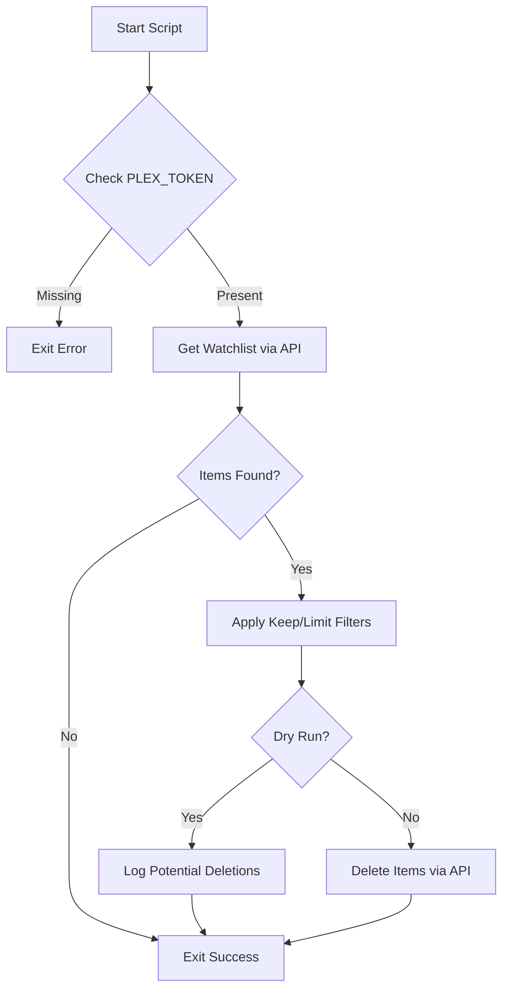
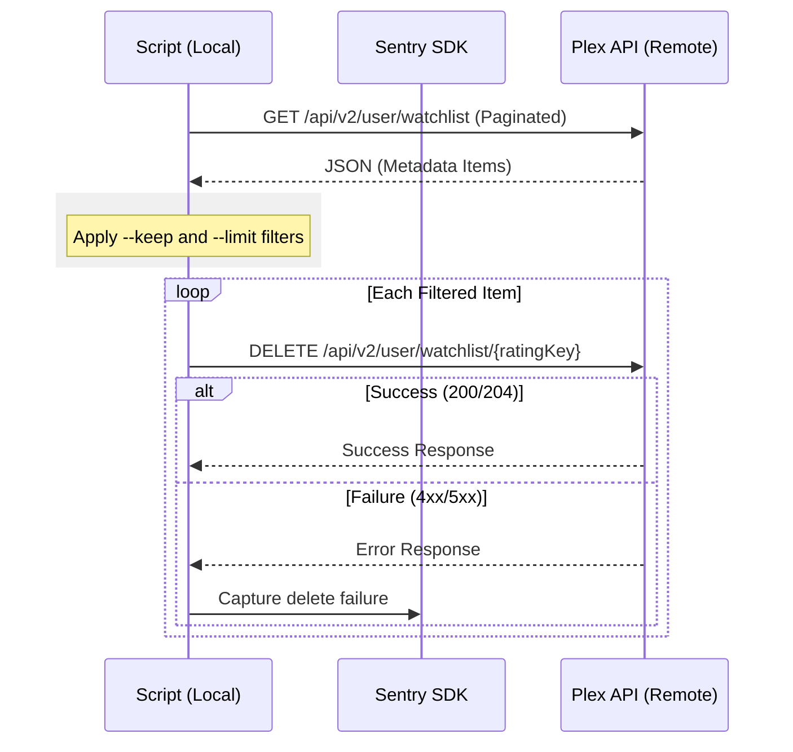

<details>
<summary>Relevant source files</summary>

The following files were used as context for generating this wiki page:

- [plex_clear_watchlist.py](plex_clear_watchlist.py)
- [README.md](README.md)
- [AGENTS.md](AGENTS.md)
- [CLAUDE.md](CLAUDE.md)
- [docker-compose.yml](docker-compose.yml)
- [SECURITY.md](SECURITY.md)
- [requirements.txt](requirements.txt)
</details>

# Home

Plex Clear Watchlist is a specialized utility designed to programmatically remove items from a user's Plex Watchlist via the Plex API. The application is implemented as a single-purpose Python script designed to run in a one-shot Docker container environment. It provides users with granular control over their watchlist management through filtering options such as deletion limits and retention policies for recent items.

Sources: [README.md:1-12](README.md#L1-L12), [AGENTS.md:1-5](AGENTS.md#L1-L5)

The tool interfaces directly with the Plex API v2, utilizing authenticated requests to fetch and delete metadata items. It includes built-in support for dry-run operations to ensure safe execution and integrates with Sentry for error tracking and monitoring.

Sources: [plex_clear_watchlist.py:16-18](plex_clear_watchlist.py#L16-L18), [plex_clear_watchlist.py:100-108](plex_clear_watchlist.py#L100-L108)

## System Architecture and Logic

The application follows a linear execution flow: authentication check, watchlist retrieval with pagination, filtering based on user arguments, and sequential deletion.

### Core Execution Flow
The following diagram illustrates the high-level logic used when the script is executed:



Sources: [plex_clear_watchlist.py:9-14](plex_clear_watchlist.py#L9-L14), [plex_clear_watchlist.py:115-167](plex_clear_watchlist.py#L115-L167)

### Watchlist Retrieval
Watchlist items are fetched using a paginated approach to handle large lists. The script requests pages of 100 items sorted by the date they were added (`addedAt:asc`).

| Component | Detail |
| :--- | :--- |
| **Endpoint** | `https://plex.tv/api/v2/user/watchlist` |
| **Method** | GET |
| **Page Size** | 100 items |
| **Sorting** | `addedAt:asc` |
| **Headers** | `X-Plex-Token`, `Accept: application/json` |

Sources: [plex_clear_watchlist.py:16-23](plex_clear_watchlist.py#L16-L23), [plex_clear_watchlist.py:26-34](plex_clear_watchlist.py#L26-L34)

### Data Flow for Item Deletion
The sequence below demonstrates the interaction between the local script and the Plex API during the deletion phase.



Sources: [plex_clear_watchlist.py:65-79](plex_clear_watchlist.py#L65-L79), [plex_clear_watchlist.py:136-165](plex_clear_watchlist.py#L136-L165)

## Configuration and Environment

The application relies strictly on environment variables for configuration, adhering to security best practices by avoiding hardcoded credentials.

| Variable | Description | Requirement |
| :--- | :--- | :--- |
| `PLEX_TOKEN` | Authentication token for Plex.tv API | **Required** |
| `SENTRY_DSN` | Data Source Name for Sentry error tracking | Optional |

Sources: [plex_clear_watchlist.py:9-11](plex_clear_watchlist.py#L9-L11), [SECURITY.md:14-16](SECURITY.md#L14-L16), [docker-compose.yml:6-8](docker-compose.yml#L6-L8)

### Command Line Arguments
Users can modify the script's behavior using the following flags:

| Flag | Type | Default | Description |
| :--- | :--- | :--- | :--- |
| `--dry-run` | Flag | False | Logs actions without performing API deletions. |
| `--limit` | Integer | 0 | Max number of items to delete (0 = no limit). |
| `--keep` | Integer | 0 | Number of most recently added items to retain. |

Sources: [plex_clear_watchlist.py:91-95](plex_clear_watchlist.py#L91-L95), [README.md:37-41](README.md#L37-L41)

## Error Handling and Security

### Security Policy
- **Credential Management**: Secrets are managed via environment variables and are explicitly forbidden in version control.
- **Reporting**: Vulnerabilities are handled through GitHub's private reporting feature rather than public issues.
- **Updates**: Dependencies are managed via Renovate to ensure the latest versions are used.

Sources: [SECURITY.md:7-16](SECURITY.md#L7-L16), [renovate.json:1-6](renovate.json#L1-L6)

### API Resilience
The script includes logic to prevent accidental partial deletions. If a 404 error occurs mid-pagination, the script raises an exception rather than continuing with an incomplete list, which prevents the logic from assuming the remaining list is empty.

```python
if response.status_code == 404:
    if page == 1:
        return items
    raise requests.HTTPError(
        f"Plex API returnerade 404 på sida {page} efter att {len(items)} "
        "item(er) redan samlats in - avbryter istället för att riskera "
        "en ofullständig radering.",
        response=response,
    )
```

Sources: [plex_clear_watchlist.py:36-47](plex_clear_watchlist.py#L36-L47)

## Deployment

The application is distributed as a Docker image via GHCR (GitHub Container Registry). It is intended to be run as a transient container that performs its task and exits.

```bash
PLEX_TOKEN=your-token docker compose run --rm plex-clear-watchlist --dry-run
```

Sources: [README.md:17-25](README.md#L17-L25), [AGENTS.md:10-14](AGENTS.md#L10-L14)

## Summary
Plex Clear Watchlist provides a robust, containerized solution for automated Plex Watchlist maintenance. By leveraging the Plex API v2 and providing flexible filtering options (keep/limit), it allows users to manage their media queues efficiently while maintaining security through environment-based configuration and safe "dry-run" capabilities.
