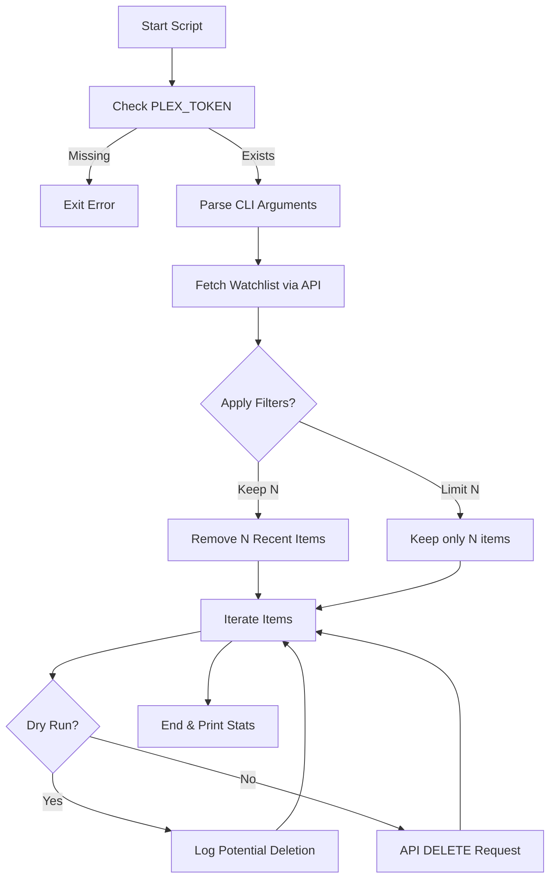
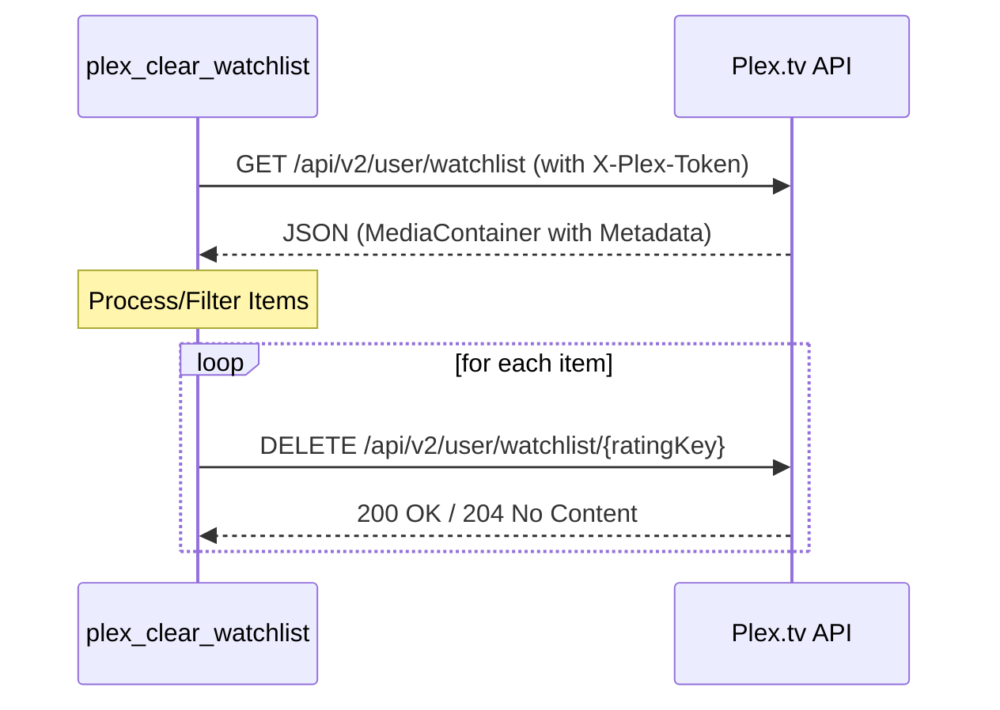

<details>
<summary>Relevant source files</summary>

The following files were used as context for generating this wiki page:

- [README.md](README.md)
- [plex_clear_watchlist.py](plex_clear_watchlist.py)
- [AGENTS.md](AGENTS.md)
- [docker-compose.yml](docker-compose.yml)
- [requirements.txt](requirements.txt)
- [SECURITY.md](SECURITY.md)
</details>

# Home

Plex Clear Watchlist is a specialized utility designed to automate the removal of items from a user's Plex Watchlist via the Plex API. It is built as a single-purpose Python script intended to be run as a one-shot Docker container or a standalone CLI tool.

The system facilitates bulk management of watchlist items, providing options for dry runs, item limits, and retention of the most recently added content. It integrates with Sentry for error tracking and relies on environment variables for secure configuration.

Sources: [README.md:1-12](README.md#L1-L12), [AGENTS.md:1-5](AGENTS.md#L1-L5), [plex_clear_watchlist.py:1-25](plex_clear_watchlist.py#L1-L25)

## System Architecture and Logic

The application follows a straightforward procedural flow: authenticating with the Plex API, fetching the complete paginated watchlist, applying filtering logic based on user arguments, and executing deletion requests.

### Core Workflow
The following diagram illustrates the execution flow from initialization to completion:



The script uses a paginated approach to retrieve items to ensure large watchlists are handled correctly without missing data.

Sources: [plex_clear_watchlist.py:9-25](plex_clear_watchlist.py#L9-L25), [plex_clear_watchlist.py:93-165](plex_clear_watchlist.py#L93-L165)

## Configuration and Environment

The application is configured primarily through environment variables to ensure security and portability, particularly when deployed via Docker.

### Environment Variables

| Variable | Required | Description |
| :--- | :--- | :--- |
| `PLEX_TOKEN` | Yes | Authentication token obtained from Plex Account Settings. |
| `SENTRY_DSN` | No | Data Source Name for Sentry error tracking. |

Sources: [README.md:15-18](README.md#L15-L18), [plex_clear_watchlist.py:9-12](plex_clear_watchlist.py#L9-L12), [docker-compose.yml:6-8](docker-compose.yml#L6-L8)

### Execution Options
The script supports several CLI arguments to control deletion behavior:

| Flag | Type | Default | Description |
| :--- | :--- | :--- | :--- |
| `--dry-run` | Boolean | False | Preview deletions without executing API changes. |
| `--limit` | Integer | 0 | Max number of items to delete (0 = unlimited). |
| `--keep` | Integer | 0 | Number of most recently added items to preserve. |

Sources: [README.md:43-48](README.md#L43-L48), [plex_clear_watchlist.py:94-98](plex_clear_watchlist.py#L94-L98)

## API Integration

The tool interacts with the Plex TV API v2. It uses the `requests` library for synchronous HTTP communication.

### Endpoint Details
The main interaction point is the user watchlist endpoint.



### Technical Specifications
- **Base URL**: `https://plex.tv`
- **Watchlist Endpoint**: `/api/v2/user/watchlist`
- **Authentication**: Provided via `X-Plex-Token` in the request header.
- **Timeout**: Global request timeout of 30 seconds.
- **Pagination**: Uses `page` and `pageSize` (default 100) parameters with `addedAt:asc` sorting.

Sources: [plex_clear_watchlist.py:19-25](plex_clear_watchlist.py#L19-L25), [plex_clear_watchlist.py:28-60](plex_clear_watchlist.py#L28-L60)

## Error Handling and Security

### Security Policy
- **Secrets Management**: Secrets like `PLEX_TOKEN` must never be hardcoded or committed to version control.
- **Vulnerability Reporting**: Security issues should be reported via GitHub's private reporting feature rather than public issues.
- **Updates**: Dependencies are managed via Renovate to ensure the `requests` and `sentry-sdk` libraries remain current.

Sources: [SECURITY.md:1-15](SECURITY.md#L1-L15), [renovate.json:1-6](renovate.json#L1-L6), [requirements.txt:1-2](requirements.txt#L1-L2)

### Error Tracking
If `SENTRY_DSN` is provided, the application initializes the Sentry SDK (except during dry runs). It captures exceptions during watchlist retrieval and logs specific failures if a deletion request returns an unexpected status code.

Sources: [plex_clear_watchlist.py:100-107](plex_clear_watchlist.py#L100-L107), [plex_clear_watchlist.py:155-163](plex_clear_watchlist.py#L155-L163)

## Deployment

The project is optimized for Docker environments, providing a `docker-compose.yml` for easy execution.

```yaml
services:
  plex-clear-watchlist:
    image: ghcr.io/blixten85/plex-clear-watchlist:latest
    environment:
      - PLEX_TOKEN=${PLEX_TOKEN}
      - SENTRY_DSN=${SENTRY_DSN:-}
```

Sources: [docker-compose.yml:1-8](docker-compose.yml#L1-L8), [AGENTS.md:7-13](AGENTS.md#L7-L13)

## Summary

Plex Clear Watchlist provides a robust, containerized solution for bulk-cleaning a Plex Watchlist. By leveraging the Plex API v2 and providing safety mechanisms like `--dry-run` and item retention filters, it allows users to maintain their media lists with high precision and minimal manual effort.
