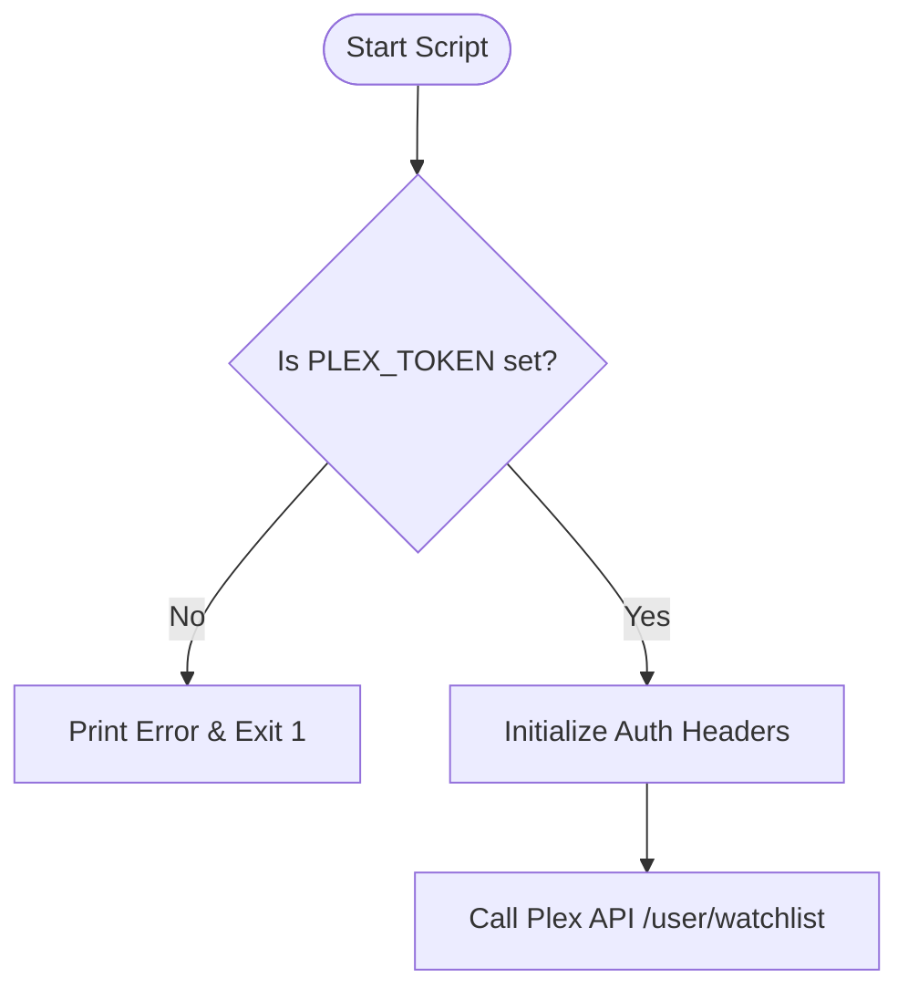
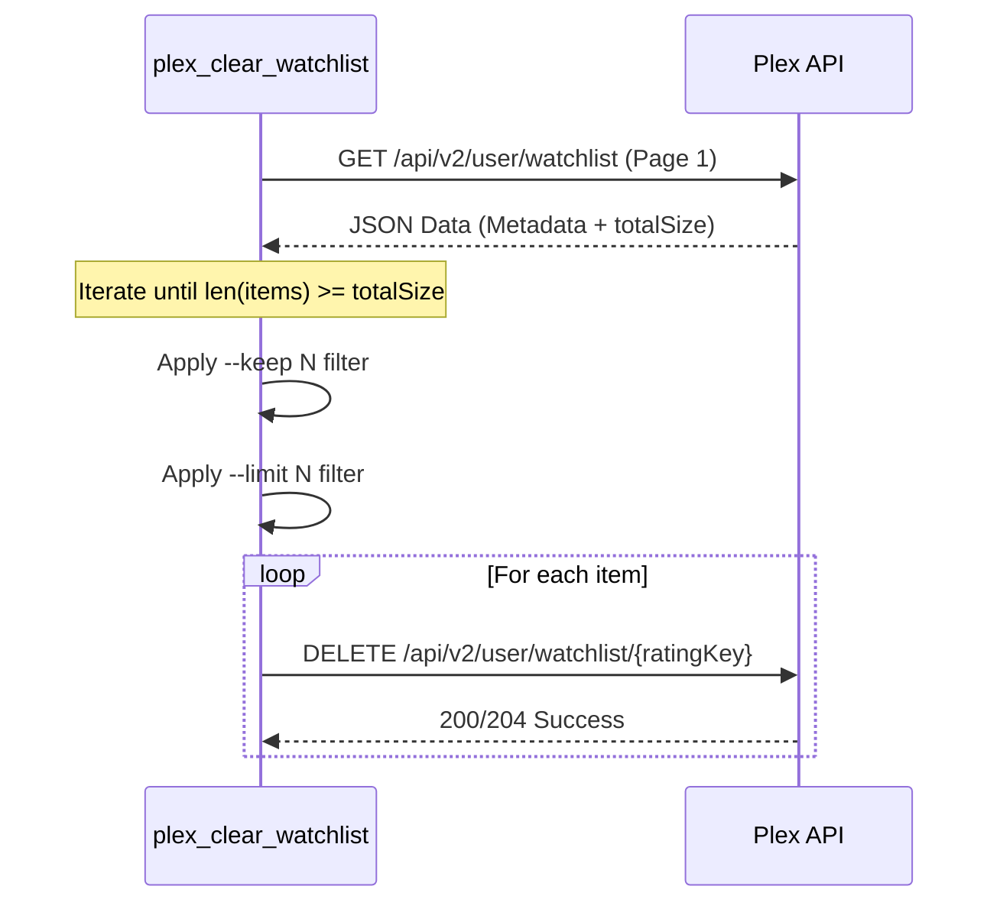

<details>
<summary>Relevant source files</summary>

The following files were used as context for generating this wiki page:

- [README.md](README.md)
- [plex_clear_watchlist.py](plex_clear_watchlist.py)
- [docker-compose.yml](docker-compose.yml)
- [AGENTS.md](AGENTS.md)
- [CLAUDE.md](CLAUDE.md)
- [SECURITY.md](SECURITY.md)
- [requirements.txt](requirements.txt)
</details>

# Quick Start Guide

The `plex_clear_watchlist` utility is a specialized Python-based tool designed to automate the removal of items from a user's Plex Watchlist via the Plex API. It is architected as a "one-shot" script, meaning it executes its logic and then terminates, making it ideal for containerized execution or scheduled tasks.

Sources: [AGENTS.md:3-5](AGENTS.md#L3-L5), [CLAUDE.md:3-5](CLAUDE.md#L3-L5), [README.md:12-14](README.md#L12-L14)

This guide provides the technical foundation for deploying and operating the script using various methods, including Docker Compose, standalone Docker, and native Python environments. It also details the available configuration options and execution flags that control the deletion logic.

Sources: [README.md:16-41](README.md#L16-L41), [plex_clear_watchlist.py:100-105](plex_clear_watchlist.py#L100-L105)

## Prerequisites and Authentication

The application requires a valid `PLEX_TOKEN` to interact with the Plex API. This token serves as the primary authentication mechanism and must be provided as an environment variable.

Sources: [plex_clear_watchlist.py:10-15](plex_clear_watchlist.py#L10-L15), [AGENTS.md:21-23](AGENTS.md#L21-L23)

| Variable | Requirement | Description |
| :--- | :--- | :--- |
| `PLEX_TOKEN` | Required | Authentication token obtained from Plex Account Settings. |
| `SENTRY_DSN` | Optional | Data Source Name for error tracking via Sentry. |

Sources: [README.md:18-20](README.md#L18-L20), [docker-compose.yml:7-9](docker-compose.yml#L7-L9)

### Authentication Flow

The following diagram illustrates how the script validates the presence of the required token before initiating any API requests.



Sources: [plex_clear_watchlist.py:10-22](plex_clear_watchlist.py#L10-L22)

## Deployment Methods

### Docker Compose (Recommended)
Using Docker Compose is the most efficient method for running the tool as it automatically manages environment variables and image pulling.

```bash
PLEX_TOKEN=your-token docker compose run --rm plex-clear-watchlist --dry-run
```

Sources: [README.md:22-26](README.md#L22-L26), [docker-compose.yml:1-9](docker-compose.yml#L1-L9)

### Native Python Execution
For local development or environments without Docker, the script can be run directly using Python 3.14.

1.  **Install Dependencies:** `pip3 install -r requirements.txt`
2.  **Export Token:** `export PLEX_TOKEN="your-token-here"`
3.  **Execute:** `python3 plex_clear_watchlist.py`

Sources: [README.md:37-41](README.md#L37-L41), [CLAUDE.md:8-10](CLAUDE.md#L8-L10)

## Script Logic and Operations

The application follows a linear execution path: fetching the watchlist, applying filters (limit/keep), and performing deletions.

### Data Processing Flow

The system retrieves items using pagination to ensure the entire watchlist is captured before processing.



Sources: [plex_clear_watchlist.py:25-60](plex_clear_watchlist.py#L25-L60), [plex_clear_watchlist.py:118-144](plex_clear_watchlist.py#L118-L144)

### Configuration Flags

The script supports specific arguments to control which items are removed.

| Flag | Type | Default | Description |
| :--- | :--- | :--- | :--- |
| `--dry-run` | Boolean | False | Simulates deletion without making API DELETE calls. |
| `--limit N` | Integer | 0 | Maximum number of items to delete (0 = no limit). |
| `--keep N` | Integer | 0 | Preserves the N most recently added items in the watchlist. |

Sources: [plex_clear_watchlist.py:100-105](plex_clear_watchlist.py#L100-L105), [README.md:43-47](README.md#L43-L47)

## Technical Architecture

### Core Components
- **`get_watchlist()`**: Handles paginated requests to the Plex API using a default page size of 100 items. It includes error handling for 404 responses during pagination to prevent partial deletions.
- **`delete_from_watchlist()`**: Performs the HTTP DELETE request for a specific `ratingKey`.
- **Sentry Integration**: If `SENTRY_DSN` is provided and `--dry-run` is not active, the script initializes the Sentry SDK for error reporting.

Sources: [plex_clear_watchlist.py:25-50](plex_clear_watchlist.py#L25-L50), [plex_clear_watchlist.py:62-73](plex_clear_watchlist.py#L62-L73), [plex_clear_watchlist.py:107-114](plex_clear_watchlist.py#L107-L114)

### Dependencies
The project relies on two primary external libraries:
1.  **`requests`**: For handling HTTP communication with Plex.
2.  **`sentry-sdk`**: For error monitoring and diagnostics.

Sources: [requirements.txt:1-2](requirements.txt#L1-L2), [plex_clear_watchlist.py:4-5](plex_clear_watchlist.py#L4-L5)

## Summary
The `plex_clear_watchlist` tool provides a robust, single-purpose solution for managing Plex Watchlists. By utilizing environment variables for security and providing a `--dry-run` mode for safety, it ensures that users can confidently automate the maintenance of their media libraries.

Sources: [SECURITY.md:15-17](SECURITY.md#L15-L17), [AGENTS.md:21-25](AGENTS.md#L21-L25)
