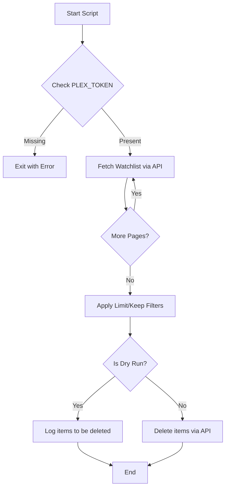

<details>
<summary>Relevant source files</summary>

The following files were used as context for generating this wiki page:

- [README.md](README.md)
- [docker-compose.yml](docker-compose.yml)
- [plex_clear_watchlist.py](plex_clear_watchlist.py)
- [AGENTS.md](AGENTS.md)
- [CLAUDE.md](CLAUDE.md)
- [SECURITY.md](SECURITY.md)
</details>

# Quick Start Guide

## Introduction

The **plex_clear_watchlist** utility is a single-purpose tool designed to automate the deletion of items from a user's Plex Watchlist. It interacts directly with the Plex API to fetch and remove watchlist entries, providing a streamlined way to manage account history and recommendations. Sources: [README.md:1-12](README.md#L1-L12), [AGENTS.md:3-5](AGENTS.md#L3-L5)

The tool is designed as a one-shot execution script that can be run natively via Python or within a Docker container. It supports safety features like dry-runs and granular control through limits and retention filters. Sources: [CLAUDE.md:3-5](CLAUDE.md#L3-L5), [plex_clear_watchlist.py:101-104](plex_clear_watchlist.py#L101-L104)

## Core Logic and Execution Flow

The application operates by fetching the entire watchlist through paginated API requests and then iterating through the items to perform deletions based on user-defined constraints.

### Execution Lifecycle
The following diagram illustrates the internal logic flow from initialization to completion:



Sources: [plex_clear_watchlist.py:11-18](plex_clear_watchlist.py#L11-L18), [plex_clear_watchlist.py:27-60](plex_clear_watchlist.py#L27-L60), [plex_clear_watchlist.py:126-155](plex_clear_watchlist.py#L126-L155)

### Data Handling
The script utilizes the `requests` library to communicate with the Plex API. It handles pagination by checking the `totalSize` attribute in the `MediaContainer` response. Sources: [plex_clear_watchlist.py:46-56](plex_clear_watchlist.py#L46-L56)

| Phase | Description | Key Variable/Constant |
| :--- | :--- | :--- |
| Authentication | Uses `X-Plex-Token` in HTTP headers | `PLEX_TOKEN` |
| Retrieval | Fetches items in pages of 100 | `page_size` |
| Identification | Uses unique keys for deletion | `ratingKey` |
| Error Tracking | Optional telemetry via Sentry | `SENTRY_DSN` |

Sources: [plex_clear_watchlist.py:11-23](plex_clear_watchlist.py#L11-L23), [plex_clear_watchlist.py:32](plex_clear_watchlist.py#L32), [plex_clear_watchlist.py:106-113](plex_clear_watchlist.py#L106-L113)

## Deployment Options

### Docker Compose (Recommended)
The tool is packaged for easy deployment using Docker Compose. This method automatically handles environment variable forwarding.

```bash
# Example: Running a dry run with Docker Compose
PLEX_TOKEN=your-token docker compose run --rm plex-clear-watchlist --dry-run
```

Sources: [docker-compose.yml:1-8](docker-compose.yml#L1-L8), [README.md:18-24](README.md#L18-L24)

### Native Python Execution
For local execution, dependencies defined in `requirements.txt` must be installed.

```bash
export PLEX_TOKEN="your-token-here"
pip3 install -r requirements.txt
python3 plex_clear_watchlist.py --dry-run
```

Sources: [README.md:31-35](README.md#L31-L35), [requirements.txt:1-2](requirements.txt#L1-L2)

## Configuration and Options

### Environment Variables
Configuration is primarily handled through environment variables to ensure security and portability. Sources: [SECURITY.md:15-18](SECURITY.md#L15-L18)

| Variable | Required | Description |
| :--- | :--- | :--- |
| `PLEX_TOKEN` | Yes | Your Plex authentication token. |
| `SENTRY_DSN` | No | Data Source Name for Sentry error tracking. |

Sources: [plex_clear_watchlist.py:11-12](plex_clear_watchlist.py#L11-L12), [docker-compose.yml:6-8](docker-compose.yml#L6-L8)

### Command Line Arguments
The script supports several flags to modify its behavior during execution.

| Flag | Description |
| :--- | :--- |
| `--dry-run` | Displays items targeted for deletion without executing the API DELETE request. |
| `--limit N` | Deletes at most N items from the watchlist. |
| `--keep N` | Retains the N most recently added items and targets the rest for deletion. |

Sources: [README.md:39-43](README.md#L39-L43), [plex_clear_watchlist.py:101-104](plex_clear_watchlist.py#L101-L104)

## Security and Maintenance
- **Vulnerability Reporting**: Security issues should be reported via GitHub's private reporting feature rather than public issues. Sources: [SECURITY.md:7-13](SECURITY.md#L7-L13)
- **Dependency Management**: The project uses Renovate for automated dependency updates. Sources: [renovate.json:1-6](renovate.json#L1-L6)
- **Secrets**: Never hardcode the `PLEX_TOKEN`; it must always be provided via the environment. Sources: [AGENTS.md:18-20](AGENTS.md#L18-L20), [CLAUDE.md:18-20](CLAUDE.md#L18-L20)

## Summary
The **plex_clear_watchlist** tool provides a safe and configurable method for clearing Plex Watchlists. By utilizing Docker and environment-based configuration, it maintains high security standards while offering flexibility through filtering arguments like `--keep` and `--limit`. Sources: [README.md:1-12](README.md#L1-L12), [plex_clear_watchlist.py:126-140](plex_clear_watchlist.py#L126-L140)
