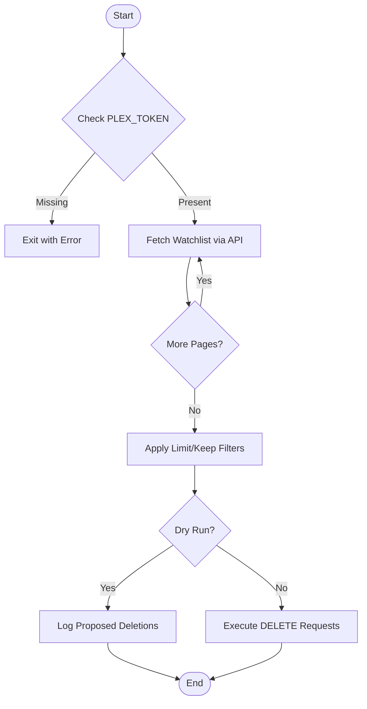
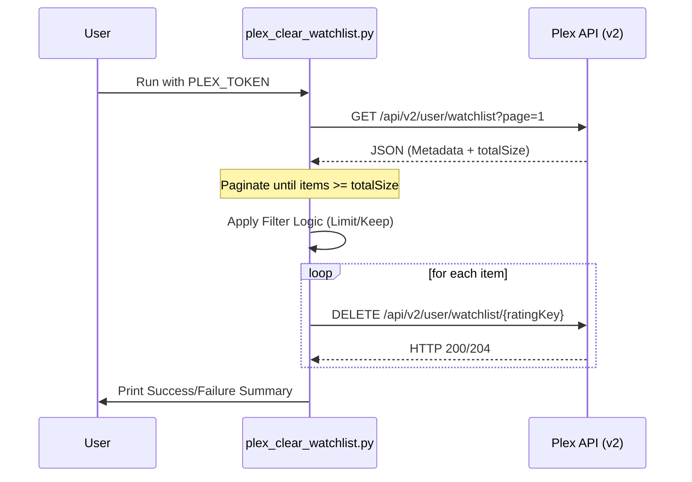

<details>
<summary>Relevant source files</summary>

The following files were used as context for generating this wiki page:

- [README.md](README.md)
- [AGENTS.md](AGENTS.md)
- [plex_clear_watchlist.py](plex_clear_watchlist.py)
- [docker-compose.yml](docker-compose.yml)
- [CLAUDE.md](CLAUDE.md)
- [SECURITY.md](SECURITY.md)

</details>

# Use Cases & Examples

The `plex_clear_watchlist` tool is a specialized utility designed to manage and prune entries from a user's Plex Watchlist via the official Plex API. It serves as a one-shot execution script, typically deployed via Docker, to automate the removal of media items that are no longer desired in the watchlist.

The system supports various operational modes, including safety-first simulations, partial deletions based on count, and retention of recent items. By leveraging environment variables for authentication and Sentry for error tracking, it provides a robust solution for maintaining a clean Plex profile.

Sources: [README.md:14-16](README.md#L14-L16), [AGENTS.md:3-5](AGENTS.md#L3-L5), [plex_clear_watchlist.py:108-112](plex_clear_watchlist.py#L108-L112)

## Core Operational Logic

The application follows a linear execution flow: authenticating with the Plex API, retrieving the full watchlist using pagination, applying user-defined filters (limit or keep), and executing deletion requests.

### Data Flow Overview

This diagram illustrates the progression from initial configuration check to the final deletion of items.



The script uses a `while True` loop to handle paginated results from `https://plex.tv/api/v2/user/watchlist`, ensuring large watchlists are fully captured before any processing occurs.
Sources: [plex_clear_watchlist.py:27-58](plex_clear_watchlist.py#L27-L58), [plex_clear_watchlist.py:108-163](plex_clear_watchlist.py#L108-L163)

## Execution Use Cases

The tool supports four primary use cases through command-line arguments, which can be passed via Docker Compose or direct Python execution.

### 1. Safety Simulation (Dry Run)
The `--dry-run` flag allows users to verify which items will be targeted without making actual changes to the Plex account. This is a mandatory safety check recommended for first-time users.
Sources: [README.md:46](README.md#L46), [CLAUDE.md:23](CLAUDE.md#L23)

### 2. Full Watchlist Clearance
The default behavior (without `--limit` or `--keep`) is to attempt deletion of every item retrieved from the API. This is used for a complete reset of the user's watchlist.
Sources: [AGENTS.md:15](AGENTS.md#L15), [plex_clear_watchlist.py:136-139](plex_clear_watchlist.py#L136-L139)

### 3. Partial Pruning (Limit)
Using `--limit N` restricts the operation to deleting only the first `N` items found (sorted by `addedAt:asc`). This is useful for gradual cleanup.
Sources: [README.md:47](README.md#L47), [plex_clear_watchlist.py:132-134](plex_clear_watchlist.py#L132-L134)

### 4. Retaining Recent Additions (Keep)
The `--keep N` argument ensures that the `N` most recently added items remain in the watchlist, while older items are removed.
Sources: [README.md:48](README.md#L48), [plex_clear_watchlist.py:128-130](plex_clear_watchlist.py#L128-L130)

| Feature | Argument | Impact |
| :--- | :--- | :--- |
| **Dry Run** | `--dry-run` | Logs actions to stdout; no API DELETE calls made. |
| **Delete Limit** | `--limit <int>` | Deletes maximum of N items. |
| **Retain Items** | `--keep <int>` | Preserves N newest items; deletes the rest. |

Sources: [README.md:45-49](README.md#L45-L49), [plex_clear_watchlist.py:110-113](plex_clear_watchlist.py#L110-L113)

## Technical Implementation Details

### Configuration and Environment
The application requires sensitive credentials and optional monitoring configurations provided via environment variables.

| Variable | Required | Description |
| :--- | :--- | :--- |
| `PLEX_TOKEN` | Yes | Authentication token from plex.tv. |
| `SENTRY_DSN` | No | Sentry Data Source Name for error reporting. |

Sources: [README.md:20-24](README.md#L20-L24), [docker-compose.yml:6-8](docker-compose.yml#L6-L8), [plex_clear_watchlist.py:9-14](plex_clear_watchlist.py#L9-L14)

### Sequence of API Interaction
The following diagram details the interaction between the script and the Plex backend during a standard deletion cycle.



Sources: [plex_clear_watchlist.py:27-72](plex_clear_watchlist.py#L27-L72), [plex_clear_watchlist.py:145-163](plex_clear_watchlist.py#L145-L163)

### Error Handling and Security
*  **Security**: The application explicitly forbids hardcoding the `PLEX_TOKEN` and recommends using `.env` files or direct environment injection.
*  **API Resilience**: If the API returns a `404` error during pagination (but not on the first page), the script raises an `HTTPError` to prevent "partial radering" (incomplete deletion) where only a subset of items might be cleared due to an API glitch.
*  **Monitoring**: When `SENTRY_DSN` is provided, the script initializes the Sentry SDK to capture exceptions during the fetch and delete phases.

Sources: [SECURITY.md:15-17](SECURITY.md#L15-L17), [plex_clear_watchlist.py:35-46](plex_clear_watchlist.py#L35-L46), [plex_clear_watchlist.py:115-121](plex_clear_watchlist.py#L115-L121)

## Deployment Examples

### Docker Compose (Recommended)
Users can define the service in a `docker-compose.yml` and execute via `run`.

```bash
# Using environment variables directly
PLEX_TOKEN=your-token docker compose run --rm plex-clear-watchlist --keep 5
```

Sources: [docker-compose.yml:1-8](docker-compose.yml#L1-L8), [README.md:28-31](README.md#L28-L31)

### Standalone Python
For environments without Docker, the script can be run directly after installing dependencies.

```bash
export PLEX_TOKEN="your-token-here"
pip3 install -r requirements.txt
python3 plex_clear_watchlist.py --dry-run
```

Sources: [requirements.txt:1-2](requirements.txt#L1-L2), [README.md:40-42](README.md#L40-L42)

### Summary
`plex_clear_watchlist` provides a narrow but flexible set of tools for managing Plex Watchlists. By combining pagination-aware fetching with specific filtering logic (`limit` and `keep`), it allows users to automate profile maintenance securely using Docker-based one-shot containers.
