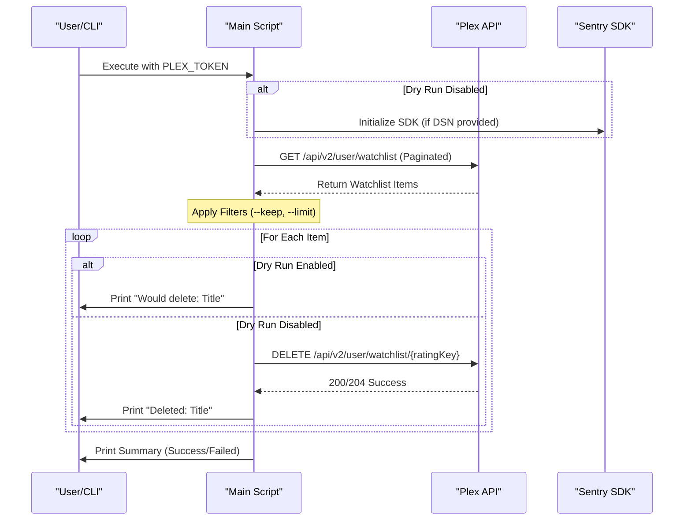
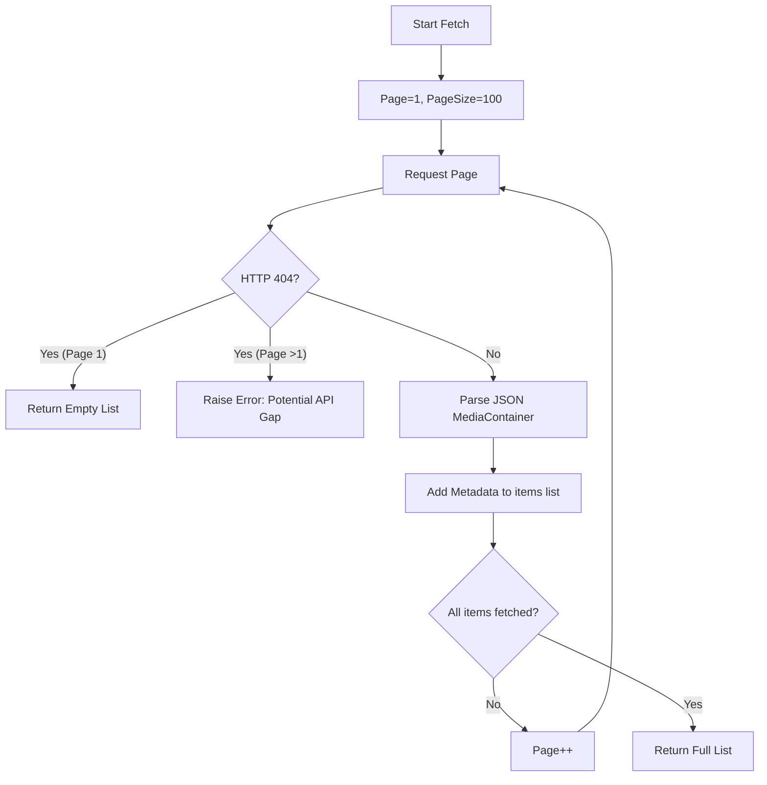

<details>
<summary>Relevant source files</summary>

The following files were used as context for generating this wiki page:

- [README.md](README.md)
- [AGENTS.md](AGENTS.md)
- [plex_clear_watchlist.py](plex_clear_watchlist.py)
- [docker-compose.yml](docker-compose.yml)
- [CLAUDE.md](CLAUDE.md)
- [SECURITY.md](SECURITY.md)
</details>

# Use Cases & Examples

This page provides a comprehensive overview of the operational scenarios and implementation details for the `plex_clear_watchlist` utility. The tool is designed as a single-purpose, one-shot script to manage and clear items from a user's Plex Watchlist via the official Plex API. 

Sources: [README.md:10-12](README.md#L10-L12), [AGENTS.md:5](AGENTS.md#L5), [CLAUDE.md:5](CLAUDE.md#L5)

## Execution Workflows

The utility supports multiple execution environments, including Docker, Docker Compose, and direct Python execution. The core logic remains consistent across these platforms, utilizing environment variables for authentication and command-line arguments for operational control.

### Basic Workflow Sequence
The following diagram illustrates the standard sequence of events when the script is executed.



Sources: [plex_clear_watchlist.py:91-163](plex_clear_watchlist.py#L91-L163), [README.md:17-45](README.md#L17-L45)

## Primary Use Cases

### 1. Safe Simulation (Dry Run)
Before performing destructive operations, users can simulate the deletion process. This is the recommended first step to verify the scope of the operation without modifying the actual Watchlist.

*  **Command**: `python3 plex_clear_watchlist.py --dry-run`
*  **Logic**: The script fetches the list but skips the `delete_from_watchlist` function call, printing the items that *would* have been removed.

Sources: [plex_clear_watchlist.py:94](plex_clear_watchlist.py#L94), [README.md:47](README.md#L47), [CLAUDE.md:11](CLAUDE.md#L11)

### 2. Partial Cleanup (Limit)
Users may want to clear a specific number of items rather than the entire list. This is useful for incremental cleaning or testing.

*  **Command**: `python3 plex_clear_watchlist.py --limit 10`
*  **Logic**: The script truncates the fetched item list to the specified integer `N` before starting the deletion loop.

Sources: [plex_clear_watchlist.py:126-128](plex_clear_watchlist.py#L126-L128), [README.md:48](README.md#L48)

### 3. Preserving Recent Additions (Keep)
This use case allows users to purge older content while retaining a buffer of the most recently added items.

*  **Command**: `python3 plex_clear_watchlist.py --keep 5`
*  **Logic**: The script sorts items by `addedAt:asc` during fetching and then slices the list to remove the most recent `N` items from the deletion queue.

Sources: [plex_clear_watchlist.py:38](plex_clear_watchlist.py#L38), [plex_clear_watchlist.py:122-124](plex_clear_watchlist.py#L122-L124), [README.md:49](README.md#L49)

## Configuration and Parameters

The system relies on a combination of environment variables for security-sensitive data and CLI flags for behavior modification.

### Environment Variables

| Variable | Required | Description |
| :--- | :--- | :--- |
| `PLEX_TOKEN` | Yes | Authentication token retrieved from plex.tv account settings. |
| `SENTRY_DSN` | No | Error tracking endpoint for Sentry.io. |

Sources: [plex_clear_watchlist.py:9-17](plex_clear_watchlist.py#L9-L17), [README.md:17-21](README.md#L17-L21), [SECURITY.md:15-16](SECURITY.md#L15-L16)

### Command Line Arguments

| Flag | Type | Default | Description |
| :--- | :--- | :--- | :--- |
| `--dry-run` | Boolean | False | Enables simulation mode. |
| `--limit` | Integer | 0 | Maximum number of items to delete (0 = no limit). |
| `--keep` | Integer | 0 | Number of most recent items to exclude from deletion. |

Sources: [plex_clear_watchlist.py:93-96](plex_clear_watchlist.py#L93-L96), [README.md:46-50](README.md#L46-L50)

## Internal Logic & Data Flow

### Watchlist Retrieval Logic
The script handles Plex's paginated API to ensure a complete list is retrieved before any operations begin.



Sources: [plex_clear_watchlist.py:27-63](plex_clear_watchlist.py#L27-L63)

### Deletion Safety
The script implements specific safety checks:
- **Authentication Check**: Exits immediately if `PLEX_TOKEN` is missing.
- **Error Handling**: Checks the deletion response for HTTP 200/204 and returns `False` on any other status, reporting the failure via Sentry (if configured) instead of raising.
- **Paging Integrity**: If a 404 is encountered after the first page, the script aborts to prevent "partial" deletions that might occur if the API intermittently fails.

Sources: [plex_clear_watchlist.py:10-15](plex_clear_watchlist.py#L10-L15), [plex_clear_watchlist.py:41-52](plex_clear_watchlist.py#L41-L52), [plex_clear_watchlist.py:100-111](plex_clear_watchlist.py#L100-L111)

## Implementation Example: Docker Compose
The project is optimized for containerized execution. The `docker-compose.yml` file maps environment variables directly to the container environment.

```yaml
services:
  plex-clear-watchlist:
    image: ghcr.io/blixten85/plex-clear-watchlist:latest
    build: .
    environment:
      - PLEX_TOKEN=${PLEX_TOKEN}
      - SENTRY_DSN=${SENTRY_DSN:-}
```

Sources: [docker-compose.yml:1-8](docker-compose.yml#L1-L8)

## Summary
The `plex_clear_watchlist` tool provides a robust mechanism for automating Plex maintenance. By supporting dry runs, limits, and retention counts, it offers granular control over Watchlist management while maintaining security through environment-based credential handling.

Sources: [AGENTS.md:5-15](AGENTS.md#L5-L15), [README.md:10-15](README.md#L10-L15)
