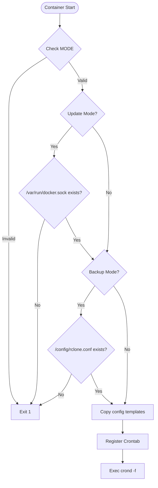
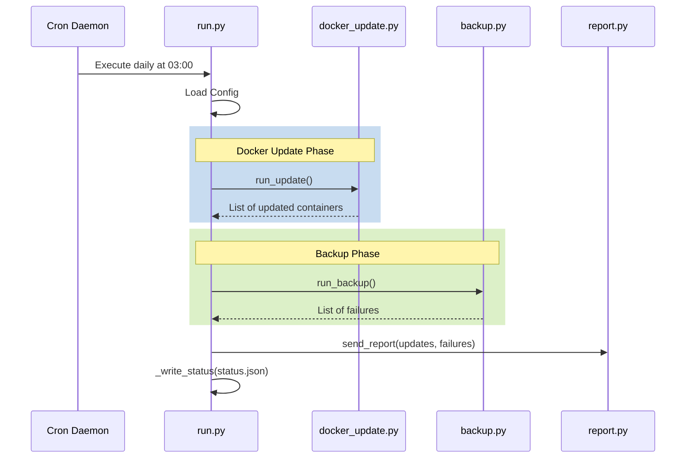

Relevant source files

The following files were used as context for generating this wiki page:

- [README.md](../../../README.md)
- [src/entrypoint.py](../../../src/entrypoint.py)
- [src/run.py](../../../src/run.py)
- [src/config.py](../../../src/config.py)
- [src/docker_update.py](../../../src/docker_update.py)
- [src/backup.py](../../../src/backup.py)
- [src/report.py](../../../src/report.py)
- [src/github_report.py](../../../src/github_report.py)
- [src/sentry_report.py](../../../src/sentry_report.py)

# Project Overview

The **docker-idempotent-update** project is a Python-based utility designed for daily Docker host maintenance contained within a single Docker image. It automates the process of pulling updated container images, recreating containers when changes are detected, syncing application data to remote storage using `rclone`, and providing status reports via email. The system operates on a schedule managed by an internal cron daemon, eliminating the need for external host dependencies beyond the Docker engine itself.

The project emphasizes an "idempotent" approach, meaning it ensures the desired state (updated containers and synced backups) is achieved without redundant actions. It only sends notification emails when a container is updated or a backup failure occurs, reducing noise for administrators.

Sources: [README.md:1-20](README.md#L1-L20), [AGENTS.md:3-8](AGENTS.md#L3-L8)

## System Architecture and Execution Flow

The system is structured as a series of Python modules triggered by a central entrypoint that initializes the environment and schedules the main execution logic.

### Startup and Initialization
The initialization process, handled by `src/entrypoint.py`, validates the configuration, ensures necessary mounts (like the Docker socket) are present, and generates configuration files from templates if they are missing. It then registers a cron job to execute the main maintenance script.

*The diagram above illustrates the validation and initialization sequence performed by the entrypoint before handing control to the cron daemon.*
Sources: [src/entrypoint.py:18-68](src/entrypoint.py#L18-L68)

### Execution Cycle
Once scheduled, the `src/run.py` script serves as the orchestrator for the maintenance tasks. It sequentially executes the update logic, the backup logic, and the reporting logic.

*The sequence diagram shows the main execution loop triggered by the internal cron daemon.*
Sources: [src/run.py:30-50](src/run.py#L30-L50), [README.md:25-33](README.md#L25-L33)

## Core Components

### Docker Update Module (`src/docker_update.py`)
This module handles image pulling and container recreation. It supports two operational modes:
*  **Socket-only (Option A):** Iterates through all running containers via the Docker socket, pulls their images, and recreates the container if the running image ID differs from the newly pulled one.
*  **Compose File (Option B):** Uses `docker compose pull` and `docker compose up -d --remove-orphans` to synchronize the state with a provided compose file.

Sources: [src/docker_update.py:11-26](src/docker_update.py#L11-L26), [README.md:90-103](README.md#L90-L103)

### Backup Module (`src/backup.py`)
Backups are performed using `rclone sync`. The module scans a source directory (default `/data`) for subdirectories named `backup` or `backups` (case-insensitive) and synchronizes them to a configured destination remote.

Sources: [src/backup.py:40-66](src/backup.py#L40-L66), [src/config.py:36-50](src/config.py#L36-L50)

### Error Reporting and Safety
The system includes best-effort error reporting to GitHub and Sentry for unhandled exceptions. These reporters use Python's standard library (`urllib`) to avoid external dependencies.

| Feature | Description | File |
| :--- | :--- | :--- |
| **GitHub Reporting** | Opens a `@claude`-tagged issue in the repository when a crash occurs. | `src/github_report.py` |
| **Sentry Reporting** | Posts crash details to a Sentry DSN using the Envelope API. | `src/sentry_report.py` |
| **Secrets Masking** | Automatically redacts environment variables containing `KEY`, `TOKEN`, `SECRET`, etc. | `src/github_report.py:46-56` |

Sources: [CLAUDE.md:27-38](CLAUDE.md#L27-L38), [src/github_report.py:31-43](src/github_report.py#L31-L43)

## Configuration and Environment Variables

Configuration is primarily driven by environment variables and a dedicated `backup.conf` file.

### Primary Environment Variables
| Variable | Default | Description |
| :--- | :--- | :--- |
| `MODE` | `both` | Operation mode: `update`, `backup`, or `both`. |
| `EMAIL_TO` | *(unset)* | Email recipient. If unset, no mail is sent. |
| `CRON_SCHEDULE` | `0 3 * * *` | Cron-formatted execution time. |
| `DRY_RUN` | `false` | If `true`, logs actions without executing them. |
| `COMPOSE_FILE` | *(unset)* | Path to a `docker-compose.yml` for Option B updates. |
| `COMPOSE_ENV_FILE` | *(unset)* | Optional `.env` file path passed alongside `COMPOSE_FILE` for Compose-based updates. |

Sources: [src/config.py:8-23](src/config.py#L8-L23), [README.md:124-135](README.md#L124-L135)

### Configurable Files
The following files are mapped inside the container to persist configuration:
*  `/config/rclone.conf`: Rclone remote settings, configured via `rclone config`.
*  `/config/msmtprc`: Mail server settings (copied from `/etc/msmtprc.template`).
*  `/config/backup.conf`: Custom source/destination paths for backups.

Sources: [README.md:73-81](README.md#L73-L81), [src/entrypoint.py:50-60](src/entrypoint.py#L50-L60)

## Status and Reporting
After each run, the system generates a summary. A report is emailed via `msmtp` only if containers were updated or backups failed. Additionally, a machine-readable `status.json` is written to the `/config` directory containing:
*  `timestamp`: UTC execution time.
*  `containers_updated`: A list of container names that were successfully updated.
*  `backup_failures`: A list of directory paths that failed to sync.
*  `docker_changes`: A diff-style string showing container state changes.

Sources: [src/run.py:53-65](src/run.py#L53-L65), [src/report.py:12-16](src/report.py#L12-L16)

## Summary
The **docker-idempotent-update** project provides a lightweight, dependency-free solution for Docker maintenance. By combining Docker container lifecycle management with `rclone` backups and selective email reporting, it offers an "install and forget" experience for managing Docker hosts while maintaining high visibility through automated status logs and error reporting.
