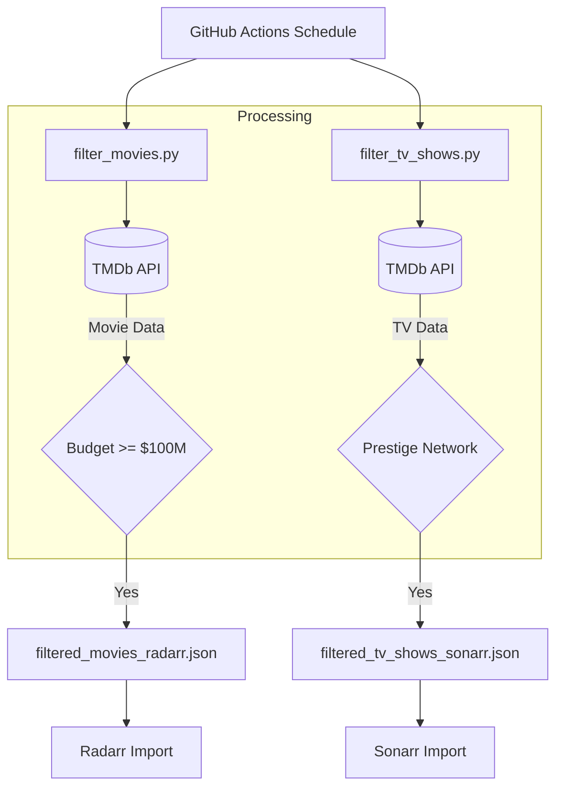

<details>
<summary>Relevant source files</summary>

The following files were used as context for generating this wiki page:

- [README.md](README.md)
- [AGENTS.md](AGENTS.md)
- [SECURITY.md](SECURITY.md)
- [filter_movies.py](filter_movies.py)
- [filter_tv_shows.py](filter_tv_shows.py)
</details>

# Introduction & Philosophy

The Filtered Movies project is an automated system designed to bridge the gap between vast content databases and personal media management tools like Radarr and Sonarr. Its primary purpose is to generate high-value, curated lists of movies and TV shows based on objective production criteria rather than subjective critical ratings. By leveraging The Movie Database (TMDb) API, the system identifies "Big Budget" cinema and "Prestige Network" television, providing users with automated entry points for mainstream and high-production-value content.
Sources: [README.md:1-12](README.md#L1-L12), [AGENTS.md:3-5](AGENTS.md#L3-L5)

The philosophy of the project centers on the idea that significant financial investment or association with top-tier distribution platforms is a strong indicator of content relevance. For movies, the system prioritizes production scale ($100M+ budget), while for television, it prioritizes the reputation of the broadcasting network or streaming service. This ensures that users are alerted to major cultural releases without needing to manually track industry news or rely on volatile user review scores.
Sources: [README.md:16-30](README.md#L16-L30), [filter_movies.py:6-9](filter_movies.py#L6-L9)

## Project Architecture & Core Logic

The system operates as a serverless automation pipeline utilizing Python scripts for data processing and GitHub Actions for scheduling. The core logic is split into two specialized scripts: `filter_movies.py` and `filter_tv_shows.py`. These scripts interact with the TMDb API to fetch contemporary releases, apply specific filters, and output JSON files formatted for immediate consumption by media aggregators.
Sources: [AGENTS.md:7-20](AGENTS.md#L7-L20), [README.md:88-100](README.md#L88-L100)

### System Workflow
The following diagram illustrates the daily automated data flow from the TMDb API to the final output files consumed by Radarr and Sonarr.



The diagram shows how GitHub Actions triggers scripts that query TMDb and filter results into specific JSON outputs.
Sources: [README.md:88-100](README.md#L88-L100), [AGENTS.md:7-16](AGENTS.md#L7-L16), [filter_movies.py:46-77](filter_movies.py#L46-L77), [filter_tv_shows.py:53-93](filter_tv_shows.py#L53-L93)

## Filtering Philosophies

The project implements two distinct filtering strategies tailored to the medium of the content.

### Movie Filtering: The "Big Budget" Principle
For movies, the system ignores critical acclaim and focuses entirely on the scale of production. The logic assumes that a movie with a budget of at least $100,000,000 represents a significant industry event.
- **Criteria**: Budget ≥ $100,000,000.
- **Date Range**: Released within the current calendar year.
- **Data Requirement**: Must have a valid IMDb ID for Radarr compatibility.
Sources: [README.md:16-22](README.md#L16-L22), [filter_movies.py:48-52](filter_movies.py#L48-L52)

### TV Filtering: The "Prestige Network" Principle
For television, where budget data is often less transparent, the system filters by the "Prestige" of the network or streaming service.
- **Current Networks**: Amazon (Prime Video), Apple TV+, HBO/Max, and National Geographic.
- **Date Range**: Premiered during the current calendar year.
- **Data Requirement**: Must have a valid TVDB ID for Sonarr compatibility.
Sources: [README.md:24-34](README.md#L24-L34), [filter_tv_shows.py:41-50](filter_tv_shows.py#L41-L50)

## Security and Integration

Security is managed through strict credential handling. The project strictly forbids hardcoding credentials, instead utilizing `TMDB_API_KEY` as a GitHub Secret or environment variable. The scripts utilize TMDb's "Read Access Token" (JWT) rather than the standard API key to ensure secure, authorized communication.
Sources: [SECURITY.md:28-40](SECURITY.md#L28-L40), [filter_movies.py:33-37](filter_movies.py#L33-L37), [README.md:74-85](README.md#L74-L85)

### Key Components Summary

| Component | Responsibility | Relevant Files |
|-----------|----------------|----------------|
| `filter_movies.py` | Fetches movies, applies $100M budget filter, exports Radarr JSON. | `filter_movies.py` |
| `filter_tv_shows.py` | Fetches TV shows, applies network filter, exports Sonarr JSON. | `filter_tv_shows.py` |
| GitHub Actions | Schedules daily runs (06:00/07:00 UTC) and commits updates. | `README.md`, `AGENTS.md` |
| TMDb API | Source of all movie/show metadata and identifiers. | `filter_movies.py`, `filter_tv_shows.py` |
| Radarr/Sonarr | Target platforms that consume the generated JSON lists. | `README.md` |
Sources: [README.md:7-13](README.md#L7-L13), [README.md:88-100](README.md#L88-L100), [AGENTS.md:7-16](AGENTS.md#L7-L16), [filter_movies.py:1-20](filter_movies.py#L1-L20), [filter_tv_shows.py:1-20](filter_tv_shows.py#L1-L20)

## Development Conventions

The repository follows specific conventions to ensure the reliability of the automated lists. This includes using Sentry for error tracking and maintaining a "short-lived script" pattern where events are flushed explicitly before the process ends.
Sources: [filter_movies.py:28-30, 155-156](filter_movies.py#L28-L30), [CLAUDE.md:23-28](CLAUDE.md#L23-L28)

```python
# Sentry initialization for error tracking in short-lived scripts
sentry_sdk.init(dsn=os.environ.get("SENTRY_DSN"), traces_sample_rate=0)

# ... script execution ...

# Explicit flush required to ensure background workers send events before exit
sentry_sdk.flush(timeout=5)
```

Sources: [filter_movies.py:28-30, 155-156](filter_movies.py#L28-L30), [filter_tv_shows.py:28-30, 153-154](filter_tv_shows.py#L28-L30)

In conclusion, the project provides a highly focused, automated bridge between major entertainment releases and automated media management, prioritizing objective production metrics to ensure a consistent and relevant stream of content for the end user.
