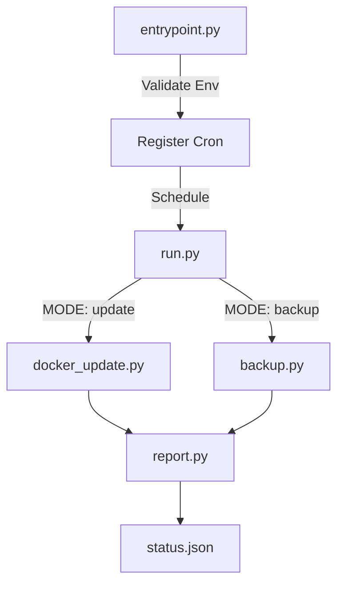
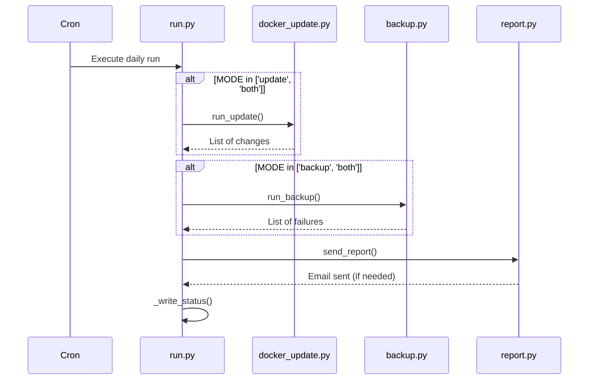

Relevant source files

The following files were used as context for generating this wiki page:

- [README.md](../../../README.md)
- [src/entrypoint.py](../../../src/entrypoint.py)
- [src/run.py](../../../src/run.py)
- [src/config.py](../../../src/config.py)
- [src/docker_update.py](../../../src/docker_update.py)
- [src/backup.py](../../../src/backup.py)

# Getting Started

The **docker-idempotent-update** project is designed to provide automated, daily maintenance for Docker hosts within a single container. Its primary purpose is to pull updated images, recreate modified containers, synchronize application data to remote storage using rclone, and send an email summary only when significant events occur.

Sources: [README.md:1-12](README.md#L1-L12), [AGENTS.md:3-3](AGENTS.md#L3)

The system operates via an internal cron daemon, eliminating the need for host-level dependencies beyond Docker itself. It supports three primary operation modes: `update`, `backup`, or `both`, allowing users to tailor the maintenance tasks to their specific environment requirements.

Sources: [README.md:14-15](README.md#L14-L15), [src/entrypoint.py:22-30](src/entrypoint.py#L22-L30)

## System Architecture

The application is structured into a initialization phase followed by a scheduled execution phase. The `entrypoint.py` script handles environment validation and cron registration, while `run.py` serves as the main execution engine for daily tasks.

This diagram illustrates the high-level flow from container startup to the execution of maintenance tasks and final reporting.
Sources: [README.md:17-25](README.md#L17-L25), [src/entrypoint.py:61-75](src/entrypoint.py#L61-L75), [src/run.py:32-48](src/run.py#L32-L48)

## Core Components

### 1. Initialization and Validation
The entrypoint script performs critical checks before starting the cron daemon. It ensures the Docker socket is available if the update mode is active and verifies the presence of the `rclone.conf` file for backup operations. If necessary configuration templates for backups (`backup.conf`) or email (`msmtprc`) are missing, it initializes them from templates.

Sources: [src/entrypoint.py:32-58](src/entrypoint.py#L32-L58)

### 2. Docker Update Logic
The update step can function in two ways:
*  **Option A (Socket-only):** Pulls images for all running containers and recreates those where the image ID has changed.
*  **Option B (Compose-file):** Executes `docker compose pull` and `up -d --remove-orphans`.

Sources: [README.md:92-100](README.md#L92-L100), [src/docker_update.py:11-23](src/docker_update.py#L11-L23)

### 3. Backup Synchronization
Backup operations use `rclone sync` to transfer data from a source directory (default `/data`) to a remote destination (default `gdrive:backups`). It scans for specific folder names (e.g., `backup` or `backups`) up to two levels deep within application directories.

Sources: [README.md:102-111](README.md#L102-L111), [src/backup.py:42-63](src/backup.py#L42-L63), [src/config.py:23-25](src/config.py#L23-L25)

## Configuration

The system is primarily configured via environment variables and local configuration files stored in the `/config` volume.

### Environment Variables

| Variable | Default | Description |
| :--- | :--- | :--- |
| `MODE` | `both` | Operation mode: `update`, `backup`, or `both`. |
| `CRON_SCHEDULE` | `0 3 * * *` | Standard cron expression for task execution. |
| `DRY_RUN` | `false` | If `true`, logs actions without executing changes. |
| `EMAIL_TO` | *(unset)* | Recipient for the summary report. |
| `COMPOSE_FILE` | *(unset)* | Path to compose file for Option B updates. |

Sources: [README.md:115-125](README.md#L115-L125), [src/config.py:10-21](src/config.py#L10-L21)

### File-Based Configuration

| File | Purpose | Location in Container |
| :--- | :--- | :--- |
| `rclone.conf` | Remote storage credentials and settings. | `/config/rclone.conf` |
| `backup.conf` | Defines `RCLONE_SRC`, `RCLONE_DST`, and target folders. | `/config/backup.conf` |
| `msmtprc` | SMTP server configuration for email reports. | `/config/msmtprc` |

Sources: [README.md:73-81](README.md#L73-L81), [src/entrypoint.py:53-63](src/entrypoint.py#L53-L63), [src/config.py:27-31](src/config.py#L27-L31)

## Execution Flow

When the scheduled time is reached, `run.py` executes the following sequence:

The sequence diagram shows how the main execution script coordinates the update and backup modules before generating reports.
Sources: [src/run.py:32-48](src/run.py#L32-L48), [src/report.py:12-16](src/report.py#L12-L16)

## Summary
To get started with **docker-idempotent-update**, users mount their Docker socket and application data into the container, configure the desired `MODE`, and optionally set up `rclone` and email credentials. The system then autonomously manages image updates, container recreations, and data backups, providing a "set and forget" maintenance solution for Docker environments.

Sources: [README.md:46-68](README.md#L46-L68), [AGENTS.md:3-8](AGENTS.md#L3-L8)
