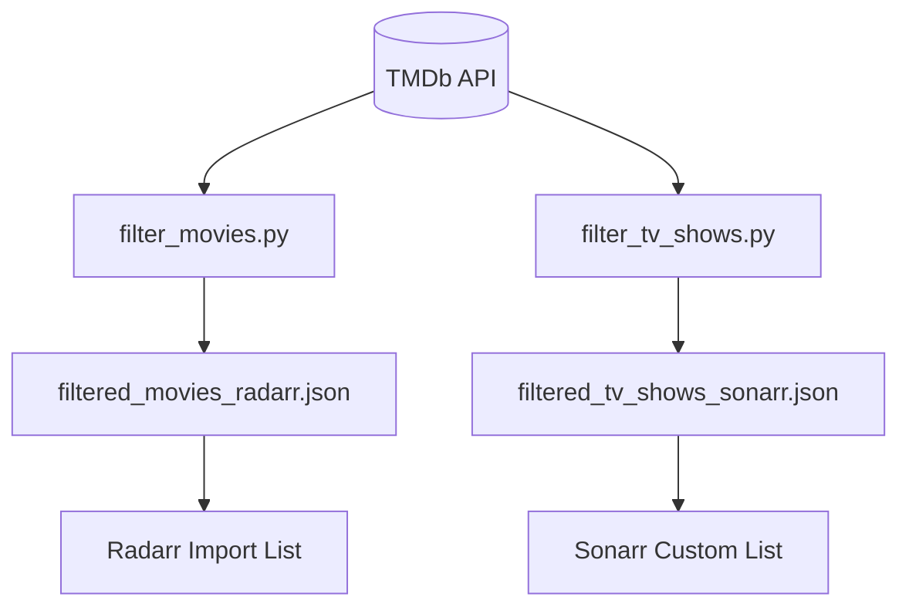
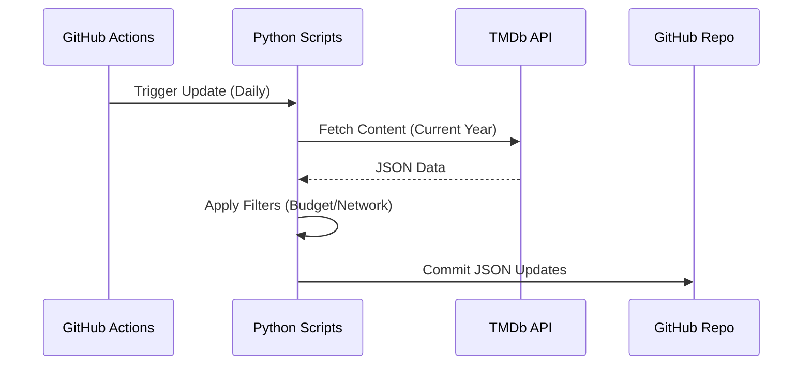

<details>
<summary>Relevant source files</summary>

The following files were used as context for generating this wiki page:

- [README.md](README.md)
- [filter_movies.py](filter_movies.py)
- [filter_tv_shows.py](filter_tv_shows.py)
- [SECURITY.md](SECURITY.md)
- [AGENTS.md](AGENTS.md)
- [CLAUDE.md](CLAUDE.md)
</details>

# Quick Start Guide

This guide provides the necessary steps to set up and use the **filtered-movies** project, which generates automated lists of high-value movies and TV shows for Radarr and Sonarr. The project leverages The Movie Database (TMDb) API to filter content based on production budget for movies and network prestige for TV shows.

The system is designed to run automatically via GitHub Actions, but it can also be executed locally for development or custom filtering purposes. For details on security practices, see [Security Best Practices](#security-best-practices).

Sources: [README.md:1-12](README.md#L1-L12), [AGENTS.md:3-5](AGENTS.md#L3-L5), [CLAUDE.md:3-5](CLAUDE.md#L3-L5)

## System Architecture

The project consists of two primary Python scripts that interact with the TMDb API. These scripts process data and generate JSON files formatted specifically for media management tools like Radarr and Sonarr.



The diagram above illustrates the data flow from the TMDb API through the filtering scripts to the final JSON outputs consumed by Radarr and Sonarr.

Sources: [README.md:14-22](README.md#L14-L22), [filter_movies.py:1-17](filter_movies.py#L1-L17), [filter_tv_shows.py:1-18](filter_tv_shows.py#L1-L18)

## Prerequisites and Local Setup

To run the filtering scripts locally, ensure you have Python 3.8 or later installed. You also require a **TMDb API Read Access Token** (not the standard API Key).

### Environment Configuration
The scripts require the `TMDB_API_KEY` environment variable to be set. This token must be the "API Read Access Token" (a long string starting with `eyJ...`).

| Variable | Description | Source |
|----------|-------------|--------|
| `TMDB_API_KEY` | TMDb API Read Access Token | TMDb API Settings |
| `SENTRY_DSN` | (Optional) Sentry DSN for error tracking | Sentry Project |

Sources: [README.md:52-66](README.md#L52-L66), [filter_movies.py:32-35](filter_movies.py#L32-L35), [filter_tv_shows.py:33-36](filter_tv_shows.py#L33-L36)

### Installation Steps

```bash
# Clone the repository
git clone https://github.com/blixten85/filtered-movies.git
cd filtered-movies

# Install dependencies
pip install requests sentry-sdk

# Set the environment variable (Linux/macOS)
export TMDB_API_KEY="your_read_access_token_here"

# Run the scripts
python3 filter_movies.py
python3 filter_tv_shows.py
```

Sources: [README.md:68-76](README.md#L68-L76), [requirements.txt:1-2](requirements.txt#L1-L2)

## Data Filtering Logic

The project applies specific criteria to identify "high-value" content.

### Movie Filtering (Radarr)
The `filter_movies.py` script targets movies released within the current year that meet a high budget threshold.
*  **Budget:** $\geq$ $100,000,000.
*  **Date Range:** Current year up to today.
*  **Output Format:** StevenLu Custom (includes `title` and `imdb_id`).

### TV Show Filtering (Sonarr)
The `filter_tv_shows.py` script filters for shows premiering in the current year on specific prestige platforms.
*  **Prestige Networks:** Amazon, HBO/Max, Apple TV+, National Geographic.
*  **Requirement:** Must have a TVDB ID.
*  **Output Format:** Sonarr Custom List (includes `TvdbId`).

Sources: [README.md:24-42](README.md#L24-L42), [filter_movies.py:37-38](filter_movies.py#L37-L38), [filter_tv_shows.py:39-49](filter_tv_shows.py#L39-L49)

## Automated Updates

The project is configured to update its lists daily using GitHub Actions.



GitHub Actions workflows run `update-movies.yml` at 06:00 UTC and `update-tv-shows.yml` at 07:00 UTC.

Sources: [README.md:78-87](README.md#L78-L87), [CLAUDE.md:23-26](CLAUDE.md#L23-L26)

## Security Best Practices

Security is maintained through strict handling of API credentials and vulnerability reporting.

### API Key Handling
- Never hardcode keys in the source code.
- Store keys as GitHub Secrets (`TMDB_API_KEY`).
- The scripts read `TMDB_API_KEY` directly from the process environment — they do not load `.env` files. For local development, export the variable (`export TMDB_API_KEY=...`) or `source` a `.env` file yourself before running; keep any such file listed in `.gitignore`.
- If a key is exposed, revoke it immediately via TMDb settings.

Sources: [SECURITY.md:38-54](SECURITY.md#L38-L54), [AGENTS.md:23-23](AGENTS.md#L23)

### Vulnerability Reporting
If a security vulnerability is discovered, report it privately via email to `dev@denied.se` or through the GitHub Security tab "Report a vulnerability" button.

Sources: [SECURITY.md:5-10](SECURITY.md#L5-L10)

## Summary

The Quick Start Guide facilitates the automated curation of premium media lists. By configuring the `TMDB_API_KEY` and utilizing the provided Python scripts, users can generate Radarr and Sonarr compatible lists that focus on big-budget cinema and prestige television. The system ensures data freshness through daily automated GitHub Action cycles while maintaining security through environment variable injection.
