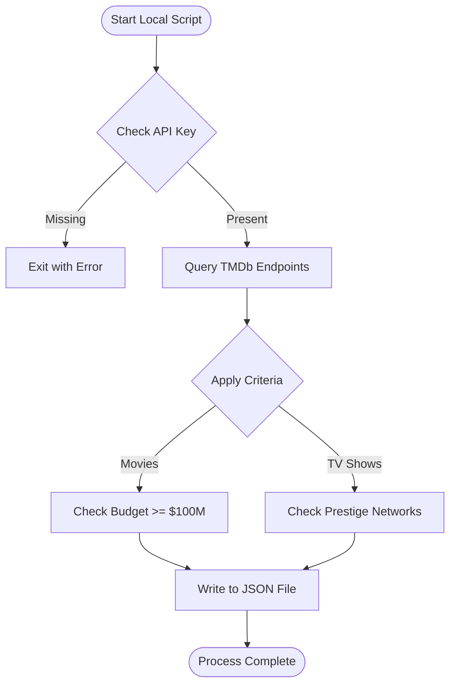
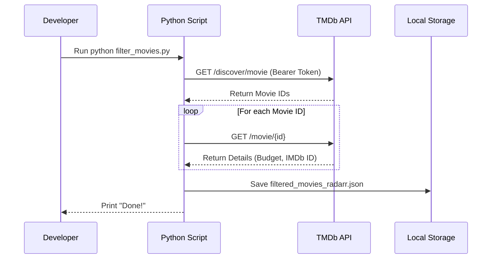

<details>
<summary>Relevant source files</summary>

The following files were used as context for generating this wiki page:

- [README.md](README.md)
- [AGENTS.md](AGENTS.md)
- [SECURITY.md](SECURITY.md)
- [filter_movies.py](filter_movies.py)
- [filter_tv_shows.py](filter_tv_shows.py)
- [requirements.txt](requirements.txt)
</details>

# Local Development Setup

The `filtered-movies` project is a Python-based utility designed to generate curated JSON lists of high-value movies and TV shows for media managers like Radarr and Sonarr. It leverages The Movie Database (TMDb) API to filter content based on production budget and network prestige.

Local development allows contributors to test filtering logic, modify criteria, or debug the data fetching process without waiting for the daily GitHub Actions schedule. The environment relies on Python 3 and requires specific authentication tokens to interact with TMDb.

Sources: [README.md:1-12](README.md#L1-L12), [AGENTS.md:1-11](AGENTS.md#L1-L11)

## Prerequisites

Before setting up the environment, ensure the following requirements are met:

*  **Python Version:** Python 3.8 or later is required.
*  **TMDb API Access:** A "Read Access Token" from TMDb is mandatory. This is distinct from the standard API Key; it is a long string starting with `eyJ...`.
*  **External Dependencies:** The project uses the `requests` library for HTTP communication and `sentry-sdk` for error monitoring.

Sources: [README.md:66-77](README.md#L66-L77), [requirements.txt:1-2](requirements.txt#L1-L2)

## Environment Configuration

The application identifies itself to the TMDb API via an environment variable. Security protocols dictate that these credentials must never be hardcoded into the scripts.

| Variable | Description | Requirement |
| :--- | :--- | :--- |
| `TMDB_API_KEY` | TMDb Read Access Token (starts with `eyJ...`) | **Required** |
| `SENTRY_DSN` | Data Source Name for Sentry error logging | Optional |

Sources: [filter_movies.py:34-37](filter_movies.py#L34-L37), [SECURITY.md:50-58](SECURITY.md#L50-L58)

### Security Best Practices
The scripts read secrets directly from the process environment — they do not load `.env` files themselves. When developing locally, export the variables or `source` a `.env` file yourself before running; keep any such file listed in `.gitignore` to prevent accidental credential leakage. If a key is exposed, it must be revoked immediately via the TMDb settings page.

Sources: [SECURITY.md:53-65](SECURITY.md#L53-L65)

## Installation Steps

To initialize the local development environment, follow this workflow:

```bash
# Clone the repository
git clone https://github.com/blixten85/filtered-movies.git
cd filtered-movies

# Install dependencies
pip install -r requirements.txt

# Export the required token
export TMDB_API_KEY="your_read_access_token_here"
```

Sources: [README.md:79-88](README.md#L79-L88), [AGENTS.md:21-25](AGENTS.md#L21-L25)

## Core Development Scripts

The project consists of two primary execution scripts that handle data retrieval and output generation.

### Execution Flow
The following diagram illustrates the process from authentication to file generation.



This diagram shows the logic flow used by both `filter_movies.py` and `filter_tv_shows.py`.
Sources: [filter_movies.py:33-40](filter_movies.py#L33-L40), [filter_tv_shows.py:38-44](filter_tv_shows.py#L38-L44)

### Script Summary

| Script | Primary Function | Primary Filter | Output File |
| :--- | :--- | :--- | :--- |
| `filter_movies.py` | Generates Radarr-compatible movie list | Budget ≥ $100,000,000 | `filtered_movies_radarr.json` |
| `filter_tv_shows.py` | Generates Sonarr-compatible TV list | Prestige Network (e.g., HBO, Max, Apple TV+) | `filtered_tv_shows_sonarr.json` |

Sources: [AGENTS.md:13-19](AGENTS.md#L13-L19), [filter_movies.py:1-18](filter_movies.py#L1-L18), [filter_tv_shows.py:1-20](filter_tv_shows.py#L1-L20)

## Data Interaction Logic

The local setup allows developers to simulate the production pipeline. The scripts use the `requests` library to fetch data with a retry mechanism for rate-limiting (HTTP 429 errors).



The sequence above details the iterative fetching process used to gather specific metadata like budgets which are not present in the initial search results.
Sources: [filter_movies.py:53-83](filter_movies.py#L53-L83), [filter_movies.py:102-140](filter_movies.py#L102-L140)

### TV Show Filtering Criteria
For TV shows, the script specifically filters for the following networks:
*  HBO / Max
*  Apple TV+
*  National Geographic
*  Amazon / Prime Video

Sources: [filter_tv_shows.py:46-55](filter_tv_shows.py#L46-L55), [README.md:27-38](README.md#L27-L38)

## Conclusion

Local development of the `filtered-movies` project is centered around a Python environment that mimics the GitHub Actions automation. By configuring the `TMDB_API_KEY` and running the provided filtering scripts, developers can verify that content meets the high-value criteria (big budgets or prestige networks) before contributing changes to the filtering logic.

Sources: [README.md:66-88](README.md#L66-L88), [AGENTS.md:21-35](AGENTS.md#L21-L35)
