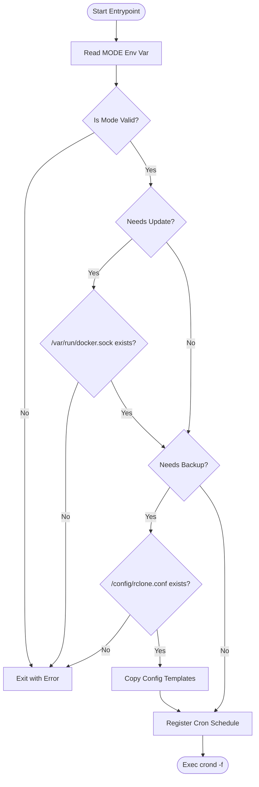
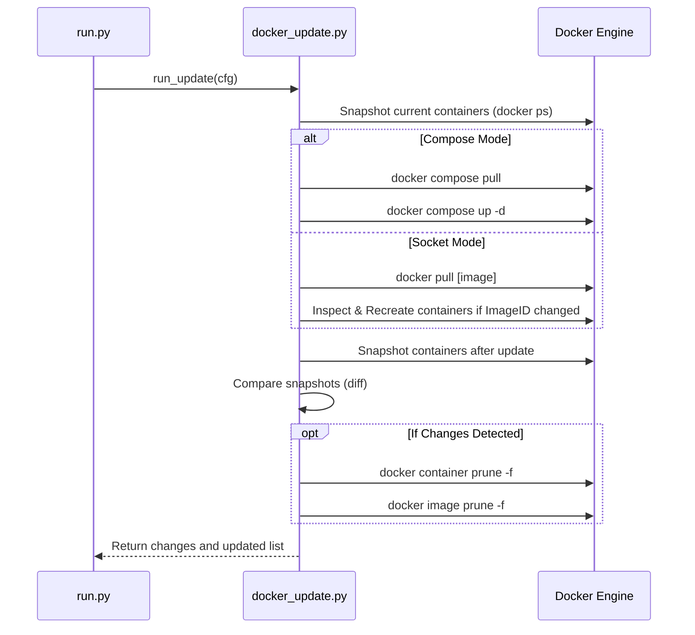
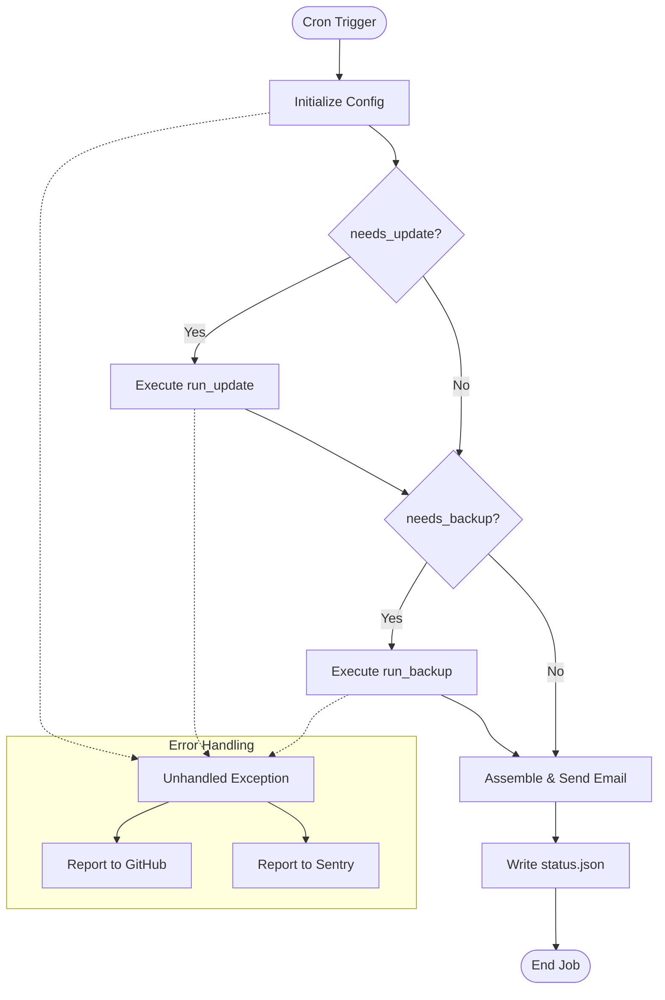

<details>
<summary>Relevant source files</summary>

The following files were used as context for generating this wiki page:

- [README.md](README.md)
- [src/entrypoint.py](src/entrypoint.py)
- [src/run.py](src/run.py)
- [src/docker_update.py](src/docker_update.py)
- [src/backup.py](src/backup.py)
- [src/config.py](src/config.py)
- [src/report.py](src/report.py)
</details>

# Use Cases & Examples

This page provides a detailed overview of the primary operational modes, configuration scenarios, and execution flows for `docker-idempotent-update`. This system is designed to provide daily Docker host maintenance, specifically image updates, container recreation, and data backups via rclone.

The project operates based on a `MODE` environment variable, which determines whether the system performs updates, backups, or both. It utilizes an internal cron daemon to schedule these tasks and provides email notifications only when actions are taken or errors occur.

Sources: [README.md:1-25](README.md#L1-L25), [src/entrypoint.py:1-60](src/entrypoint.py#L1-L60)

## Operational Modes

The behavior of the application is governed by the `MODE` environment variable. The following table outlines the available modes and their requirements:

| MODE | Update Functionality | Backup Functionality | Required Configuration |
| :--- | :--- | :--- | :--- |
| `update` | Enabled | Disabled | Docker socket mount (`/var/run/docker.sock`) |
| `backup` | Disabled | Enabled | `rclone.conf`, `backup.conf` |
| `both` | Enabled | Enabled | Docker socket, rclone config, and backup config |

Sources: [README.md:33-40](README.md#L33-L40), [src/entrypoint.py:20-40](src/entrypoint.py#L20-L40), [src/config.py:10-40](src/config.py#L10-L40)

### Logic Flow for Mode Selection

The following diagram illustrates how the `entrypoint.py` script validates the environment based on the selected mode before initiating the cron daemon.



The entrypoint ensures that the necessary system resources (like the Docker socket) and configuration files are present for the requested operational mode. 

Sources: [src/entrypoint.py:19-68](src/entrypoint.py#L19-L68), [README.md:14-23](README.md#L14-L23)

---

## Use Case 1: Automated Docker Updates

The update mechanism supports two primary execution paths: **Option A (Socket-only)** and **Option B (Compose-based)**.

### Option A: Socket-only Updates
In this scenario, the application queries the Docker socket to find all running containers, pulls their corresponding images, and recreates any container whose image ID has changed. 

### Option B: Compose-based Updates
This is the recommended approach. It uses the `docker compose` command to pull images and run `up -d --remove-orphans`. This preserves complex service relationships defined in your compose files.

### Update Process Sequence
The following sequence diagram shows the internal logic of the update step within `src/docker_update.py`.



The system performs a "before and after" snapshot to detect actual changes, ensuring that maintenance reports are accurate.

Sources: [src/docker_update.py:13-130](src/docker_update.py#L13-L130), [README.md:85-100](README.md#L85-L100)

---

## Use Case 2: Data Backups via rclone

The backup system utilizes `rclone sync` to move data from a source directory (default `/data`) to a remote destination (default `gdrive:backups`).

### Directory Discovery Logic
The system scans the source directory for subfolders specifically named in the `BACKUP_DIRS` configuration (defaulting to `backup` or `backups`). It performs this scan up to two levels deep.

- **Example Structure**:
  - `/data/prowlarr/backups/` $\rightarrow$ `remote:backups/prowlarr/backups/`
  - `/data/sonarr/config/backup/` $\rightarrow$ `remote:backups/sonarr/backup/`

Sources: [src/backup.py:40-100](src/backup.py#L40-L100), [src/config.py:42-60](src/config.py#L42-L60), [README.md:102-114](README.md#L102-L114)

### Backup Configuration (`backup.conf`)
Users can override default backup behaviors by editing `/config/backup.conf`.

| Parameter | Default Value | Description |
| :--- | :--- | :--- |
| `RCLONE_SRC` | `/data` | The base directory on the host to scan for backups. |
| `RCLONE_DST` | `gdrive:backups` | The rclone remote and path for storage. |
| `BACKUP_DIRS` | `backup backups` | Space-separated list of folder names to sync. |

Sources: [src/config.py:22-55](src/config.py#L22-L55), [README.md:116-130](README.md#L116-L130)

---

## Use Case 3: Reporting and Notifications

The system is designed to be "quiet" and only sends notifications via `msmtp` when specific conditions are met during the daily run at 03:00 (default).

### Notification Conditions
Reports are generated and sent if:
1. One or more containers were successfully updated.
2. One or more backup operations failed.
3. An unhandled exception occurred during the execution of `run.py`.

If no changes occurred and all backups were successful, no email is sent.

### Status Tracking
Regardless of whether an email is sent, the system writes a `status.json` file to the `/config` directory after every run. This file contains the timestamp, mode, lists of updated containers, and backup failures.

```json
{
  "timestamp": "2023-10-27T03:00:00Z",
  "mode": "both",
  "dry_run": false,
  "containers_updated": ["nginx", "db"],
  "backup_failures": [],
  "docker_changes": "> nginx latest ...\n> db latest ..."
}
```

Sources: [src/run.py:53-70](src/run.py#L53-L70), [src/report.py:11-45](src/report.py#L11-L45), [README.md:27-31](README.md#L27-L31)

---

## Execution Flow Example

The following diagram summarizes the complete execution flow of the `src/run.py` script, which is triggered by the cron daemon.



Sources: [src/run.py:27-51](src/run.py#L27-L51), [src/run.py:80-90](src/run.py#L80-L90), [src/report.py:11-20](src/report.py#L11-L20)

## Summary

`docker-idempotent-update` serves as a lightweight, dependency-free maintenance agent for Docker hosts. By combining container updates and rclone backups into a single scheduled process, it ensures that applications stay current and data is safely off-sited. The system's "report-by-exception" philosophy minimizes notification fatigue, while the `status.json` and error reporting features provide transparency for administrators.

Sources: [README.md:1-25](README.md#L1-L25), [AGENTS.md:1-15](AGENTS.md#L1-L15)
