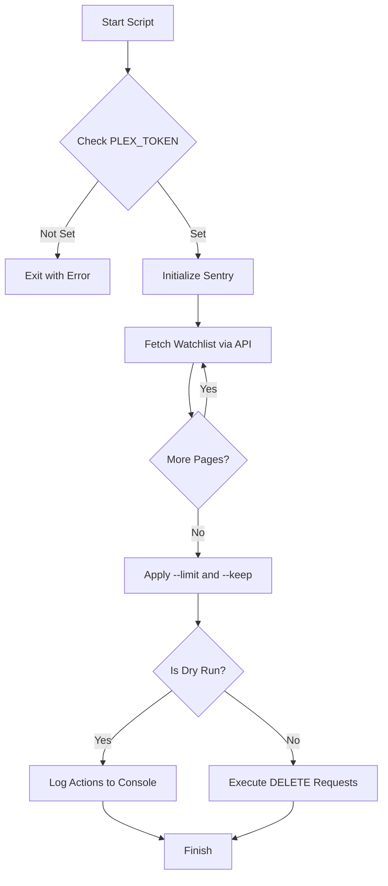

<details>
<summary>Relevant source files</summary>

The following files were used as context for generating this wiki page:

- [README.md](README.md)
- [requirements.txt](requirements.txt)
- [plex_clear_watchlist.py](plex_clear_watchlist.py)
- [AGENTS.md](AGENTS.md)
- [docker-compose.yml](docker-compose.yml)
- [SECURITY.md](SECURITY.md)
</details>

# Python Setup

The Python setup for `plex_clear_watchlist` provides a lightweight, single-purpose automation tool designed to manage and clear a user's Plex Watchlist via the Plex API. The environment is built around Python 3.14 and utilizes minimal external dependencies to interface with Plex web services and provide error tracking.

The system is architected as a one-shot execution script that can be run natively in a Python environment or encapsulated within a Docker container. Its primary scope includes fetching paginated watchlist data, applying user-defined filters (limits and retention), and performing authenticated deletion requests.

Sources: [AGENTS.md:5-7](AGENTS.md#L5-L7), [README.md:10-12](README.md#L10-L12), [plex_clear_watchlist.py:1-25](plex_clear_watchlist.py#L1-L25)

## Environment Configuration

The application relies on environment variables for authentication and optional monitoring. Secrets are never hardcoded and must be provided at runtime to ensure security.

### Core Dependencies
The project utilizes two primary external libraries:
*  `requests`: Used for all HTTP interactions with the Plex API.
*  `sentry-sdk`: Employed for error tracking and reporting when a DSN is provided.

Sources: [requirements.txt:1-2](requirements.txt#L1-L2), [plex_clear_watchlist.py:4-5](plex_clear_watchlist.py#L4-L5)

### Configuration Variables
| Variable | Description | Requirement |
| :--- | :--- | :--- |
| `PLEX_TOKEN` | Authenticates requests to the Plex API. Obtained from plex.tv account settings. | **Required** |
| `SENTRY_DSN` | Data Source Name for Sentry error tracking. | Optional |

Sources: [README.md:14-18](README.md#L14-L18), [plex_clear_watchlist.py:9-11](plex_clear_watchlist.py#L9-L11), [docker-compose.yml:7-8](docker-compose.yml#L7-L8)

## System Architecture and Data Flow

The script follows a linear execution path: initializing configuration, fetching the complete watchlist through paginated API calls, filtering the list based on user arguments, and executing deletions.

### Execution Flow Diagram
The following diagram illustrates the internal logic flow of the Python script during a standard execution.



Sources: [plex_clear_watchlist.py:9-140](plex_clear_watchlist.py#L9-L140)

### Plex API Interaction
The script interacts with the Plex API v2 endpoint. It uses paginated GET requests to retrieve items and specific DELETE requests per item.

| Endpoint | Method | Purpose |
| :--- | :--- | :--- |
| `/api/v2/user/watchlist` | `GET` | Retrieve list items (supports `page`, `pageSize`, and `sort`). |
| `/api/v2/user/watchlist/{rating_key}` | `DELETE` | Remove a specific item by its rating key. |

Sources: [plex_clear_watchlist.py:18-19](plex_clear_watchlist.py#L18-L19), [plex_clear_watchlist.py:30-45](plex_clear_watchlist.py#L30-L45), [plex_clear_watchlist.py:65-67](plex_clear_watchlist.py#L65-L67)

## Command Line Interface (CLI)

The Python setup includes a robust argument parser to control the behavior of the watchlist clearing process.

### Arguments and Options
Users can modify the script's behavior using the following flags:

*  **`--dry-run`**: Prevents actual deletion. The script will log exactly which items would have been removed.
*  **`--limit N`**: Restricts the deletion to a maximum of `N` items.
*  **`--keep N`**: Retains the `N` most recently added items in the watchlist while clearing the rest.

Sources: [README.md:43-47](README.md#L43-L47), [plex_clear_watchlist.py:84-87](plex_clear_watchlist.py#L84-L87)

### Logic Sequence for Item Selection
The script processes filters in a specific order to determine the final deletion set:
1.  **Retention**: If `--keep` is used, the most recent items are sliced out of the list.
2.  **Limitation**: If `--limit` is used, the remaining list is truncated to the specified size.

```python
# Sources: [plex_clear_watchlist.py:115-121]
if args.keep > 0 and args.keep < total:
    items = items[:-args.keep]

if args.limit > 0 and args.limit < len(items) :
    items = items[:args.limit]
```

## Error Handling and Security

### Security Best Practices
As defined in the security policy and script conventions:
*  **No Hardcoded Secrets**: `PLEX_TOKEN` is strictly sourced from environment variables.
*  **Timeout Management**: All API requests implement a 30-second timeout to prevent hanging processes.
*  **Paginaton Safety**: The script raises an `HTTPError` if a 404 occurs mid-pagination to avoid accidental partial deletions caused by API inconsistencies.

Sources: [SECURITY.md:15-17](SECURITY.md#L15-L17), [plex_clear_watchlist.py:23](plex_clear_watchlist.py#L23), [plex_clear_watchlist.py:37-45](plex_clear_watchlist.py#L37-L45)

### Error Reporting
When `SENTRY_DSN` is configured, the system automatically captures:
*  Request exceptions during watchlist retrieval.
*  Individual item deletion failures.

Sources: [plex_clear_watchlist.py:89-96](plex_clear_watchlist.py#L89-L96), [plex_clear_watchlist.py:108-110](plex_clear_watchlist.py#L108-L110), [plex_clear_watchlist.py:141-149](plex_clear_watchlist.py#L141-L149)

The Python setup ensures a reliable and configurable workflow for managing Plex metadata with safety checks integrated into both the CLI and the API interaction logic.
