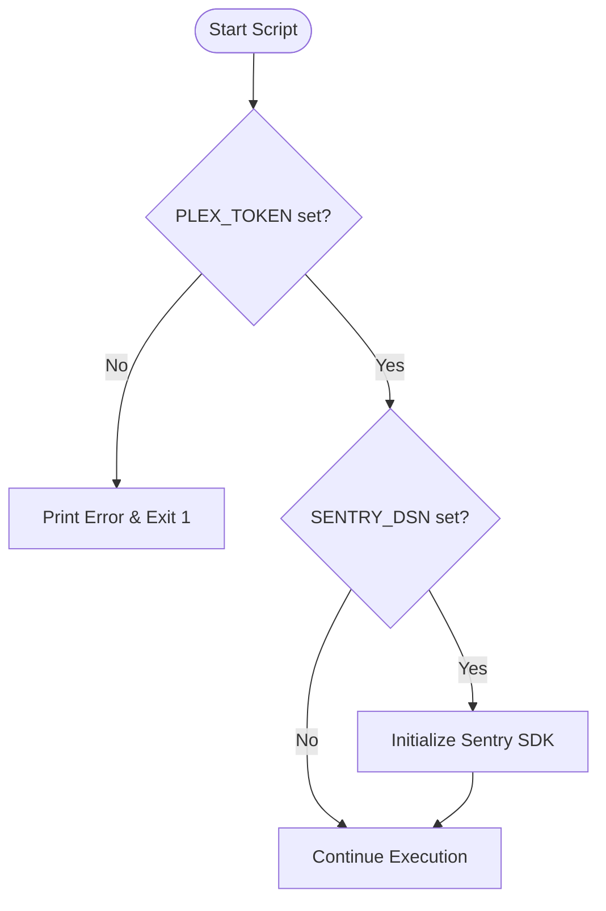
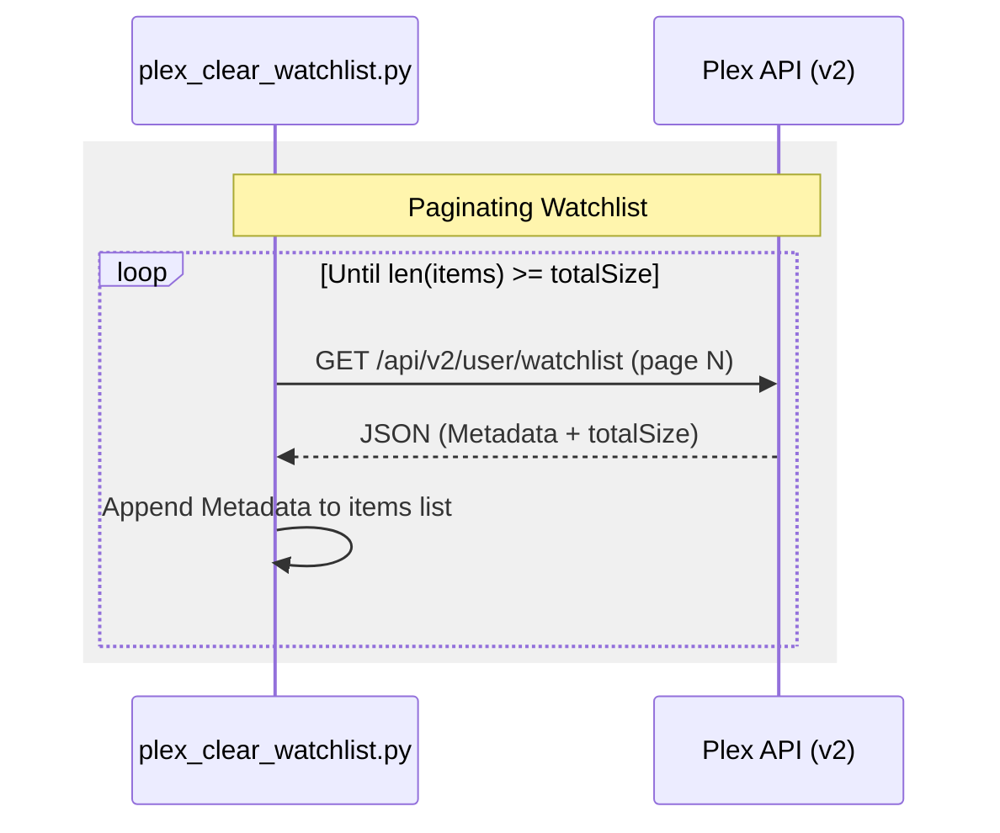

Relevant source files

The following files were used as context for generating this wiki page:

- [README.md](README.md)
- [requirements.txt](requirements.txt)
- [plex_clear_watchlist.py](plex_clear_watchlist.py)
- [AGENTS.md](AGENTS.md)
- [CLAUDE.md](CLAUDE.md)
- [docker-compose.yml](docker-compose.yml)
- [SECURITY.md](SECURITY.md)

# Python Setup

The Python setup for the `plex_clear_watchlist` project is designed as a lightweight, single-purpose utility used to interact with the Plex API. The environment is built around Python 3.14 and focuses on managing a user's Plex Watchlist through specific operations such as retrieval and deletion of items. 

Sources: [AGENTS.md:5-10](AGENTS.md#L5-L10), [CLAUDE.md:5-10](CLAUDE.md#L5-L10), [plex_clear_watchlist.py:1-5](plex_clear_watchlist.py#L1-L5)

## Dependency Management

The project relies on a minimal set of external libraries to handle HTTP requests and error tracking. These dependencies are listed in the `requirements.txt` file and must be installed prior to running the script directly on a host machine.

### Required Packages

| Package | Version | Description |
| :--- | :--- | :--- |
| `requests` | Latest | Handles synchronous HTTP requests to the Plex API. |
| `sentry-sdk` | >=2.0.0 | Provides error tracking and performance monitoring. |

Sources: [requirements.txt:1-2](requirements.txt#L1-L2), [plex_clear_watchlist.py:4-7](plex_clear_watchlist.py#L4-L7)

## Environment Configuration

The application requires specific environment variables to authenticate with Plex and optionally report errors to Sentry. The logic for loading these variables is found in the initialization section of the main script.

### Configuration Variables

| Variable | Required | Description |
| :--- | :--- | :--- |
| `PLEX_TOKEN` | Yes | Authentication token obtained from Plex settings. |
| `SENTRY_DSN` | No | Data Source Name for Sentry error tracking. |

The following flow diagram illustrates the initialization check for the `PLEX_TOKEN` variable:

Sources: [plex_clear_watchlist.py:10-16](plex_clear_watchlist.py#L10-L16), [README.md:14-16](README.md#L14-L16), [docker-compose.yml:7-8](docker-compose.yml#L7-L8)

## Execution Logic and Data Flow

The script follows a linear execution path: authenticating, fetching the watchlist with pagination, applying filters (limit/keep), and performing deletions.

### Watchlist Retrieval Process
The `get_watchlist()` function implements a paginated fetch mechanism to ensure all items are retrieved from the Plex API.

### Script Arguments
The script uses `argparse` to provide a command-line interface for controlling execution behavior.

| Argument | Type | Default | Description |
| :--- | :--- | :--- | :--- |
| `--dry-run` | Flag | False | Logs actions without performing API DELETE requests. |
| `--limit` | Integer | 0 | Limits the number of items processed (0 = all). |
| `--keep` | Integer | 0 | Preserves the N most recently added items. |

Sources: [plex_clear_watchlist.py:31-61](plex_clear_watchlist.py#L31-L61), [plex_clear_watchlist.py:91-97](plex_clear_watchlist.py#L91-L97), [README.md:38-42](README.md#L38-L42)

## Error Handling and Security

Security is maintained by ensuring that sensitive tokens like `PLEX_TOKEN` are never hardcoded and are passed via environment variables or Docker secrets. Retrieval failures are handled through `response.raise_for_status()`; deletion failures are handled separately (see below) and reported via Sentry integration.

### Error Handling Flow
- **API Failures:** If a 404 occurs during pagination, the script raises an `HTTPError` to prevent partial deletions based on incomplete data.
- **Deletion Failures:** `delete_from_watchlist()` checks the response for HTTP 200/204 and returns `False` on any other status — it does not call `raise_for_status()`.
- **Sentry Integration:** Errors are captured via `sentry_sdk.capture_exception` if a request fails and the script is not in dry-run mode.

Sources: [plex_clear_watchlist.py:41-50](plex_clear_watchlist.py#L41-L50), [plex_clear_watchlist.py:114-118](plex_clear_watchlist.py#L114-L118), [SECURITY.md:15-18](SECURITY.md#L15-L18)

## Summary
The Python setup for `plex_clear_watchlist` provides a robust CLI tool for Plex maintenance. It leverages a modern Python stack (3.14) with the `requests` library to interface with the Plex API v2. By utilizing environment variables for configuration and offering comprehensive dry-run capabilities, it ensures safe and flexible operation for managing media watchlists.
