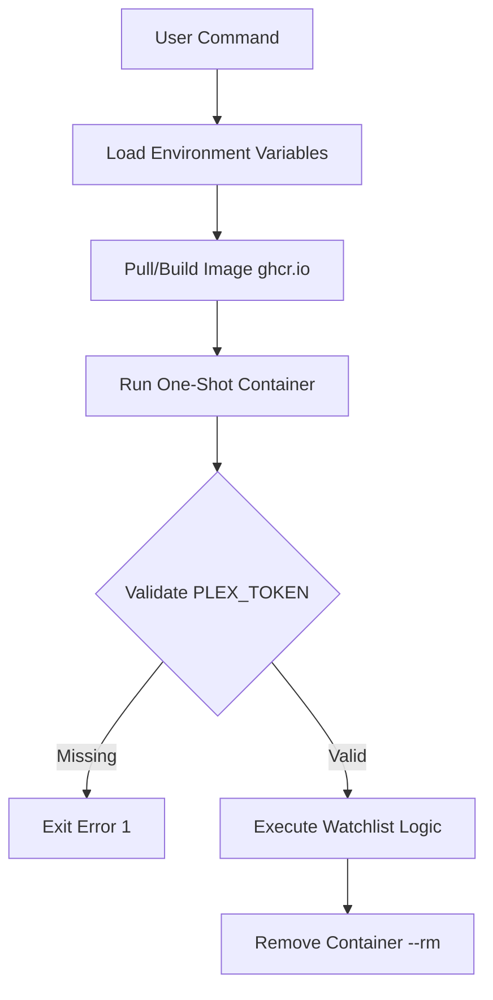
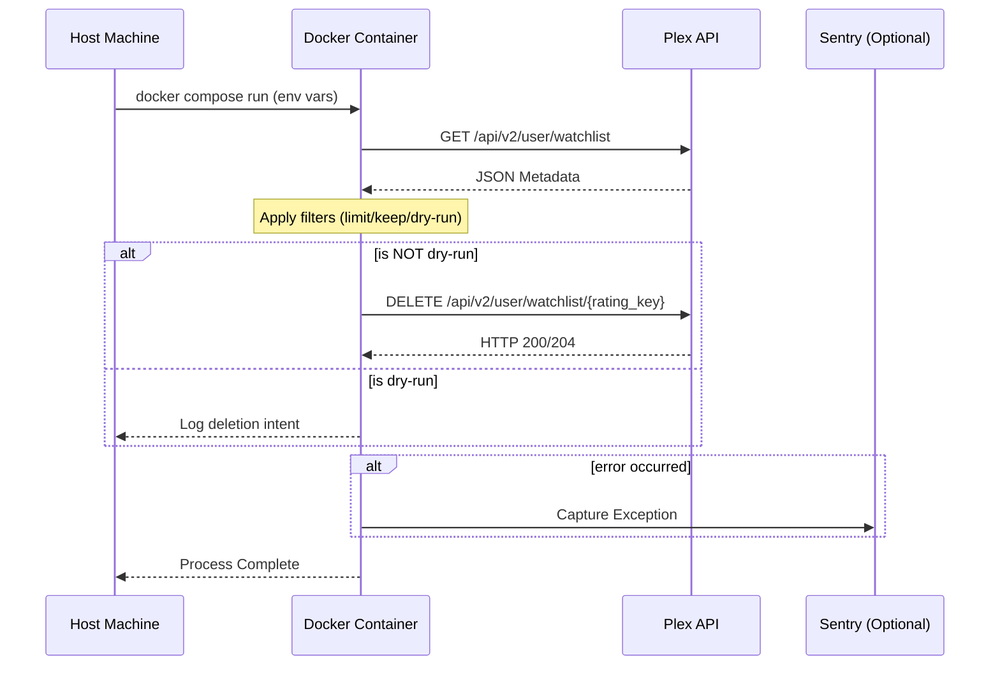

<details>
<summary>Relevant source files</summary>

The following files were used as context for generating this wiki page:

- [README.md](README.md)
- [docker-compose.yml](docker-compose.yml)
- [plex_clear_watchlist.py](plex_clear_watchlist.py)
- [AGENTS.md](AGENTS.md)
- [CLAUDE.md](CLAUDE.md)
- [requirements.txt](requirements.txt)
</details>

# Docker Setup

The Docker setup for `plex_clear_watchlist` is designed to provide a portable, "one-shot" execution environment for the Python-based utility. Its primary purpose is to interact with the Plex API to manage and clear a user's Watchlist without requiring the user to manually manage Python dependencies like `requests` or `sentry-sdk`.

The environment leverages Docker and Docker Compose to automate the deployment of the script, ensuring that the correct Python 3.14 environment is utilized. Configuration is handled strictly through environment variables to maintain security and prevent credential leakage.

Sources: [AGENTS.md:3-8](AGENTS.md#L3-L8), [README.md:1-10](README.md#L1-L10), [requirements.txt:1-2](requirements.txt#L1-L2)

## Container Architecture

The system operates as a transient container service. When triggered via Docker Compose or the Docker CLI, it initializes the Python environment, executes the `plex_clear_watchlist.py` script, and terminates upon completion.

### Deployment Flow

The following diagram illustrates the lifecycle of the Docker container from execution to completion.



Sources: [docker-compose.yml:1-7](docker-compose.yml#L1-L7), [plex_clear_watchlist.py:10-15](plex_clear_watchlist.py#L10-L15), [AGENTS.md:10-15](AGENTS.md#L10-L15)

## Docker Compose Configuration

The `docker-compose.yml` file defines a single service, `plex-clear-watchlist`, which uses the official image hosted on the GitHub Container Registry (GHCR).

### Service Specifications

| Parameter | Value / Source | Description |
|---|---|---|
| Image | `ghcr.io/blixten85/plex-clear-watchlist:latest` | The pre-built production image. |
| Build | `.` | Context for building the image locally via Dockerfile. |
| Environment | `PLEX_TOKEN`, `SENTRY_DSN` | Variables passed from the host to the container. |

Sources: [docker-compose.yml:2-7](docker-compose.yml#L2-L7), [README.md:40-42](README.md#L40-L42)

### Environment Variables
Security is enforced by requiring sensitive information to be passed through environment variables rather than being hardcoded in the script or image.

*  **`PLEX_TOKEN`**: Required. This token authorizes the script to modify the Plex Watchlist. It is sourced from the host environment or a `.env` file.
*  **`SENTRY_DSN`**: Optional. Used for error tracking. If unset, it defaults to an empty string in the Compose file, and the application treats it as a no-op.

```yaml
services:
  plex-clear-watchlist:
    image: ghcr.io/blixten85/plex-clear-watchlist:latest
    build: .
    environment:
      - PLEX_TOKEN=${PLEX_TOKEN}
      - SENTRY_DSN=${SENTRY_DSN:-}
```

Sources: [docker-compose.yml:1-7](docker-compose.yml#L1-L7), [plex_clear_watchlist.py:10-15](plex_clear_watchlist.py#L10-L15), [SECURITY.md:15-17](SECURITY.md#L15-L17)

## Execution Modes

The Docker setup supports several execution flags passed as arguments to the container entrypoint. These flags allow users to control the deletion logic.

### Comparison of Execution Commands

| Command | Mode | Result |
|---|---|---|
| `docker compose run --rm ... --dry-run` | Simulation | Logs items that would be deleted without making API calls. |
| `docker compose run --rm ... --limit 10` | Restricted | Deletes only the first 10 items found in the list. |
| `docker compose run --rm ... --keep 5` | Retention | Keeps the 5 most recently added items and deletes the rest. |

Sources: [README.md:23-28](README.md#L23-L28), [plex_clear_watchlist.py:91-95](plex_clear_watchlist.py#L91-L95), [CLAUDE.md:12-17](CLAUDE.md#L12-L17)

### Container Data Flow
The sequence diagram below shows how the Docker container interacts with external Plex and Sentry services.



Sources: [plex_clear_watchlist.py:27-88](plex_clear_watchlist.py#L27-L88), [README.md:20-35](README.md#L20-L35), [AGENTS.md:20-22](AGENTS.md#L20-L22)

## Summary

The Docker setup provides a secure and automated way to manage Plex Watchlists. By containerizing the Python script and its dependencies (`requests`, `sentry-sdk`), the project ensures consistent behavior across different environments. The integration with Docker Compose facilitates easy credential management via environment variables and supports various operational modes such as dry-runs and item limits.

Sources: [README.md:1-5](README.md#L1-L5), [AGENTS.md:1-5](AGENTS.md#L1-L5), [requirements.txt:1-2](requirements.txt#L1-L2)
