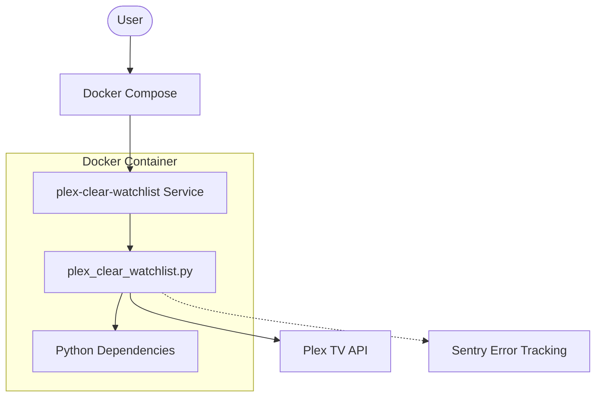
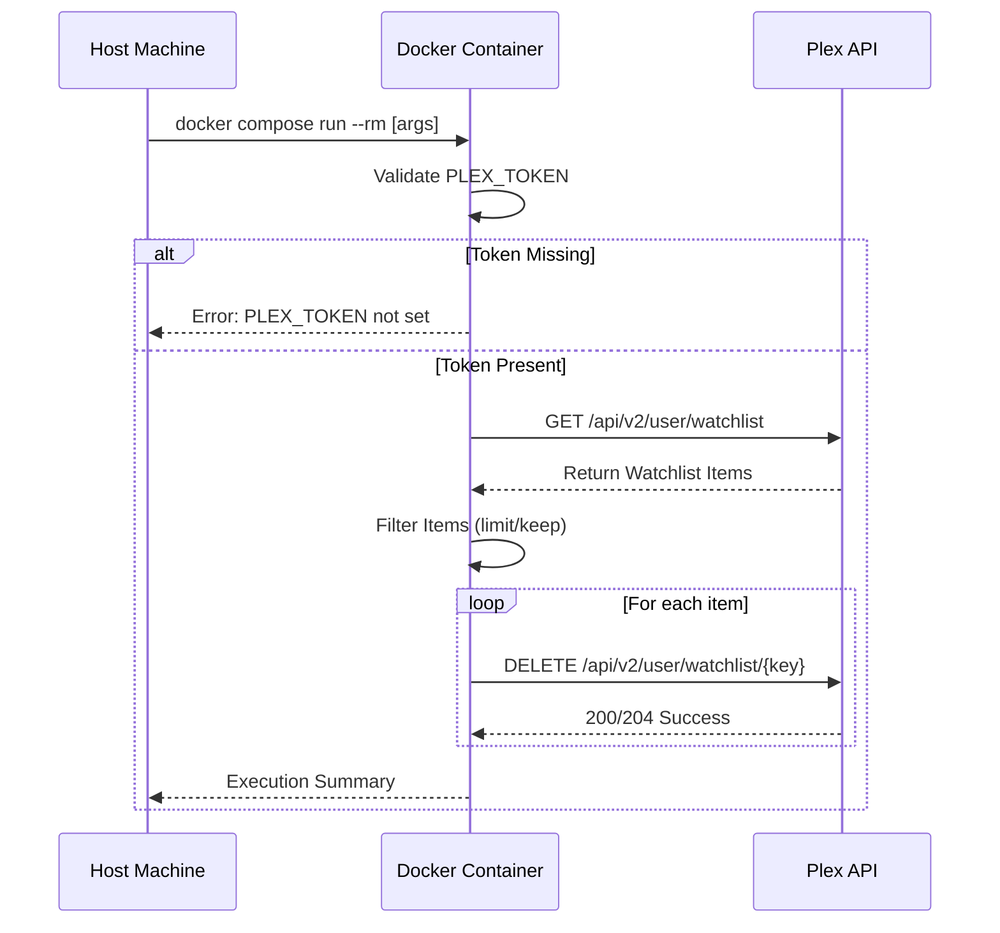

Relevant source files

The following files were used as context for generating this wiki page:

- [README.md](README.md)
- [docker-compose.yml](docker-compose.yml)
- [plex_clear_watchlist.py](plex_clear_watchlist.py)
- [AGENTS.md](AGENTS.md)
- [CLAUDE.md](CLAUDE.md)
- [requirements.txt](requirements.txt)

# Docker Setup

The Docker setup for `plex_clear_watchlist` is designed to provide a portable, one-shot execution environment for clearing items from a Plex Watchlist. By encapsulating the Python-based script and its dependencies—such as `requests` and `sentry-sdk`—within a container, the project ensures consistent behavior across different platforms without requiring local Python installation.

Sources: [AGENTS.md:3-5](AGENTS.md#L3-L5), [CLAUDE.md:3-5](CLAUDE.md#L3-L5), [requirements.txt:1-2](requirements.txt#L1-L2)

The system relies on Docker Compose to manage environment variables and execution flags. It specifically targets a "one-shot" workflow where the container is spun up, performs the requested deletion or dry-run, and is then immediately removed.

Sources: [README.md:21-36](README.md#L21-L36), [docker-compose.yml:1-7](docker-compose.yml#L1-L7)

## Architecture and Components

The Docker implementation consists of a single service that interacts with the Plex API via the containerized Python script.

### Service Definition
The service, named `plex-clear-watchlist`, is configured to build from the local directory or pull the latest image from the GitHub Container Registry (GHCR).

The diagram above illustrates how the Docker Compose service encapsulates the main script and its interactions with external APIs.
Sources: [docker-compose.yml:2-7](docker-compose.yml#L2-L7), [AGENTS.md:14-19](AGENTS.md#L14-L19)

### Environment Configuration
The containerized application requires specific environment variables to function, which are passed from the host system or a `.env` file through the Docker Compose layer.

| Variable | Source File | Description | Required |
| :--- | :--- | :--- | :--- |
| `PLEX_TOKEN` | `docker-compose.yml:6` | Authentication token for Plex API access | Yes |
| `SENTRY_DSN` | `docker-compose.yml:7` | Data Source Name for error tracking via Sentry | No |

Sources: [README.md:14-19](README.md#L14-L19), [docker-compose.yml:5-7](docker-compose.yml#L5-L7), [plex_clear_watchlist.py:9-14](plex_clear_watchlist.py#L9-L14)

## Execution Flow

The Docker setup supports several execution modes through CLI arguments passed to the `docker compose run` command.

### Initialization Sequence
When the container starts, the script validates the presence of the `PLEX_TOKEN`. If missing, the process terminates with an error code.

This sequence shows the interaction between the host, the containerized environment, and the remote Plex API.
Sources: [plex_clear_watchlist.py:9-14, 102-159](plex_clear_watchlist.py#L9-L14), [README.md:21-28](README.md#L21-L28)

## Configuration and Flags

Docker commands for this project utilize the `--rm` flag to ensure the container is removed after the one-shot task is completed. The following table details how Docker handles specific script flags:

| Flag | Docker Usage Example | Outcome |
| :--- | :--- | :--- |
| `--dry-run` | `docker compose run --rm plex-clear-watchlist --dry-run` | Logs items that would be deleted without making API changes. |
| `--limit N` | `docker compose run --rm plex-clear-watchlist --limit 10` | Deletes only the first N items found in the watchlist. |
| `--keep N` | `docker compose run --rm plex-clear-watchlist --keep 5` | Retains the N most recently added items and deletes the rest. |

Sources: [README.md:21-28, 43-47](README.md#L21-L28), [AGENTS.md:10-14](AGENTS.md#L10-L14), [plex_clear_watchlist.py:93-97](plex_clear_watchlist.py#L93-L97)

## Dependency Management

The Docker environment is built around Python 3.14 and includes specific libraries managed via `requirements.txt`.

- **requests**: Used for all HTTP communication with the Plex API, including paginated GET requests and DELETE requests.
- **sentry-sdk**: Utilized for error reporting if `SENTRY_DSN` is provided.

Sources: [requirements.txt:1-2](requirements.txt#L1-L2), [plex_clear_watchlist.py:4-5, 33-35, 62-64](plex_clear_watchlist.py#L4-L5), [AGENTS.md:8](AGENTS.md#L8)

## Summary

The Docker setup provides a streamlined, ephemeral execution model for the `plex_clear_watchlist` tool. By utilizing Docker Compose, users can safely manage their `PLEX_TOKEN` and run the script with various filters (`--limit`, `--keep`) or in a safe mode (`--dry-run`) without polluting their local environment with Python dependencies.

Sources: [README.md:21-36](README.md#L21-L36), [CLAUDE.md:14-18](CLAUDE.md#L14-L18)
