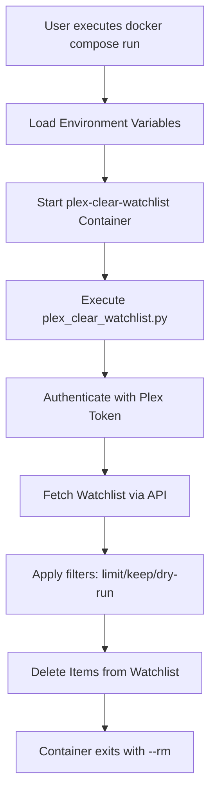
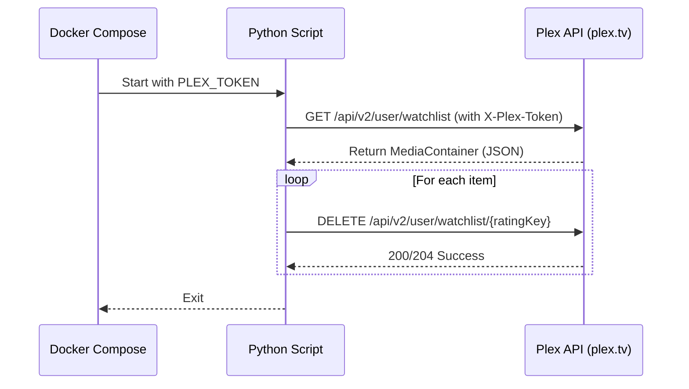

Relevant source files

The following files were used as context for generating this wiki page:

- [README.md](README.md)
- [docker-compose.yml](docker-compose.yml)
- [plex_clear_watchlist.py](plex_clear_watchlist.py)
- [AGENTS.md](AGENTS.md)
- [CLAUDE.md](CLAUDE.md)
- [SECURITY.md](SECURITY.md)

# Docker Compose Setup

The Docker Compose setup for the `plex_clear_watchlist` project provides a containerized environment to execute a Python-based utility that interacts with the Plex API. Its primary purpose is to automate the removal of items from a user's Plex Watchlist. The system is designed as a "one-shot" container, meaning it is intended to run a specific task and then exit, rather than running as a persistent background service.

Sources: [AGENTS.md:3-5](AGENTS.md#L3-L5), [CLAUDE.md:3-5](CLAUDE.md#L3-L5), [README.md:10-12](README.md#L10-L12)

## Service Configuration

The setup is defined in a `docker-compose.yml` file which specifies a single service named `plex-clear-watchlist`. This service can be built locally using the provided `Dockerfile` or pulled as a pre-built image from the GitHub Container Registry.

Sources: [docker-compose.yml:2-4](docker-compose.yml#L2-L4), [README.md:27-29](README.md#L27-L29)

### Image and Build
The service utilizes the following image and build parameters:
- **Image**: `ghcr.io/blixten85/plex-clear-watchlist:latest`
- **Build Context**: The current directory (`.`), indicating it uses a local Dockerfile to build the Python 3.14 environment.

Sources: [docker-compose.yml:3-4](docker-compose.yml#L3-L4), [AGENTS.md:7](AGENTS.md#L7)

### Environment Variables
The Docker Compose configuration relies on environment variables to pass sensitive information and configuration to the Python script.

| Variable | Description | Requirement |
| :--- | :--- | :--- |
| `PLEX_TOKEN` | Authentication token for the Plex API. | Mandatory |
| `SENTRY_DSN` | Data Source Name for Sentry error tracking. | Optional |

Sources: [docker-compose.yml:5-7](docker-compose.yml#L5-L7), [SECURITY.md:19](SECURITY.md#L19), [README.md:17-19](README.md#L17-L19)

## Operational Workflow

The Docker Compose setup is designed for interactive or scheduled execution. Users provide the necessary `PLEX_TOKEN` either via the command line or a `.env` file.

### Execution Flow
The following diagram illustrates the lifecycle of a single execution using Docker Compose.

The workflow ensures that the container is cleaned up automatically after execution via the `--rm` flag.
Sources: [README.md:21-25](README.md#L21-L25), [plex_clear_watchlist.py:101-140](plex_clear_watchlist.py#L101-L140)

### Interaction with Plex API
The containerized script communicates with the Plex API using the provided token.

Sources: [plex_clear_watchlist.py:27-56](plex_clear_watchlist.py#L27-L56), [plex_clear_watchlist.py:65-73](plex_clear_watchlist.py#L65-L73)

## Command Line Arguments

When running via Docker Compose, users can pass arguments directly to the underlying Python script to control the deletion logic.

| Argument | Description | Usage Example |
| :--- | :--- | :--- |
| `--dry-run` | Shows items that would be deleted without performing the action. | `docker compose run --rm plex-clear-watchlist --dry-run` |
| `--limit N` | Restricts the deletion to a maximum of N items. | `docker compose run --rm plex-clear-watchlist --limit 10` |
| `--keep N` | Retains the N most recently added items in the watchlist. | `docker compose run --rm plex-clear-watchlist --keep 5` |

Sources: [README.md:21-25](README.md#L21-L25), [plex_clear_watchlist.py:91-95](plex_clear_watchlist.py#L91-L95), [AGENTS.md:13-16](AGENTS.md#L13-L16)

## Security and Best Practices

The Docker Compose setup adheres to specific security guidelines to protect user credentials:
- **No Hardcoded Tokens**: The `PLEX_TOKEN` is never stored in the image or the repository; it is injected at runtime.
- **Environment Files**: Support for `.env` files allows users to manage secrets locally without exposing them in shell history.
- **Minimal Image**: The use of a focused Python 3.14 environment reduces the attack surface.

Sources: [SECURITY.md:19-21](SECURITY.md#L19-L21), [AGENTS.md:21](AGENTS.md#L21), [docker-compose.yml:6](docker-compose.yml#L6)

## Summary
The Docker Compose setup provides a standardized, portable method for running the Plex Clear Watchlist utility. By leveraging environment variables for authentication and supporting various runtime flags, it allows for safe and configurable watchlist management through a simple containerized command.

Sources: [README.md:21-25](README.md#L21-L25), [docker-compose.yml:1-7](docker-compose.yml#L1-L7)
