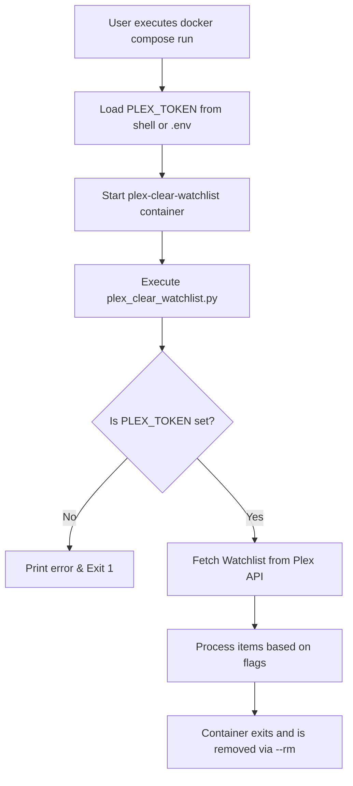
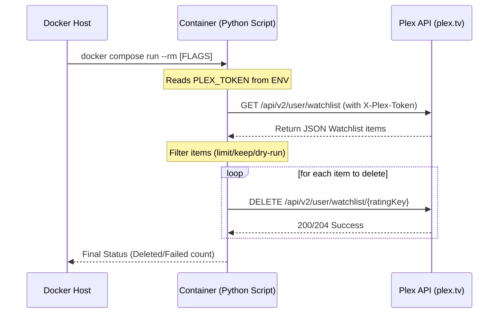

<details>
<summary>Relevant source files</summary>

The following files were used as context for generating this wiki page:

- [README.md](README.md)
- [docker-compose.yml](docker-compose.yml)
- [plex_clear_watchlist.py](plex_clear_watchlist.py)
- [AGENTS.md](AGENTS.md)
- [CLAUDE.md](CLAUDE.md)
- [SECURITY.md](SECURITY.md)
</details>

# Docker Compose Setup

The Docker Compose setup for `plex_clear_watchlist` provides a containerized environment to execute a Python-based utility that interacts with the Plex API to manage and clear a user's Watchlist. It is designed as a "one-shot" container, meaning it performs its task and then exits, rather than running as a persistent background service.

This setup abstracts the Python 3.14 environment and its dependencies (such as `requests` and `sentry-sdk`), ensuring consistency across different host systems while strictly adhering to security practices like injecting credentials via environment variables rather than hardcoding them.

Sources: [AGENTS.md:3-5](AGENTS.md#L3-L5), [CLAUDE.md:3-5](CLAUDE.md#L3-L5), [docker-compose.yml:1-7](docker-compose.yml#L1-L7)

## Service Configuration

The project defines a single service named `plex-clear-watchlist` within the `docker-compose.yml` file. This service is responsible for building the local image or pulling the latest version from the GitHub Container Registry (GHCR).

### Environment Variables
Configuration is handled through environment variables passed from the host to the container. This approach ensures that sensitive data, specifically the Plex authentication token, is never committed to version control.

| Variable | Required | Description | Default |
| :--- | :--- | :--- | :--- |
| `PLEX_TOKEN` | Yes | Authentication token obtained from plex.tv settings. | None |
| `SENTRY_DSN` | No | Data Source Name for Sentry error tracking. | Empty string |

Sources: [README.md:14-18](README.md#L14-L18), [docker-compose.yml:5-7](docker-compose.yml#L5-L7), [SECURITY.md:21-22](SECURITY.md#L21-L22), [plex_clear_watchlist.py:9-14](plex_clear_watchlist.py#L9-L14)

### Image and Build
The service is configured to use the latest image from `ghcr.io/blixten85/plex-clear-watchlist:latest`. If the image is built locally, the build context is set to the current directory (`.`).

Sources: [docker-compose.yml:3-4](docker-compose.yml#L3-L4)

## Execution Flow

The Docker Compose setup is intended to be used with `docker compose run`. This command initializes the container, injects the necessary environment variables, and allows the user to pass command-line arguments directly to the underlying Python script.

The following flowchart illustrates the initialization and execution sequence:



Sources: [README.md:21-34](README.md#L21-L34), [plex_clear_watchlist.py:9-14](plex_clear_watchlist.py#L9-L14), [AGENTS.md:7-12](AGENTS.md#L7-L12)

## Command Usage and Parameters

Users interact with the Docker Compose setup by appending flags to the `run` command. These flags are passed to the python script's `argparse` module.

### Common Execution Patterns
The `--rm` flag is recommended to ensure the container is removed after the task is completed, maintaining a clean host environment.

*  **Dry Run:** `PLEX_TOKEN=xxx docker compose run --rm plex-clear-watchlist --dry-run`
*  **Limit Deletion:** `PLEX_TOKEN=xxx docker compose run --rm plex-clear-watchlist --limit 10`
*  **Keep Recent:** `PLEX_TOKEN=xxx docker compose run --rm plex-clear-watchlist --keep 5`

Sources: [README.md:23-26](README.md#L23-L26), [CLAUDE.md:11-14](CLAUDE.md#L11-L14)

### Data Flow Sequence
The interaction between the Docker host, the containerized script, and the external Plex API is defined in the sequence below:



Sources: [plex_clear_watchlist.py:27-46](plex_clear_watchlist.py#L27-L46), [plex_clear_watchlist.py:59-70](plex_clear_watchlist.py#L59-L70), [README.md:21-27](README.md#L21-L27)

## Implementation Details

The `docker-compose.yml` file maps host environment variables to the container's environment, which the Python script then accesses via `os.environ.get()`.

```yaml
services:
  plex-clear-watchlist:
    image: ghcr.io/blixten85/plex-clear-watchlist:latest
    build: .
    environment:
      - PLEX_TOKEN=${PLEX_TOKEN}
      - SENTRY_DSN=${SENTRY_DSN:-}
```

Sources: [docker-compose.yml:1-7](docker-compose.yml#L1-L7)

The script utilizes these variables to construct the `HEADERS` used in all `requests` calls to the Plex API:

```python
PLEX_TOKEN = os.environ.get("PLEX_TOKEN", "")
# ...
HEADERS = {
    "X-Plex-Token": PLEX_TOKEN,
    "Accept": "application/json"
}
```

Sources: [plex_clear_watchlist.py:9-21](plex_clear_watchlist.py#L9-L21)

## Summary

The Docker Compose setup for `plex_clear_watchlist` facilitates a secure and reproducible way to manage Plex Watchlists. By utilizing environment variables for authentication and providing a one-shot execution model, it minimizes the footprint on the host system while ensuring that the Python environment and its dependencies are correctly configured.

Sources: [AGENTS.md:3-5](AGENTS.md#L3-L5), [SECURITY.md:21-23](SECURITY.md#L21-L23)
