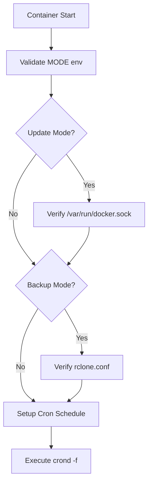
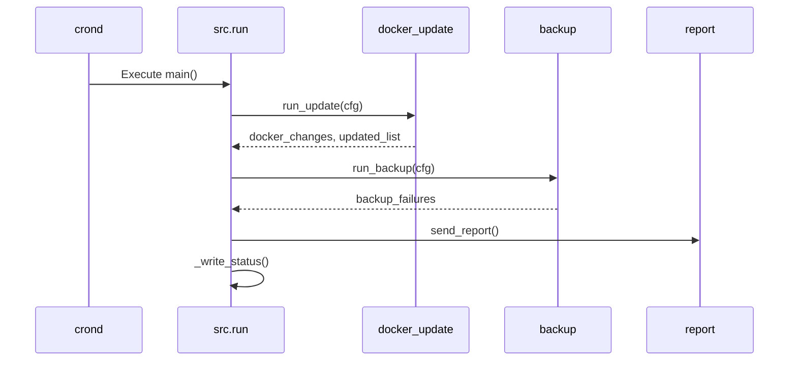
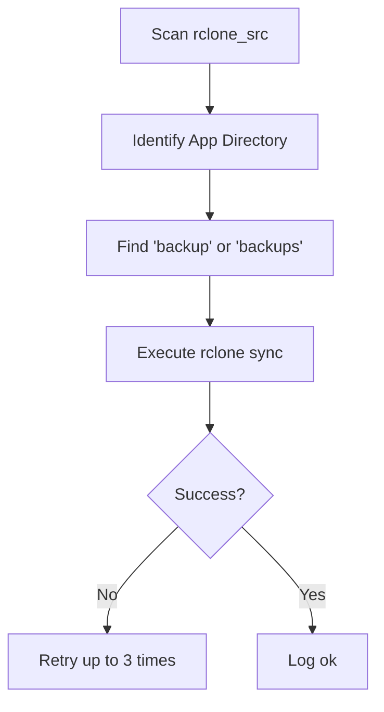

Relevant source files

The following files were used as context for generating this wiki page:

- [README.md](README.md)
- [src/run.py](src/run.py)
- [src/entrypoint.py](src/entrypoint.py)
- [src/docker_update.py](src/docker_update.py)
- [src/backup.py](src/backup.py)
- [src/config.py](src/config.py)
- [src/report.py](src/report.py)
- [src/github_report.py](src/github_report.py)
- [src/sentry_report.py](src/sentry_report.py)

# Architecture Overview

The `docker-idempotent-update` project is a Python-based utility designed for daily Docker host maintenance. It operates within a single container to automate image updates, container recreation, and data backups via `rclone`, providing a combined status report via email.

The system is designed to be idempotent and dependency-light, utilizing the Python standard library for its core logic and external tools like `msmtp` and `rclone` for specialized tasks. It supports multiple operation modes: updating containers, backing up data, or both.

Sources: [README.md:1-20](README.md#L1-L20), [AGENTS.md:1-15](AGENTS.md#L1-L15)

## System Execution Flow

The system operates in two distinct phases: initialization and scheduled execution. 

### Initialization Phase
The `entrypoint.py` script serves as the container's entry point. It performs environment validation, ensures required configurations (like Docker socket or rclone configs) exist, and sets up the internal cron daemon.

The initialization logic ensures that the container will not run in a broken state by exiting early if mandatory mounts or configurations are missing.

Sources: [src/entrypoint.py:20-75](src/entrypoint.py#L20-L75)

### Scheduled Job Execution
Once `crond` is active, it executes `src/run.py` according to the `CRON_SCHEDULE`. This script coordinates the update, backup, and reporting modules.

Sources: [src/run.py:24-45](src/run.py#L24-L45), [src/entrypoint.py:65-68](src/entrypoint.py#L65-L68)

## Component Breakdown

### Configuration Management
The `Config` class centralizes settings derived from environment variables and the `backup.conf` file.

| Attribute | Source | Default | Description |
|-----------|--------|---------|-------------|
| `mode` | `MODE` | `both` | Determines if updates, backups, or both run. |
| `dry_run` | `DRY_RUN` | `false` | If true, logs actions without making changes. |
| `cron_schedule`| `CRON_SCHEDULE`| `0 3 * * *` | Cron-formatted execution time. |
| `rclone_src` | `backup.conf` | `/data` | Source directory for backups. |
| `rclone_dst` | `backup.conf` | `gdrive:backups`| Destination rclone remote/path. |

Sources: [src/config.py:6-55](src/config.py#L6-L55)

### Docker Update Logic
The update system supports two methods for updating containers:
1.  **Compose-based:** Uses `docker compose pull` and `up -d --remove-orphans`.
2.  **Socket-based:** Manually pulls images for running containers and recreates them by inspecting their current configuration (env vars, volumes, ports) and running a new instance.

Sources: [src/docker_update.py:11-30](src/docker_update.py#L11-L30), [README.md:105-115](README.md#L105-L115)

### Backup Logic
The backup module uses `rclone sync` to transfer data. It recursively scans the source directory for folders matching specified names (default: `backup`, `backups`).

Sources: [src/backup.py:40-85](src/backup.py#L40-L85)

### Reporting and Error Handling
Reports are sent via `msmtp` only if changes occurred or failures were detected. The system also includes "best-effort" error reporting to GitHub and Sentry for unhandled exceptions.

*  **GitHub Reporting:** Creates a redacted issue with a unique fingerprint to avoid duplicates.
*  **Sentry Reporting:** Posts error envelopes to a Sentry DSN using `urllib` to maintain zero-dependency requirements.

Sources: [src/report.py:10-45](src/report.py#L10-L45), [src/github_report.py:75-125](src/github_report.py#L75-L125), [src/sentry_report.py:68-120](src/sentry_report.py#L68-L120)

## Security and Redaction
A core architectural principle is the prevention of credential leakage. Both GitHub and Sentry reporters apply redaction patterns to:
*  Environment variables containing `KEY`, `TOKEN`, `SECRET`, `PASSWORD`, or `PASS`.
*  Standard API key patterns (e.g., `ghp_`, `sk-`).
*  Email addresses.
*  Local home directory paths.

Sources: [src/github_report.py:38-51](src/github_report.py#L38-L51), [src/sentry_report.py:27-40](src/sentry_report.py#L27-L40)

## Summary
The `docker-idempotent-update` architecture provides a robust, self-contained maintenance loop. By relying on standard Linux tools (`cron`, `msmtp`, `rclone`) and a zero-dependency Python core, it ensures high portability and reliability for Docker host management.
