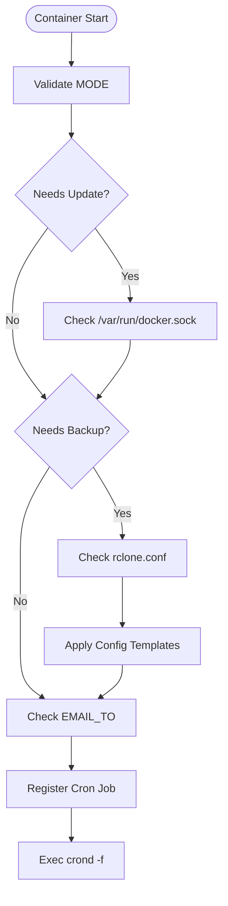
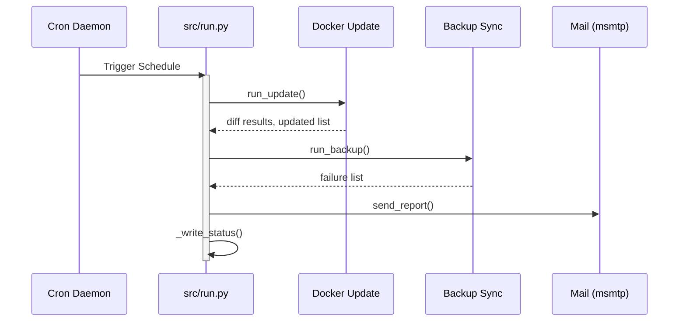

<details>
<summary>Relevant source files</summary>

The following files were used as context for generating this wiki page:

- [src/entrypoint.py](src/entrypoint.py)
- [src/run.py](src/run.py)
- [src/config.py](src/config.py)
- [src/docker_update.py](src/docker_update.py)
- [src/backup.py](src/backup.py)
- [src/report.py](src/report.py)
</details>

# Execution Flow & Scheduling

The Execution Flow & Scheduling system manages the lifecycle of the `docker-idempotent-update` container, from initial environment validation and cron registration to the automated execution of maintenance tasks. The system is designed to run as a persistent background daemon that triggers Docker image updates and data backups based on a user-defined schedule.

Sources: [src/entrypoint.py](src/entrypoint.py), [src/run.py](src/run.py), [README.md:10-18](README.md#L10-L18)

## Initialization and Daemonization

When the container starts, `src/entrypoint.py` acts as the primary process. It performs critical configuration checks, ensures necessary mounts (like the Docker socket) are present, and prepares configuration files from templates if they are missing. Once validated, it registers the maintenance job with the system's crontab and hands over execution to the `crond` daemon.

### Bootstrapping Logic
The initialization process follows these steps:
1.  **Mode Validation:** Checks if `MODE` is set to `update`, `backup`, or `both`.
2.  **Socket Verification:** If updates are enabled, it confirms `/var/run/docker.sock` is available.
3.  **Config Preparation:** Copies `backup.conf` and `msmtprc` from templates if they do not exist in the mounted `/config` volume.
4.  **Cron Registration:** Writes the schedule to the crontab, ensuring the output is redirected to the container's stdout.
5.  **Process Handoff:** Executes `crond -f` to start the scheduler in the foreground.

Sources: [src/entrypoint.py:22-72](src/entrypoint.py#L22-L72)



The diagram shows the startup sequence performed by the entrypoint before the scheduler takes over.
Sources: [src/entrypoint.py:22-72](src/entrypoint.py#L22-L72)

## Scheduled Maintenance Flow

The actual maintenance logic is contained within `src.run`, which is triggered by the cron daemon. This module coordinates the sequential execution of updates, backups, and reporting.

### Execution Sequence
The `main()` function in `src/run.py` orchestrates the following operations:
- **Configuration Loading:** Initializes the `Config` object to parse environment variables and the `backup.conf` file.
- **Docker Update:** If enabled, invokes `run_update()` to pull images and recreate containers.
- **Backup:** If enabled, invokes `run_backup()` to synchronize directories via rclone.
- **Reporting:** Sends an email summary via `send_report()` if changes occurred or failures were detected.
- **Status Persistence:** Writes the results of the run to `/config/status.json`.

Sources: [src/run.py:24-48](src/run.py#L24-L48), [src/config.py:7-25](src/config.py#L7-L25)



The sequence diagram illustrates the serial execution of maintenance tasks when triggered by the internal cron.
Sources: [src/run.py:24-52](src/run.py#L24-L52), [src/docker_update.py:12-25](src/docker_update.py#L12-L25), [src/backup.py:34-73](src/backup.py#L34-L73)

## Configuration and Parameters

The execution behavior is dictated by environment variables and local configuration files.

| Parameter | Default | Description | Source |
| :--- | :--- | :--- | :--- |
| `MODE` | `both` | Determines if `update`, `backup`, or both run. | [src/config.py:9](src/config.py#L9) |
| `CRON_SCHEDULE` | `0 3 * * *` | Standard cron expression for task timing. | [src/entrypoint.py:65](src/entrypoint.py#L65) |
| `DRY_RUN` | `false` | If true, logs actions without executing changes. | [src/config.py:15](src/config.py#L15) |
| `EMAIL_TO` | `""` | Recipient address for the summary report. | [src/report.py:13](src/report.py#L13) |
| `COMPOSE_FILE` | `""` | Optional path to a docker-compose file for updates. | [src/docker_update.py:42](src/docker_update.py#L42) |

## Error Handling and Reporting

The system implements a multi-tier error handling strategy to ensure visibility into failures during the scheduled run.

### Local Reporting
- **Status File:** Every run updates `/config/status.json` with a timestamp, updated containers, and backup failures.
- **Email:** A summary is sent via `msmtp` only if updates were performed or backups failed.

### Exception Management
If an unhandled exception occurs in `src/run.py`, the system attempts to:
1.  Log the exception to stdout.
2.  Report the error to GitHub as an issue (if `GITHUB_ERROR_REPORT_TOKEN` is set).
3.  Post the error to Sentry (if `SENTRY_DSN` is set).

Sources: [src/run.py:73-82](src/run.py#L73-L82), [src/report.py:13-20](src/report.py#L13-L20), [src/github_report.py:84-129](src/github_report.py#L84-L129)

```python
# src/run.py:73-82
if __name__ == "__main__":
    try:
        main()
    except Exception as exc:
        log.exception("Unhandled error in daily run")
        report_error_to_github(
            "blixten85/docker-idempotent-update", "Daglig körning kraschade", exc
        )
        report_error_to_sentry(exc)
        raise
```

## Summary
Execution Flow & Scheduling ensures that Docker host maintenance is performed reliably and without host-side dependencies. By utilizing an internal cron daemon and a clear initialization phase in the entrypoint, the system guarantees that updates and backups are executed in a predictable sequence, with comprehensive reporting mechanisms to notify administrators of the system's status.
