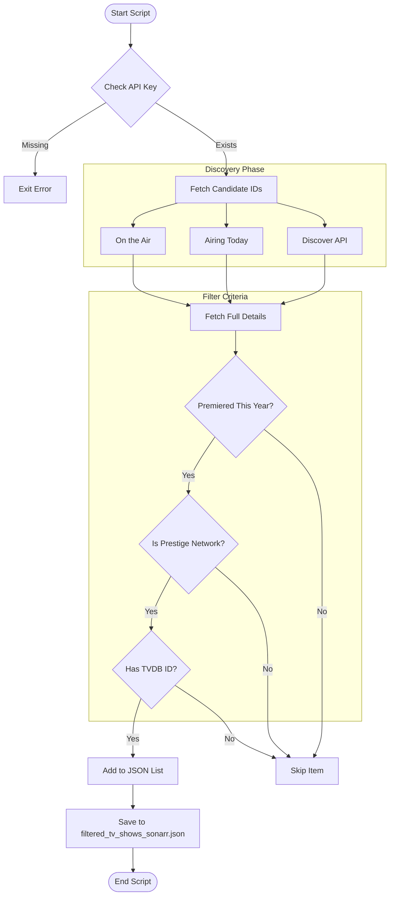
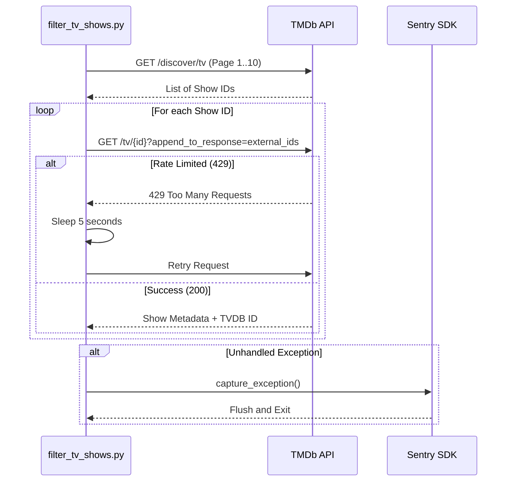

<details>
<summary>Relevant source files</summary>

The following files were used as context for generating this wiki page:

- [filter_tv_shows.py](../../../filter_tv_shows.py)
- [README.md](../../../README.md)
- [AGENTS.md](../../../AGENTS.md)
- [CLAUDE.md](../../../CLAUDE.md)
- [filtered_tv_shows_sonarr.json](../../../filtered_tv_shows_sonarr.json)
</details>

# TV Show Filtering Logic

The TV Show Filtering Logic is a specialized component of the `filtered-movies` project designed to identify and export "prestige" television content for automated media management. Its primary purpose is to query The Movie Database (TMDb) for television series that meet specific criteria—primarily focus on top-tier networks and recent premiere dates—and format these results for direct consumption by Sonarr custom lists.

Sources: [filter_tv_shows.py:1-18](filter_tv_shows.py#L1-L18), [README.md:12-25](README.md#L12-L25)

This logic is executed daily via GitHub Actions, ensuring that the exported list remains current with the latest premieres from major streaming services and cable networks. The system emphasizes high-value content from specific platforms rather than broad ratings or popularity metrics.

Sources: [AGENTS.md:5-15](AGENTS.md#L5-L15), [CLAUDE.md:5-15](CLAUDE.md#L5-L15)

## Data Acquisition and Discovery

The filtering process begins with a discovery phase that queries multiple TMDb API endpoints to compile a candidate list of TV show IDs. The system targets shows that have premiered within the current calendar year.

### Discovery Endpoints
The logic utilizes two categories of TMDb endpoints:
*  **Standard Lists**: `/tv/on_the_air` and `/tv/airing_today`.
*  **Discovery Queries**: Sorted by popularity, vote average (with a minimum of 10 votes), and release date.

Sources: [filter_tv_shows.py:61-75](filter_tv_shows.py#L61-L75)

The following flowchart illustrates the multi-stage discovery and filtering pipeline:



*This diagram shows the end-to-end flow from initial API discovery to the final JSON export.*
Sources: [filter_tv_shows.py:56-187](filter_tv_shows.py#L56-L187)

## Filtering Criteria

The system applies three primary filters to the discovered candidate shows. All criteria must be met for a show to be included in the final output.

### 1. Temporal Filter
Shows must have a `first_air_date` starting from January 1st of the current year. This ensures the list only contains new or currently premiering content.

Sources: [filter_tv_shows.py:63-64](filter_tv_shows.py#L63-L64), [README.md:24-25](README.md#L24-L25)

### 2. Network Filter (Prestige Filter)
The logic checks the `networks` attribute of the TMDb show object against a predefined list of "Prestige Networks." If any network associated with the show matches one of the following strings (case-insensitive), the show passes this filter:

| Network / Streamer | Category |
| :--- | :--- |
| Amazon / Prime Video | Streaming |
| HBO / Max | Premium Cable/Streaming |
| Apple TV+ / Apple TV | Premium Streaming |
| National Geographic | Factual/Documentary |

Sources: [filter_tv_shows.py:42-51](filter_tv_shows.py#L42-L51), [README.md:28-36](README.md#L28-L36)

### 3. External ID Requirement
Sonarr's Custom List format requires a TVDB ID. The script retrieves this via the `external_ids` TMDb sub-resource. If a show lacks a TVDB ID, it is excluded from the final list even if it meets the network and date criteria.

Sources: [filter_tv_shows.py:137-141](filter_tv_shows.py#L137-L141), [README.md:65-69](README.md#L65-L69)

## Technical Implementation

### Core Functions

| Function | Purpose |
| :--- | :--- |
| `get_tv_show_ids(pages)` | Iterates through discovery endpoints to collect unique TMDb IDs. |
| `is_prestige_show(show)` | Compares show network metadata against the `PRESTIGE_NETWORKS` list. |
| `fetch_and_filter_shows(tv_ids)` | Performs detailed lookups for each candidate and validates all criteria. |
| `main()` | Orchestrates the workflow and handles the file I/O. |

Sources: [filter_tv_shows.py:58](filter_tv_shows.py#L58), [filter_tv_shows.py:102](filter_tv_shows.py#L102), [filter_tv_shows.py:112](filter_tv_shows.py#L112), [filter_tv_shows.py:155](filter_tv_shows.py#L155)

### External API Interaction
The script communicates with TMDb using Bearer Token authentication. It handles rate limiting by catching HTTP 429 status codes and implementing a retry delay.



*The sequence of API interactions, including error handling and the optional Sentry monitoring.*
Sources: [filter_tv_shows.py:77-98](filter_tv_shows.py#L77-L98), [filter_tv_shows.py:126-133](filter_tv_shows.py#L126-L133), [filter_tv_shows.py:177-187](filter_tv_shows.py#L177-L187)

## Output Format
The resulting data is stored in `filtered_tv_shows_sonarr.json`. The format is a simple JSON array of objects, specifically tailored for Sonarr's "Custom List" import type.

```json
[
  {
    "TvdbId": 376098
  },
  {
    "TvdbId": 430654
  }
]
```

Sources: [filtered_tv_shows_sonarr.json:1-8](filtered_tv_shows_sonarr.json#L1-L8), [README.md:65-69](README.md#L65-L69)

## Summary
The TV Show Filtering Logic provides an automated way to track prestige television premieres. By combining TMDb's discovery endpoints with a strict network-based filter and a requirement for TVDB identifiers, it generates a high-signal list compatible with Sonarr for automated media acquisition.

Sources: [README.md:5-15](README.md#L5-L15), [filter_tv_shows.py:1-18](filter_tv_shows.py#L1-L18)
