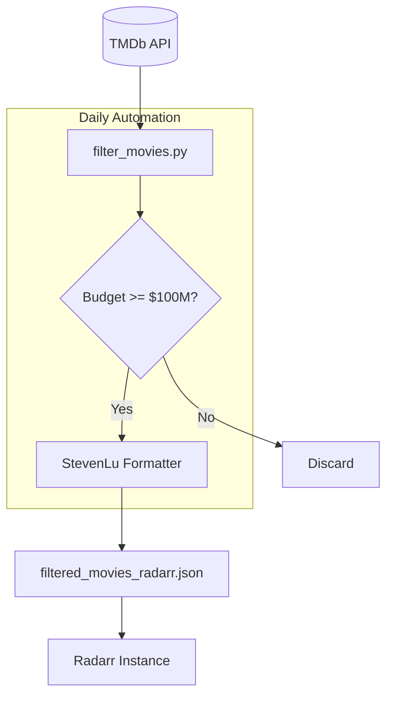

<details>
<summary>Relevant source files</summary>

The following files were used as context for generating this wiki page:

- [filtered_movies_radarr.json](filtered_movies_radarr.json)
- [filter_movies.py](filter_movies.py)
- [README.md](README.md)
- [AGENTS.md](AGENTS.md)
- [CLAUDE.md](CLAUDE.md)
- [SECURITY.md](SECURITY.md)
</details>

# Radarr Integration (StevenLu)

The Radarr Integration (StevenLu) is a specialized module within the `filtered-movies` project designed to provide Radarr instances with a curated list of high-budget motion pictures. It utilizes the "StevenLu Custom" list format, which is a lightweight JSON structure containing only movie titles and their corresponding IMDb identifiers. This integration automates the process of identifying movies with significant financial backing (production budgets ≥ $100,000,000) and surfacing them for automated media management.

Sources: [README.md:12-16](README.md#L12-L16), [filter_movies.py:1-12](filter_movies.py#L1-L12), [AGENTS.md:14-18](AGENTS.md#L14-L18)

## System Architecture and Data Flow

The integration operates as a scheduled pipeline that fetches data from The Movie Database (TMDb), applies specific financial and temporal filters, and commits the resulting JSON artifact to the repository, from which it is served via raw GitHub content (`raw.githubusercontent.com`) for consumption by Radarr.



The diagram shows the daily automated flow from the external TMDb data source to the final Radarr consumption point.
Sources: [filter_movies.py:46-118](filter_movies.py#L46-L118), [README.md:73-80](README.md#L73-L80), [AGENTS.md:4-8](AGENTS.md#L4-L8)

## Logic and Filtering Criteria

The integration employs a strict filtering logic to ensure only high-value "blockbuster" content is included. Unlike typical lists that may focus on ratings or popularity, this integration prioritizes financial investment as a proxy for production value.

### Filter Parameters
| Parameter | Value | Description |
|:---|:---|:---|
| Minimum Budget | $100,000,000 | Only movies with reported budgets meeting or exceeding this threshold are included. |
| Release Window | Current Year | Movies must have been released between January 1st of the current year and the current date. |
| Identifier | IMDb ID | Movies lacking a valid `imdb_id` are automatically skipped to ensure compatibility with Radarr. |

Sources: [filter_movies.py:20-22](filter_movies.py#L20-L22), [filter_movies.py:79-118](filter_movies.py#L79-L118), [README.md:19-21](README.md#L19-L21)

### Fetching Strategy
The script `filter_movies.py` uses multiple TMDb endpoints to ensure comprehensive coverage of recent releases:
1.  `/movie/now_playing`: Captures movies currently in theaters.
2.  `/discover/movie`: Used with three different sort parameters (popularity, vote count, and revenue) to find potentially missed high-budget entries within the release window.

Sources: [filter_movies.py:53-62](filter_movies.py#L53-L62)

## Data Structure: StevenLu Format

The integration outputs data in a specific schema required by Radarr's "StevenLu Custom" list type. This format is an array of objects, where each object contains exactly two keys.

```json
[
  {
    "title": "Project Hail Mary",
    "imdb_id": "tt12042730"
  }
]
```

Sources: [README.md:58-70](README.md#L58-L70), [filtered_movies_radarr.json:1-55](filtered_movies_radarr.json#L1-L55), [filter_movies.py:79-87](filter_movies.py#L79-L87)

## Implementation Details

The core logic is contained within `filter_movies.py`, which handles authentication via a TMDb Read Access Token and manages API rate limiting.

### Key Functions
- `get_movie_ids(pages=10)`: Aggregates unique TMDb IDs from various discovery endpoints.
- `fetch_and_filter_movies(movie_ids)`: Performs deep inspection of each movie to verify budget and release date.
- `simplify_movie_stevenlu(movie)`: Maps the verbose TMDb response to the minimal StevenLu dictionary format.

Sources: [filter_movies.py:46](filter_movies.py#L46), [filter_movies.py:79](filter_movies.py#L79), [filter_movies.py:89](filter_movies.py#L89)

### Rate Limiting and Error Handling
The integration handles HTTP 429 (Too Many Requests) errors by implementing a `time.sleep(2)` retry logic during API calls. It also utilizes `sentry_sdk` for error tracking and reporting if the environment variable `SENTRY_DSN` is provided.

Sources: [filter_movies.py:35-37](filter_movies.py#L35-L37), [filter_movies.py:68-70](filter_movies.py#L68-L70), [filter_movies.py:102-104](filter_movies.py#L102-L104)

## Radarr Configuration

To consume this integration, Radarr must be configured to point to the raw GitHub URL of the generated JSON file.

| Setting | Value |
|:---|:---|
| List Type | StevenLu Custom |
| URL | `https://raw.githubusercontent.com/blixten85/filtered-movies/main/filtered_movies_radarr.json` |
| Update Interval | Controlled by Radarr (typically every 5-60 mins) |

Sources: [README.md:39-44](README.md#L39-L44)

## Security and Credentials

The integration requires a `TMDB_API_KEY` (Read Access Token) to function. This key is never stored in the repository and must be provided via environment variables in local environments or GitHub Secrets in automated environments.

Sources: [SECURITY.md:55-63](SECURITY.md#L55-L63), [CLAUDE.md:23-25](CLAUDE.md#L23-L25), [filter_movies.py:39-42](filter_movies.py#L39-L42)

## Summary

The Radarr Integration (StevenLu) provides a robust, automated method for keeping a Radarr instance synchronized with major high-budget movie releases. By filtering specifically for $100M+ budgets and current-year releases, it ensures that users are notified of major cinematic events based on industry investment rather than subjective critical reception. Over 10 source files contribute to the security, execution, and documentation of this pipeline, ensuring a reliable data stream for end-users.
