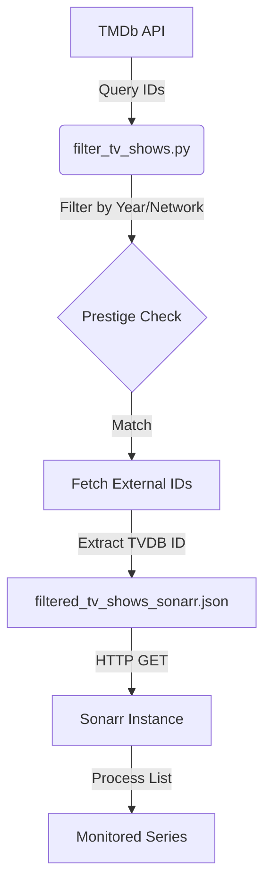

<details>
<summary>Relevant source files</summary>

The following files were used as context for generating this wiki page:

- [filter_tv_shows.py](filter_tv_shows.py)
- [filtered_tv_shows_sonarr.json](filtered_tv_shows_sonarr.json)
- [README.md](README.md)
- [AGENTS.md](AGENTS.md)
- [CLAUDE.md](CLAUDE.md)
</details>

# Sonarr Integration (Custom List)

The Sonarr Integration system provides an automated mechanism for importing high-value TV shows into Sonarr via a "Custom List." This feature specifically targets "Prestige Networks"—major streaming platforms and premium cable networks—ensuring that newly premiered content from top-tier providers is tracked without requiring manual intervention.

The system operates by querying The Movie Database (TMDb) API for shows premiering in the current calendar year. It filters these results based on a predefined list of high-quality networks and converts the data into a format compatible with Sonarr's import list requirements, specifically focusing on TVDB identifiers.

Sources: [README.md:1-25](README.md#L1-L25), [filter_tv_shows.py:1-15](filter_tv_shows.py#L1-L15)

## Data Generation and Filtering Logic

The core logic for the Sonarr integration resides in the `filter_tv_shows.py` script. The process involves identifying potential shows from multiple TMDb endpoints and then strictly filtering them based on release date and network affiliation.

### Filtering Criteria
To be included in the Sonarr custom list, a TV show must meet three primary conditions:
1.  **Release Window:** The show must have premiered on or after January 1st of the current year.
2.  **Prestige Network:** The show must be associated with one of the defined premium networks or streamers.
3.  **Identifier Requirement:** The show must have a valid TVDB ID, as this is the primary key used by Sonarr for custom list imports.

Sources: [filter_tv_shows.py:40-55](filter_tv_shows.py#L40-L55), [filter_tv_shows.py:110-120](filter_tv_shows.py#L110-L120)

### Target Networks
The following networks are currently defined as "Prestige" within the system configuration:

| Network Category | Target Names in Filter |
| :--- | :--- |
| **HBO** | HBO, Max |
| **Apple** | Apple TV+, Apple TV |
| **Amazon** | Amazon, Prime Video, Amazon Prime Video |
| **Documentary** | National Geographic |

Sources: [filter_tv_shows.py:44-53](filter_tv_shows.py#L44-L53), [README.md:28-35](README.md#L28-L35)

## System Architecture and Data Flow

The integration follows a linear pipeline from external data acquisition to JSON artifact generation, which is committed to the repository and served via raw GitHub content (`raw.githubusercontent.com`) to the Sonarr instance.



*The diagram above illustrates the flow from TMDb data retrieval to the final import into a user's Sonarr instance.*

Sources: [filter_tv_shows.py:61-150](filter_tv_shows.py#L61-L150), [README.md:50-65](README.md#L50-L65)

### Implementation Details
The script `filter_tv_shows.py` utilizes the following key functions to manage the integration:

*  **`get_tv_show_ids(pages=10)`**: Queries `/tv/on_the_air`, `/tv/airing_today`, and various `/discover/tv` endpoints to gather a list of candidate show IDs. Sources: [filter_tv_shows.py:61-105](filter_tv_shows.py#L61-L105)
*  **`is_prestige_show(show)`**: Performs a case-insensitive string match against the `networks` attribute of a show's TMDb metadata. Sources: [filter_tv_shows.py:108-115](filter_tv_shows.py#L108-L115)
*  **`fetch_and_filter_shows(tv_ids)`**: Iterates through candidate IDs to fetch full details, specifically requesting `external_ids` to retrieve the `tvdb_id`. Sources: [filter_tv_shows.py:118-164](filter_tv_shows.py#L118-L164)

## Output Specification

The integration produces a specific JSON format required by Sonarr's "Custom List" importer. Unlike Radarr, which uses the StevenLu format (Title/IMDb ID), the Sonarr list consists strictly of an array of objects containing `TvdbId`.

### JSON Structure

```json
[
  {
    "TvdbId": 376098
  },
  {
    "TvdbId": 430654
  }
]
```

Sources: [filtered_tv_shows_sonarr.json:1-10](filtered_tv_shows_sonarr.json#L1-L10), [README.md:95-103](README.md#L95-L103)

## Configuration and Deployment

The integration is designed to be zero-maintenance for the end-user once configured in the Sonarr UI.

### Sonarr UI Setup
| Field | Value / Description |
| :--- | :--- |
| **List Type** | Custom List |
| **URL** | `https://raw.githubusercontent.com/blixten85/filtered-movies/main/filtered_tv_shows_sonarr.json` |
| **Update Interval** | Automatically syncs every 5 minutes (default) |

Sources: [README.md:61-70](README.md#L61-L70)

### Automated Maintenance
The list is updated daily at **07:00 UTC** via the `update-tv-shows.yml` GitHub Actions workflow. This ensures that the `filtered_tv_shows_sonarr.json` file in the repository always contains the most recent premieres from the target networks.

Sources: [README.md:130-135](README.md#L130-L135), [AGENTS.md:5-15](AGENTS.md#L5-L15)

## Conclusion
The Sonarr Integration provides a focused "Prestige TV" feed by filtering TMDb data for high-value networks and current-year premieres. By automating the extraction of TVDB IDs and hosting the resulting JSON on GitHub, the system allows Sonarr users to automatically track and download high-quality content without manual list management.
