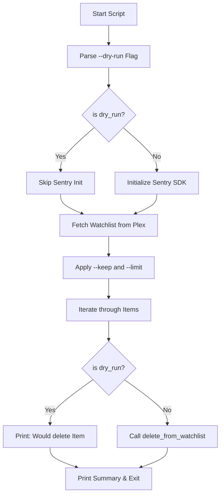
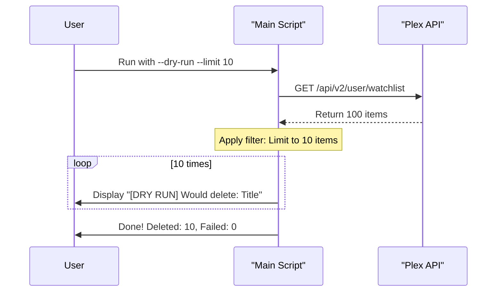

<details>
<summary>Relevant source files</summary>

The following files were used as context for generating this wiki page:

- [README.md](README.md)
- [plex_clear_watchlist.py](plex_clear_watchlist.py)
- [AGENTS.md](AGENTS.md)
- [CLAUDE.md](CLAUDE.md)
- [docker-compose.yml](docker-compose.yml)
</details>

# Dry Run Mode (--dry-run)

Dry Run Mode is a safety feature in the `plex_clear_watchlist` utility that allows users to simulate the deletion process without making any actual changes to their Plex Watchlist. Its primary purpose is to provide transparency by showing exactly which items would be removed based on the provided filtering criteria such as `--limit` or `--keep`.

This mode is considered a core convention for the project, ensuring that the script is safe to execute without unintended side effects. When active, it bypasses the destructive API calls to Plex and prevents the initialization of error-tracking services like Sentry.

Sources: [AGENTS.md:18](AGENTS.md#L18), [CLAUDE.md:17](CLAUDE.md#L17), [plex_clear_watchlist.py:94-96](plex_clear_watchlist.py#L94-L96)

## Execution Logic and Control Flow

The `--dry-run` flag is parsed using Python's `argparse` module and acts as a global toggle for the script's destructive behavior. The logic ensures that while data is still fetched from the Plex API to identify what *could* be deleted, the final deletion request is never sent.

### Process Flow
1.  **Argument Parsing**: The script checks if `--dry-run` is present in the command line arguments.
2.  **Sentry Initialization Bypass**: If Dry Run Mode is active, `sentry_sdk.init` is not called, preventing the tracking of local execution data during the simulation.
3.  **Watchlist Retrieval**: The script fetches the full watchlist via `get_watchlist()`.
4.  **Filtering**: The script applies any `--keep` or `--limit` logic to the retrieved list.
5.  **Simulated Deletion**: Instead of calling `delete_from_watchlist()`, the script iterates through the filtered list and prints the titles of the items that would have been deleted.

The following flowchart illustrates the decision-making process when the flag is utilized:



Sources: [plex_clear_watchlist.py:89-145](plex_clear_watchlist.py#L89-L145), [CLAUDE.md:17](CLAUDE.md#L17)

## Functional Impact of Dry Run Mode

The behavior of the application changes significantly when `--dry-run` is enabled. The following table summarizes the differences between standard execution and Dry Run Mode.

| Feature | Standard Mode | Dry Run Mode (`--dry-run`) |
| :--- | :--- | :--- |
| **API Interactions** | `GET` (fetch) and `DELETE` (remove) | `GET` (fetch) only |
| **Sentry Tracking** | Enabled (if `SENTRY_DSN` is set) | Forcefully disabled |
| **Console Output** | "Deleting X of Y items..." | "SEARCH: X of Y items would be deleted" |
| **Item Feedback** | "🗑️ Deleted: [Title]" | "[DRY RUN] Would delete: [Title]" |
| **Side Effects** | Permanent removal from Plex | No changes to Plex account |

Sources: [plex_clear_watchlist.py:118-145](plex_clear_watchlist.py#L118-L145), [README.md:37-41](README.md#L37-L41)

## Interaction with Filtering Options

Dry Run Mode is particularly useful when combined with the `--limit` and `--keep` flags. It allows users to verify their logic before performing a bulk deletion.

### Example Sequence: Dry Run with Limits
When a user runs the command with `--limit 10 --dry-run`, the following sequence occurs:



Sources: [plex_clear_watchlist.py:107-147](plex_clear_watchlist.py#L107-L147), [README.md:14-17](README.md#L14-L17)

## Implementation Details

In the code, the flag is implemented as an `action="store_true"` argument.

```python
# From plex_clear_watchlist.py
parser.add_argument("--dry-run", action="store_true", help="Show what would be deleted without actually deleting")

# Logic check within the loop
if args.dry_run:
    print(f"  [DRY RUN] Would delete: {title}")
    success += 1
elif delete_from_watchlist(rating_key, title):
    success += 1
```

Sources: [plex_clear_watchlist.py:90](plex_clear_watchlist.py#L90), [plex_clear_watchlist.py:136-140](plex_clear_watchlist.py#L136-L140)

## Conclusion
Dry Run Mode serves as a critical safety buffer for the `plex_clear_watchlist` tool. By simulating the deletion process and providing detailed console feedback, it ensures users can audit the script's intended actions—especially when using complex filters—before committing to permanent changes via the Plex API.
