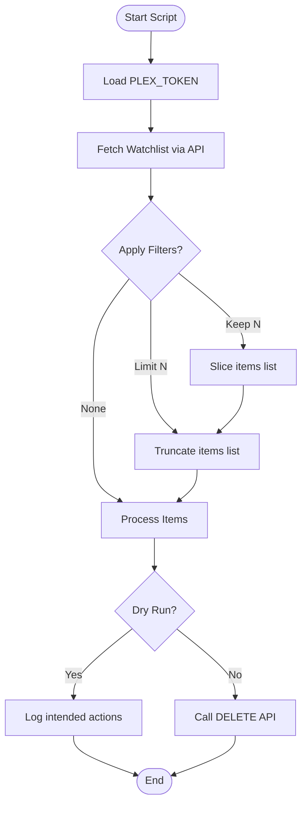
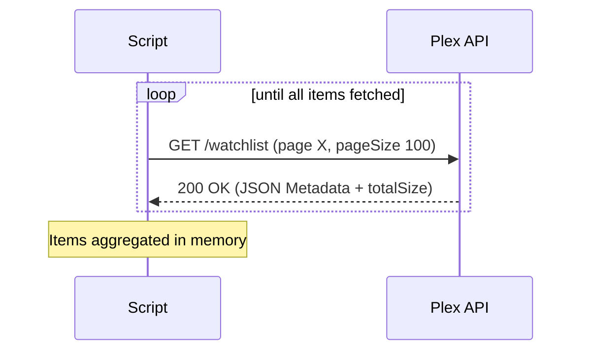

<details>
<summary>Relevant source files</summary>

The following files were used as context for generating this wiki page:

- [plex_clear_watchlist.py](plex_clear_watchlist.py)
- [README.md](README.md)
- [AGENTS.md](AGENTS.md)
- [CLAUDE.md](CLAUDE.md)
- [docker-compose.yml](docker-compose.yml)
- [SECURITY.md](SECURITY.md)
- [requirements.txt](requirements.txt)
</details>

# Full Watchlist Clearing

Full Watchlist Clearing is the core functionality of the `plex-clear-watchlist` tool, designed to automate the removal of items from a user's Plex Watchlist via the Plex API. The system operates as a one-shot process, typically executed within a Docker container, to retrieve the current state of a watchlist and perform deletions based on user-defined criteria.

Sources: [README.md:1-10](README.md#L1-L10), [AGENTS.md:3-5](AGENTS.md#L3-L5), [plex_clear_watchlist.py:100-110](plex_clear_watchlist.py#L100-L110)

## System Architecture and Execution Flow

The system follows a sequential logic flow: authentication, watchlist retrieval with pagination, filtering based on arguments, and item deletion.

### Execution Lifecycle
The following diagram illustrates the high-level flow from initialization to the completion of the clearing process.



The script uses `argparse` to handle execution modes and `requests` for API communication.
Sources: [plex_clear_watchlist.py:90-155](plex_clear_watchlist.py#L90-L155), [CLAUDE.md:15-20](CLAUDE.md#L15-L20)

## Core Components

### Configuration and Environment
The application relies on environment variables for sensitive data and connectivity.

| Variable | Source | Description |
|---|---|---|
| `PLEX_TOKEN` | Environment | **Required**. Authentication token from plex.tv. |
| `SENTRY_DSN` | Environment | Optional. Data Source Name for error tracking. |

Sources: [plex_clear_watchlist.py:9-15](plex_clear_watchlist.py#L9-L15), [README.md:13-17](README.md#L13-L17), [docker-compose.yml:6-8](docker-compose.yml#L6-L8)

### Watchlist Retrieval Logic
Items are fetched using the `get_watchlist()` function, which implements pagination to handle large watchlists.

- **Endpoint**: `https://plex.tv/api/v2/user/watchlist`
- **Method**: `GET`
- **Pagination**: 100 items per page, sorted by `addedAt:asc`.



If the API returns a `404` after the first page, the script raises an `HTTPError` to prevent accidental partial clearing, ensuring data integrity.
Sources: [plex_clear_watchlist.py:24-58](plex_clear_watchlist.py#L24-L58)

### Deletion Mechanism
Deletion is handled by `delete_from_watchlist()`, which targets specific items using their `ratingKey`.

```python
def delete_from_watchlist(rating_key: str, title: str = "") -> bool:
    """Ta bort ett item från Watchlist."""
    url = f"{WATCHLIST_URL}/{rating_key}"
    response = requests.delete(url, headers=HEADERS, timeout=REQUEST_TIMEOUT)
    # ... handles response codes 200/204
```

Sources: [plex_clear_watchlist.py:60-72](plex_clear_watchlist.py#L60-L72)

## Operational Modes and Filtering

The clearing process can be modified using command-line arguments to prevent total deletion or to simulate the process.

| Flag | Logic | File Reference |
|---|---|---|
| `--dry-run` | Skips `sentry_sdk.init` and `requests.delete` calls; prints actions only. | [plex_clear_watchlist.py:101-105](plex_clear_watchlist.py#L101-L105) |
| `--limit N` | Deletes only the first `N` items in the list. | [plex_clear_watchlist.py:129-131](plex_clear_watchlist.py#L129-L131) |
| `--keep N` | Retains the `N` most recently added items by slicing the end of the list. | [plex_clear_watchlist.py:125-127](plex_clear_watchlist.py#L125-L127) |

### Data Filtering Logic
The sorting order for retrieval is `addedAt:asc` (oldest first).
1. **Keep Logic**: `items = items[:-args.keep]` removes the newest items from the deletion queue.
2. **Limit Logic**: `items = items[:args.limit]` ensures only the requested number of items are processed.

Sources: [plex_clear_watchlist.py:32](plex_clear_watchlist.py#L32), [plex_clear_watchlist.py:125-131](plex_clear_watchlist.py#L125-L131)

## Error Handling and Security

### Security Best Practices
- **Credential Safety**: The system strictly forbids hardcoding the `PLEX_TOKEN`. It must be provided via environment variables.
- **Reporting**: Security vulnerabilities are managed via GitHub's private reporting rather than public issues.
Sources: [SECURITY.md:15-20](SECURITY.md#L15-L20), [AGENTS.md:21](AGENTS.md#L21)

### Observability
If `SENTRY_DSN` is provided, the script initializes the Sentry SDK (except in dry-run mode) to capture:
- Exceptions during watchlist retrieval.
- Individual item deletion failures.
Sources: [plex_clear_watchlist.py:107-113](plex_clear_watchlist.py#L107-L113), [requirements.txt:2](requirements.txt#L2)

Full Watchlist Clearing provides a controlled, scriptable method for managing Plex account data, ensuring either total removal or selective maintenance of the user's Watchlist through a single-purpose Python implementation.
