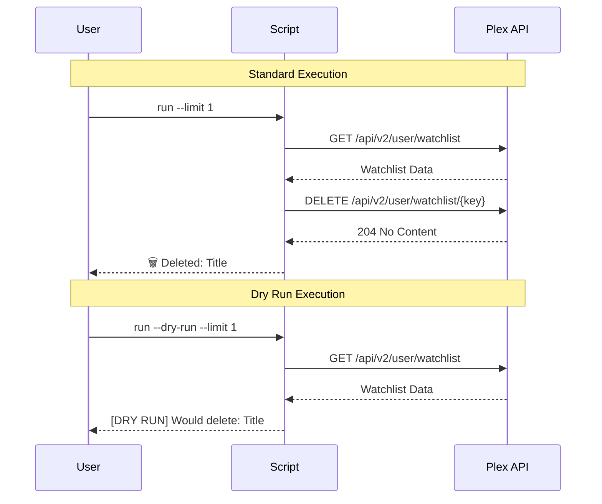

<details>
<summary>Relevant source files</summary>

The following files were used as context for generating this wiki page:

- [plex_clear_watchlist.py](plex_clear_watchlist.py)
- [README.md](README.md)
- [AGENTS.md](AGENTS.md)
- [CLAUDE.md](CLAUDE.md)
- [docker-compose.yml](docker-compose.yml)
</details>

# Dry Run Mode (--dry-run)

Dry Run Mode is a safety feature in the `plex_clear_watchlist` utility that allows users to simulate the deletion of items from their Plex Watchlist. Its primary purpose is to provide transparency by showing exactly which items would be removed based on the provided arguments (like `--limit` or `--keep`) without making any actual persistent changes to the user's Plex account via the API.

This mode is considered a core convention of the project, ensuring that the script is safe to run without unintended side effects. It is highly recommended to use this flag during the initial setup or when testing complex cleanup logic.
Sources: [README.md:52](README.md#L52), [AGENTS.md:18](AGENTS.md#L18), [CLAUDE.md:21](CLAUDE.md#L21)

## Implementation Logic

The `--dry-run` flag is implemented using Python's `argparse` module. When this flag is present in the command-line arguments, the application alters its behavior in three specific ways: disabling error tracking, modifying console output, and bypassing the API deletion calls.
Sources: [plex_clear_watchlist.py:102-104](plex_clear_watchlist.py#L102-L104)

### Logic Flow and Side Effects
The following diagram illustrates how the `dry-run` flag branches the execution logic within the main loop of the application.

```mermaid
flowchart TD
    Start[Start Application] --> ParseArgs[Parse --dry-run Flag]
    ParseArgs --> FetchList[Fetch Watchlist from API]
    FetchList --> FilterList[Apply --limit and --keep filters]
    FilterList --> Loop[Iterate through Items]
    Loop --> CheckDry{Is Dry Run?}
    CheckDry -- Yes --> PrintDry[Print: [DRY RUN] Would delete: Title]
    CheckDry -- No --> DeleteAPI[Call delete_from_watchlist API]
    PrintDry --> Next[Next Item / Finish]
    DeleteAPI --> Next
```

Sources: [plex_clear_watchlist.py:126-160](plex_clear_watchlist.py#L126-L160)

### Disabling Sentry SDK
One notable side effect of the `--dry-run` mode is the conditional initialization of the Sentry SDK. If the flag is active, `sentry_sdk.init` is bypassed entirely. This prevents the utility from sending any telemetry or error reports to a configured Sentry DSN while in simulation mode. Furthermore, if a `RequestException` occurs during the initial watchlist fetch, the exception is only captured by Sentry if `--dry-run` is disabled.
Sources: [plex_clear_watchlist.py:108-115](plex_clear_watchlist.py#L108-L115), [plex_clear_watchlist.py:120-121](plex_clear_watchlist.py#L120-L121)

## User Interaction and Output

Dry Run Mode changes the terminal output to provide clear visual feedback that no destructive actions are being taken.

| Output Element | Description |
| :--- | :--- |
| **Summary Header** | Displays "🔍 DRY RUN: X of Y items would be deleted" instead of the standard deletion message. |
| **Item Prefix** | Each item that is processed is prefixed with `[DRY RUN]` to distinguish it from actual deletions. |
| **Success Count** | The final summary increments the "Deleted" count based on what *would* have been successful. |

Sources: [plex_clear_watchlist.py:141-143](plex_clear_watchlist.py#L141-L143), [plex_clear_watchlist.py:151-153](plex_clear_watchlist.py#L151-L153)

### Comparison of Execution Modes

The following sequence diagram demonstrates the difference between a standard execution and a dry run execution when interacting with the Plex API.



Sources: [plex_clear_watchlist.py:136-158](plex_clear_watchlist.py#L136-L158), [README.md:52](README.md#L52)

## Usage Examples

Dry Run Mode can be invoked through various environments. It is often combined with other filtering flags to preview the results.

### Docker Compose

```bash
PLEX_TOKEN=your-token docker compose run --rm plex-clear-watchlist --dry-run
```

Sources: [docker-compose.yml:1-8](docker-compose.yml#L1-L8), [README.md:28](README.md#L28)

### Python CLI

```bash
python3 plex_clear_watchlist.py --dry-run --keep 5
```

Sources: [README.md:46](README.md#L46), [plex_clear_watchlist.py:105](plex_clear_watchlist.py#L105)

## Summary
The Dry Run Mode (`--dry-run`) is an essential safety mechanism within `plex_clear_watchlist`. By bypassing Sentry initialization and the `DELETE` request in the `delete_from_watchlist` function, it allows users to validate their `PLEX_TOKEN` and filter settings (`--limit`, `--keep`) without modifying their data. It ensures that the script remains simple, single-purpose, and safe for exploratory use.
Sources: [AGENTS.md:18](AGENTS.md#L18), [CLAUDE.md:21](CLAUDE.md#L21), [plex_clear_watchlist.py:148-158](plex_clear_watchlist.py#L148-L158)
