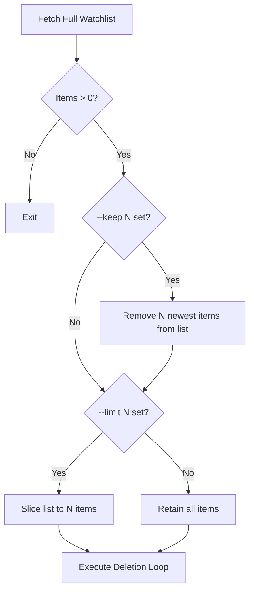
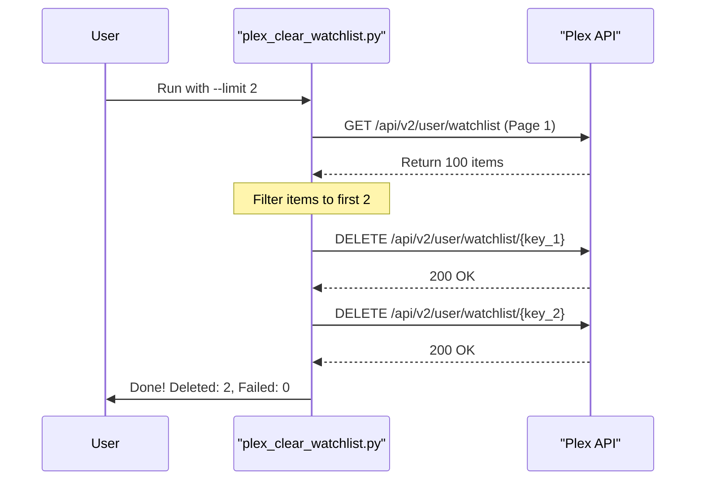

<details>
<summary>Relevant source files</summary>

The following files were used as context for generating this wiki page:

- [README.md](README.md)
- [plex_clear_watchlist.py](plex_clear_watchlist.py)
- [AGENTS.md](AGENTS.md)
- [CLAUDE.md](CLAUDE.md)
- [docker-compose.yml](docker-compose.yml)
</details>

# Limiting Deletions (--limit)

The `plex_clear_watchlist` tool provides a mechanism to restrict the number of items removed from a user's Plex Watchlist during a single execution. This is controlled via the `--limit` command-line argument, which allows users to perform partial cleanups rather than purging the entire list.

Sources: [README.md:43](README.md#L43), [plex_clear_watchlist.py:102](plex_clear_watchlist.py#L102)

This feature is particularly useful for users who want to manage their watchlist in increments or test the deletion logic on a subset of data before performing a full clear. It works in conjunction with other filtering flags like `--keep` and safety features like `--dry-run`.

Sources: [AGENTS.md:15](AGENTS.md#L15), [CLAUDE.md:15](CLAUDE.md#L15)

## Logic and Implementation

The deletion limit logic is implemented within the `main()` function of the script. After the full watchlist is retrieved and any "keep" constraints are applied, the list of items to be deleted is sliced according to the value provided to `--limit`.

### Data Flow for Limit Processing

The following diagram illustrates how the application processes the watchlist items and applies the limit constraint.



The application first fetches all items using `get_watchlist()`, then applies the `--keep` filter, and finally truncates the remaining list based on the `--limit` parameter. 
Sources: [plex_clear_watchlist.py:126-135](plex_clear_watchlist.py#L126-L135)

### Implementation Detail
In `plex_clear_watchlist.py`, the limit is handled using Python's list slicing:

```python
# Begränsa antal om --limit är satt
if args.limit > 0 and args.limit < len(items):
    items = items[:args.limit]
```

Sources: [plex_clear_watchlist.py:133-135](plex_clear_watchlist.py#L133-L135)

## Interaction with Other Options

The `--limit` flag interacts with other CLI arguments to modify the script's behavior.

| Argument | Interaction with `--limit` |
| :--- | :--- |
| `--dry-run` | Instead of deleting, the script logs the specific `N` items that would have been removed. |
| `--keep` | The `--keep` filter is applied **before** the `--limit`. The limit then applies to the remaining pool of items. |

Sources: [README.md:41-43](README.md#L41-L43), [plex_clear_watchlist.py:129-135](plex_clear_watchlist.py#L129-L135)

### Execution Sequence

The sequence diagram below shows how the script interacts with the Plex API when a limit is applied.



Sources: [plex_clear_watchlist.py:43-71](plex_clear_watchlist.py#L43-L71), [plex_clear_watchlist.py:141-155](plex_clear_watchlist.py#L141-L155)

## Usage Examples

The limit can be configured via environment variables in Docker or as direct CLI arguments in Python.

### Docker Compose

```bash
PLEX_TOKEN=your-token docker compose run --rm plex-clear-watchlist --limit 10
```

Sources: [docker-compose.yml:1-7](docker-compose.yml#L1-L7), [README.md:25](README.md#L25)

### Python CLI

```bash
python3 plex_clear_watchlist.py --limit 5
```

Sources: [README.md:38](README.md#L38)

## Summary
The "Limiting Deletions" feature provides granular control over the cleanup process. By utilizing a simple list-slicing approach in `plex_clear_watchlist.py`, the tool ensures that users can precisely define the scope of their watchlist maintenance, preventing accidental mass deletions when only a partial cleanup is desired.
