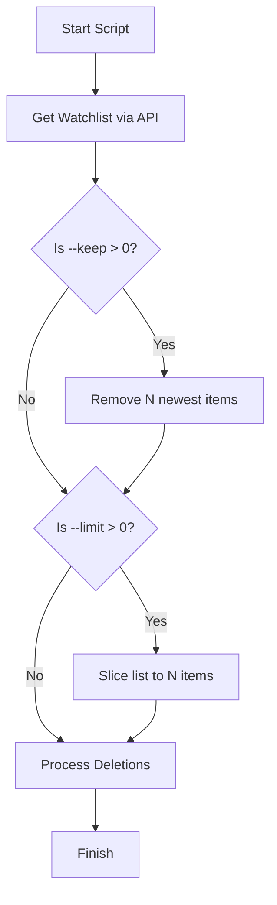

<details>
<summary>Relevant source files</summary>

The following files were used as context for generating this wiki page:

- [plex_clear_watchlist.py](plex_clear_watchlist.py)
- [README.md](README.md)
- [AGENTS.md](AGENTS.md)
- [CLAUDE.md](CLAUDE.md)
- [docker-compose.yml](docker-compose.yml)
</details>

# Limiting Deletions (--limit)

The `plex_clear_watchlist` tool provides a mechanism to control the scope of removal operations on a user's Plex Watchlist through the `--limit` command-line argument. By default, the application is designed to clear all items, but this feature allows for granular control, enabling users to delete only a specific number of items during a single execution.

This functionality is particularly useful for managing large watchlists or for testing the script's behavior alongside [Dry Run](02-page-dry-run.md) mode. It operates by slicing the list of retrieved watchlist items after any retention logic (such as `--keep`) has been applied.

Sources: [README.md:39](README.md#L39), [plex_clear_watchlist.py:118-120](plex_clear_watchlist.py#L118-L120)

## Implementation Logic

The deletion limit is handled within the `main()` function of the script. After the full watchlist is fetched from the Plex API using the `get_watchlist()` function, the application evaluates the `args.limit` value.

### Processing Flow
1.  **Fetch**: The script retrieves the entire watchlist, sorted by the date added in ascending order (`addedAt:asc`).
2.  **Retention**: If the `--keep` flag is present, the most recent items are removed from the deletion queue first.
3.  **Limiting**: If the `--limit` value is greater than zero and less than the number of remaining items, the list is sliced to include only the first `N` items.



The flow shows how the script prioritizes fetching all data before applying filter logic locally.
Sources: [plex_clear_watchlist.py:40](plex_clear_watchlist.py#L40), [plex_clear_watchlist.py:114-120](plex_clear_watchlist.py#L114-L120)

## Command Line Configuration

The `--limit` argument is defined using Python's `argparse` module. It accepts an integer value, where `0` represents no limit (the default behavior).

| Parameter | Type | Default | Description |
| :--- | :--- | :--- | :--- |
| `--limit` | Integer | `0` | Delete at most N items from the watchlist. |
| `--keep` | Integer | `0` | Keep the N most recently added items (applied before limit). |

Sources: [README.md:39](README.md#L39), [plex_clear_watchlist.py:101-102](plex_clear_watchlist.py#L101-L102)

### Integration with Docker
Users running the application via Docker Compose or standard Docker commands can pass the limit flag directly at the end of the execution command.

```bash
# Example: Delete only 10 items
PLEX_TOKEN=your-token docker compose run --rm plex-clear-watchlist --limit 10
```

Sources: [README.md:20](README.md#L20), [docker-compose.yml:1-8](docker-compose.yml#L1-L8)

## Interaction with Slicing Logic

The script uses Python list slicing to implement the limit. The watchlist items are initially sorted by `addedAt:asc` (oldest first). Consequently, the `--limit` flag targets the oldest items in the watchlist unless they have been preserved by the `--keep` flag.

```python
# plex_clear_watchlist.py:118-120
    # Begränsa antal om --limit är satt
    if args.limit > 0 and args.limit < len(items):
        items = items[:args.limit]
```

Sources: [plex_clear_watchlist.py:118-120](plex_clear_watchlist.py#L118-L120), [plex_clear_watchlist.py:40](plex_clear_watchlist.py#L40)

## Summary of Usage Scenarios

| Scenario | Command | Result |
| :--- | :--- | :--- |
| **Complete Clear** | `python3 plex_clear_watchlist.py` | All items are deleted. |
| **Partial Cleanup** | `python3 plex_clear_watchlist.py --limit 50` | Only the 50 oldest items are deleted. |
| **Controlled Retention** | `python3 plex_clear_watchlist.py --keep 10 --limit 5` | Keeps the 10 newest; deletes the 5 oldest of the remaining items. |
| **Safe Testing** | `python3 plex_clear_watchlist.py --limit 5 --dry-run` | Shows which 5 items would be deleted without action. |

Sources: [README.md:18-22](README.md#L18-L22), [AGENTS.md:16-19](AGENTS.md#L16-L19), [CLAUDE.md:16-19](CLAUDE.md#L16-L19)

The limiting feature ensures that users can perform incremental maintenance on their Plex Watchlist without being forced to perform a destructive "all-or-nothing" operation.
