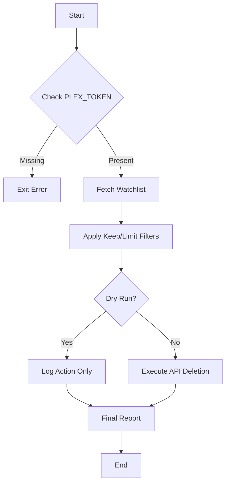
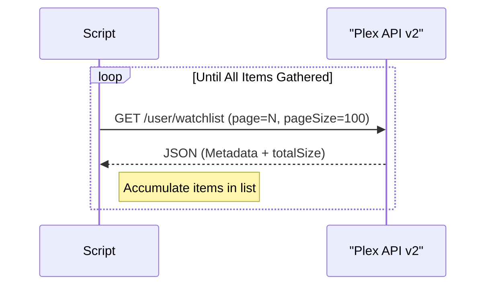

<details>
<summary>Relevant source files</summary>

The following files were used as context for generating this wiki page:

- [README.md](README.md)
- [plex_clear_watchlist.py](plex_clear_watchlist.py)
- [AGENTS.md](AGENTS.md)
- [CLAUDE.md](CLAUDE.md)
- [docker-compose.yml](docker-compose.yml)
- [requirements.txt](requirements.txt)
</details>

# Full Watchlist Clearing

Full Watchlist Clearing is the primary functional capability of the `plex_clear_watchlist` utility. It allows users to programmatically remove items from their Plex Discover Watchlist using the Plex API. The system is designed as a single-purpose, one-shot script that can be executed via Python directly or within a Docker container.

The process involves authenticating with a Plex Token, retrieving a paginated list of all watchlist items, applying user-defined filters (such as limits or retention counts), and executing deletion requests for each identified item.

Sources: [plex_clear_watchlist.py:1-5](plex_clear_watchlist.py#L1-L5), [AGENTS.md:1-5](AGENTS.md#L1-L5), [README.md:1-12](README.md#L1-L12)

## System Architecture and Data Flow

The clearing process follows a linear execution path: configuration validation, data retrieval, list processing, and item deletion.

### Component Overview

The system interacts with the Plex TV API (v2) to manage user data. It utilizes the `requests` library for HTTP communication and `sentry_sdk` for optional error tracking.



This diagram illustrates the high-level logic flow from initialization to completion.
Sources: [plex_clear_watchlist.py:11-20](plex_clear_watchlist.py#L11-L20), [plex_clear_watchlist.py:90-151](plex_clear_watchlist.py#L90-L151)

### Configuration Parameters

The clearing behavior is controlled via environment variables and command-line arguments.

| Parameter | Source | Type | Description |
|---|---|---|---|
| `PLEX_TOKEN` | Environment | String | Required. User authentication token for Plex API. |
| `SENTRY_DSN` | Environment | String | Optional. Data Source Name for Sentry error tracking. |
| `--dry-run` | CLI Flag | Boolean | If set, no deletions are performed. |
| `--limit N` | CLI Argument | Integer | Deletes at most N items from the list. |
| `--keep N` | CLI Argument | Integer | Keeps the N most recently added items. |

Sources: [plex_clear_watchlist.py:11-13](plex_clear_watchlist.py#L11-L13), [plex_clear_watchlist.py:91-96](plex_clear_watchlist.py#L91-L96), [README.md:46-51](README.md#L46-L51)

## API Interaction Logic

### Watchlist Retrieval and Pagination

The script retrieves items from `https://plex.tv/api/v2/user/watchlist`. Because the API returns results in pages, the script implements a loop to gather all items before processing.



The retrieval logic includes specific error handling for 404 status codes during pagination to prevent accidental partial deletions.
Sources: [plex_clear_watchlist.py:27-60](plex_clear_watchlist.py#L27-L60)

### Deletion Process

Individual items are deleted by appending their `ratingKey` to the base watchlist URL.

```python
def delete_from_watchlist(rating_key: str, title: str = "") -> bool:
    """Ta bort ett item från Watchlist."""
    url = f"{WATCHLIST_URL}/{rating_key}"
    response = requests.delete(url, headers=HEADERS, timeout=REQUEST_TIMEOUT)
    # ... logic to handle response
```

Sources: [plex_clear_watchlist.py:62-75](plex_clear_watchlist.py#L62-L75)

## Execution Environments

### Docker Implementation
The service is containerized for easy deployment. The `docker-compose.yml` file defines the service and maps necessary environment variables.

```yaml
services:
  plex-clear-watchlist:
    image: ghcr.io/blixten85/plex-clear-watchlist:latest
    environment:
      - PLEX_TOKEN=${PLEX_TOKEN}
      - SENTRY_DSN=${SENTRY_DSN:-}
```

Sources: [docker-compose.yml:1-7](docker-compose.yml#L1-L7), [AGENTS.md:7-14](AGENTS.md#L7-L14)

### Python Dependency Management
The project relies on a minimal set of external libraries to maintain a small footprint.
* `requests`: For API communication.
* `sentry-sdk`: For error reporting (version >= 2.0.0).

Sources: [requirements.txt:1-2](requirements.txt#L1-L2)

## Security and Best Practices

The tool adheres to several security conventions:
1.  **Token Handling:** The `PLEX_TOKEN` is never hardcoded and must be provided via environment variables.
2.  **Dry Run Safety:** The `--dry-run` flag is explicitly designed to ensure no side effects occur when testing configurations.
3.  **One-Shot Design:** The container is intended to be run with the `--rm` flag to ensure it does not persist after the task is finished.

Sources: [AGENTS.md:21-25](AGENTS.md#L21-L25), [SECURITY.md:15-18](SECURITY.md#L15-L18), [CLAUDE.md:21-25](CLAUDE.md#L21-L25)

## Summary

Full Watchlist Clearing is achieved through a controlled sequence of API interactions that prioritize data integrity. By combining pagination-aware retrieval with user-defined filters and a mandatory authentication check, the system provides a reliable method for managing large Plex Watchlists. The inclusion of a dry-run mode and Sentry integration ensures that operations are predictable and errors are traceable.
