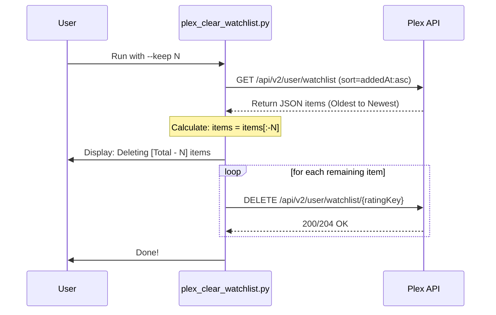

<details>
<summary>Relevant source files</summary>

The following files were used as context for generating this wiki page:

- [plex\_clear\_watchlist.py](plex_clear_watchlist.py)
- [README.md](README.md)
- [AGENTS.md](AGENTS.md)
- [CLAUDE.md](CLAUDE.md)
- [docker-compose.yml](docker-compose.yml)
</details>

# Keeping Recent Items (--keep)

The `--keep` feature is a core functional option within the `plex_clear_watchlist` utility that allows users to selectively retain a specific number of the most recently added items in their Plex Watchlist while deleting the rest. This provides a safety mechanism or a "pruning" capability rather than a complete wipe of the list.

The feature is implemented through a combination of API-side sorting and client-side list slicing. By requesting the watchlist from Plex in a specific chronological order, the script can identify which items should remain and which are eligible for removal based on the user-provided integer value.
Sources: [plex\_clear\_watchlist.py:101](plex\_clear\_watchlist.py#L101), [README.md:46](README.md#L46)

## Logic and Architecture

The retention logic relies on the `addedAt:asc` sort order provided by the Plex API during the data retrieval phase. This ensures that the oldest items appear at the beginning of the list, while the most recently added items appear at the end.

### Data Retrieval and Slicing
The script fetches all items from the Plex Watchlist using the `get_watchlist()` function. When the `--keep N` flag is used, the script performs a Python list slice to remove the last `N` items from the deletion queue.

```python
# Behåll de senaste om --keep är satt
if args.keep > 0 and args.keep < total:
    items = items[:-args.keep]
```

Sources: [plex\_clear\_watchlist.py:41](plex\_clear\_watchlist.py#L41), [plex\_clear\_watchlist.py:126-128](plex\_clear\_watchlist.py#L126-L128)

### Comparison with --limit
While both flags reduce the number of items deleted, they operate on different ends of the list or different logic:
*  `--keep N`: Preserves the `N` newest items.
*  `--limit N`: Deletes at most `N` items (starting from the oldest).

Sources: [README.md:44-46](README.md#L44-L46), [plex\_clear\_watchlist.py:130-132](plex\_clear\_watchlist.py#L130-L132)

## Workflow of the Keep Mechanism

The following diagram illustrates how the `--keep` argument modifies the deletion list after fetching items from the Plex API.

```mermaid
flowchart TD
    A[Start Script] --> B[Fetch Watchlist via API]
    B --> C{Sort: addedAt:asc}
    C --> D[Retrieve Full Item List]
    D --> E{Is --keep > 0?}
    E -- Yes --> F[Slice List: items[:-keep]]
    E -- No --> G{Is --limit > 0?}
    F --> G
    G -- Yes --> H[Slice List: items[:limit]]
    G -- No --> I[Final Deletion List]
    H --> I
    I --> J[Execute Deletion/Dry Run]
```

The diagram shows that the `--keep` filter is applied before the `--limit` filter in the processing pipeline.
Sources: [plex\_clear\_watchlist.py:126-132](plex\_clear\_watchlist.py#L126-L132)

## Configuration and Usage

The `--keep` feature is exposed as a command-line argument and can be utilized across different deployment methods including Docker Compose and direct Python execution.

### Command Line Arguments

| Flag | Type | Default | Description |
| :--- | :--- | :--- | :--- |
| `--keep` | Integer | 0 | The number of most recently added items to preserve in the watchlist. |

Sources: [plex\_clear\_watchlist.py:101](plex\_clear\_watchlist.py#L101), [README.md:46](README.md#L46)

### Execution Examples
The feature can be invoked using the following syntax:

**Docker Compose:**

```bash
PLEX_TOKEN=your-token docker compose run --rm plex-clear-watchlist --keep 5
```

Sources: [docker-compose.yml:1-7](docker-compose.yml#L1-L7), [AGENTS.md:16](AGENTS.md#L16)

**Python Interface:**

```bash
python3 plex_clear_watchlist.py --keep 10
```

Sources: [CLAUDE.md:16](CLAUDE.md#L16), [README.md:37](README.md#L37)

## Implementation Details

The implementation involves two primary stages: the API call configuration and the local array manipulation.

### API Sorting
The `get_watchlist` function explicitly requests a sort order from the Plex API to facilitate the "keep" logic. It uses the `addedAt:asc` parameter, which returns the oldest items first.
Sources: [plex\_clear\_watchlist.py:41](plex\_clear\_watchlist.py#L41)

### Execution Sequence
The sequence diagram below describes the interaction between the script and the Plex API when `--keep` is active.



Sources: [plex\_clear\_watchlist.py:35-85](plex\_clear\_watchlist.py#L35-L85), [plex\_clear\_watchlist.py:126-155](plex\_clear\_watchlist.py#L126-L155)

## Conclusion
The `keep` functionality provides a granular control mechanism for users who wish to maintain a history of their most recent additions while clearing out older, potentially forgotten items from their Plex Watchlist. By leveraging the `addedAt:asc` sort order from the Plex API, the script accurately identifies and excludes the newest entries from the deletion process.
