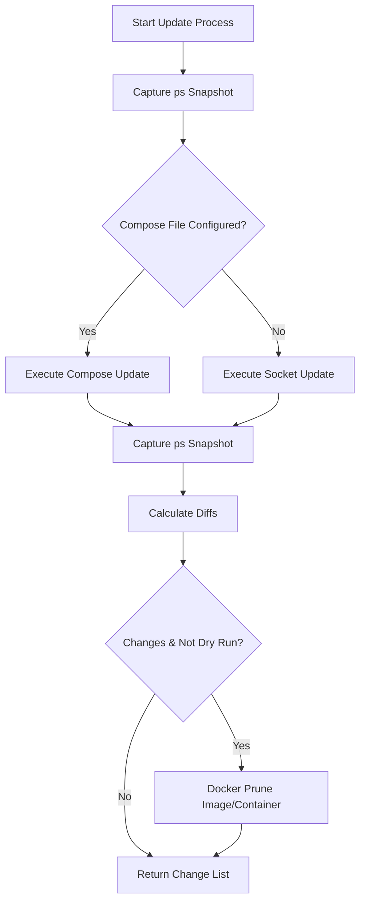
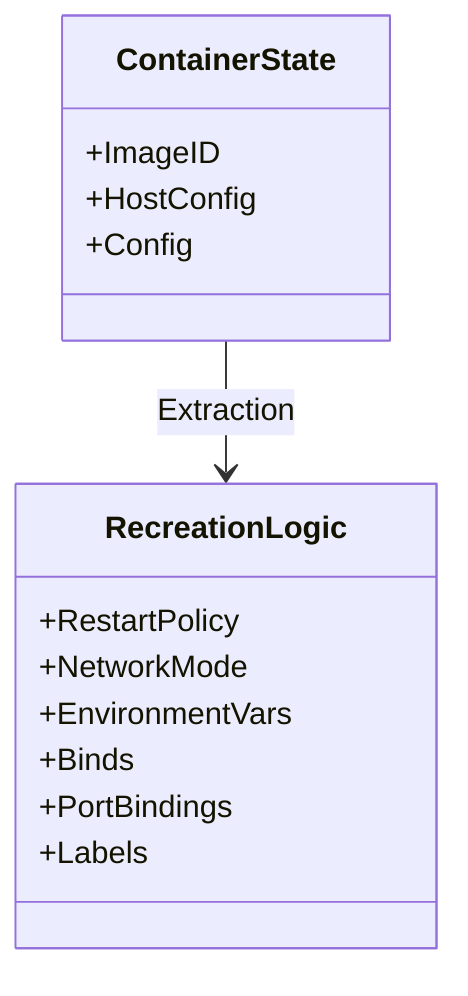

<details>
<summary>Relevant source files</summary>

The following files were used as context for generating this wiki page:

- [src/docker_update.py](src/docker_update.py)
- [src/run.py](src/run.py)
- [src/entrypoint.py](src/entrypoint.py)
- [src/config.py](src/config.py)
- [README.md](README.md)
- [CLAUDE.md](CLAUDE.md)
</details>

# Docker Container Updating

Docker Container Updating is a core module of the `docker-idempotent-update` project designed to provide daily, automated, and idempotent maintenance of a Docker host. The system monitors running containers or specific Docker Compose services, pulls the latest images, and recreates containers only when a change in the image ID is detected. This ensures that the host remains up-to-date with minimal downtime and no unnecessary restarts.

The updating process supports two primary execution paths: a Docker Compose-based approach (Option B) for structured environments and a Docker Socket-only approach (Option A) for updating all currently running containers. The system includes built-in cleanup mechanisms to prune orphaned containers and unused images following a successful update.
Sources: [README.md:9-18](README.md#L9-L18), [src/docker_update.py:11-28](src/docker_update.py#L11-L28), [CLAUDE.md:3-6](CLAUDE.md#L3-L6)

## Architecture and Execution Flow

The updating logic is orchestrated by `src/run.py` and implemented primarily in `src/docker_update.py`. The process begins by taking a snapshot of the current environment to track changes and concludes by reporting those changes via email and a local status file.

### Update Workflow Sequence
The following diagram illustrates the high-level logic used to determine which update method to execute and how changes are reconciled.



This flow ensures that maintenance tasks like pruning only occur if actual updates were applied to the system.
Sources: [src/docker_update.py:12-28](src/docker_update.py#L12-L28), [src/run.py:33-36](src/run.py#L33-L36)

## Update Methods

The system branches its logic based on the presence of the `COMPOSE_FILE` environment variable in the `Config` object.

### Option A: Docker Socket Update
When no Compose file is specified, the system iterates through all running containers via the Docker socket. It performs the following steps:
1. Lists all unique images currently in use by running containers.
2. Attempts to `docker pull` the latest version of each image.
3. Compares the `ImageID` of the running container against the ID of the newly pulled image.
4. If the IDs differ, the container is manually stopped, removed, and recreated using the original configuration (environment variables, network modes, port bindings, and volumes).
Sources: [src/docker_update.py:85-126](src/docker_update.py#L85-L126), [README.md:85-87](README.md#L85-L87)

### Option B: Docker Compose Update
If `COMPOSE_FILE` is provided, the system utilizes the `docker compose` CLI for a more integrated update:
1. Identifies all services defined in the Compose file.
2. Pulls images for each service sequentially, with a retry mechanism (up to 3 attempts with exponential backoff).
3. Executes `docker compose up -d --remove-orphans`.
4. Compares image IDs before and after the operation to identify which specific services were updated.
Sources: [src/docker_update.py:40-72](src/docker_update.py#L40-L72), [README.md:89-91](README.md#L89-L91)

## Configuration Parameters

The behavior of the update module is governed by environment variables managed through `src/config.py`.

| Variable | Default | Description |
| :--- | :--- | :--- |
| `MODE` | `both` | Determines if updates run. Must be `update` or `both`. |
| `DRY_RUN` | `false` | If `true`, logs planned actions without pulling or recreating containers. |
| `COMPOSE_FILE` | *(unset)* | Path to the `docker-compose.yml`. Triggers Option B logic. |
| `COMPOSE_ENV_FILE`| *(unset)* | Optional `.env` file passed to Docker Compose commands. |
| `CRON_SCHEDULE` | `0 3 * * *` | The internal schedule for the update task. |

Sources: [src/config.py:7-22](src/config.py#L7-L22), [src/entrypoint.py:65-67](src/entrypoint.py#L65-L67), [README.md:121-131](README.md#L121-L131)

## Idempotency and Recreation Logic

A critical feature of the update module is its ability to recreate containers from the Docker socket while preserving their original state. This is handled by the `_recreate_container` function.

### Container Configuration Mapping
When recreating a container without Docker Compose, the system inspects the existing container's `HostConfig` and `Config` to rebuild the `docker run` command.



The logic extracts the following attributes for the new container:
* **Restart Policy:** Maps `on-failure` (with retries), `always`, and `unless-stopped`.
* **Networking:** Preserves the specific `NetworkMode`.
* **Environment:** Re-applies all `Env` strings.
* **Storage:** Re-binds all volumes specified in `Binds`.
* **Ports:** Maps `HostIp`, `HostPort`, and `ContainerPort`.
* **Metadata:** Re-applies all container `Labels`.

Sources: [src/docker_update.py:129-178](src/docker_update.py#L129-L178)

## Post-Update Reporting

After the update cycle completes, the system generates a summary. This summary is used by `src/report.py` to send an email if `EMAIL_TO` is configured and changes occurred. Additionally, the final state is persisted to a status file.

### Status Schema
The status is written to `/config/status.json` with the following structure:

```json
{
  "timestamp": "2023-10-27T03:00:00Z",
  "mode": "update",
  "dry_run": false,
  "containers_updated": ["nginx", "db"],
  "backup_failures": [],
  "docker_changes": "< container_name image_old_id\n> container_name image_new_id"
}
```

Sources: [src/run.py:48-61](src/run.py#L48-L61), [src/config.py:17](src/config.py#L17)

## Summary
The Docker Container Updating module provides a robust, self-contained mechanism for maintaining Docker hosts. By abstracting the complexities of image comparison and container recreation, it ensures that services are kept current with minimal intervention. The system's flexibility in supporting both raw Docker sockets and Docker Compose files makes it suitable for a wide range of deployment scenarios.
Sources: [README.md:10-18](README.md#L10-L18), [CLAUDE.md:3-6](CLAUDE.md#L3-L6)
