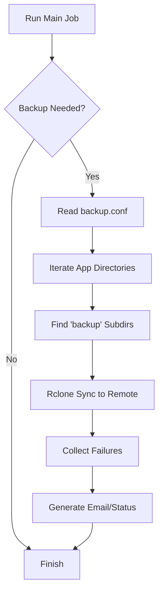
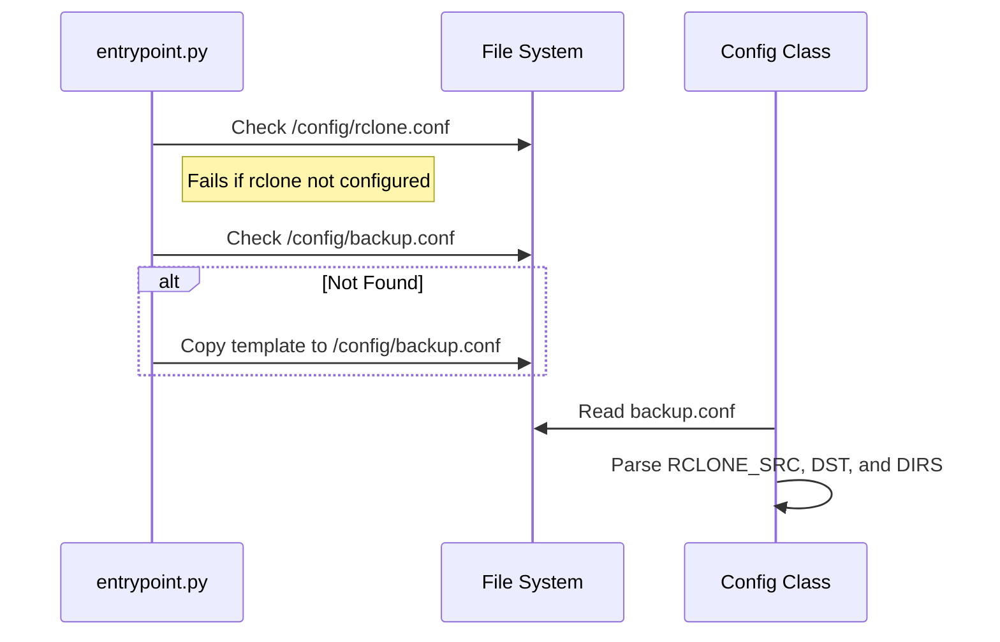

<details>
<summary>Relevant source files</summary>

The following files were used as context for generating this wiki page:

- [src/backup.py](../../../src/backup.py)
- [src/config.py](../../../src/config.py)
- [src/run.py](../../../src/run.py)
- [src/entrypoint.py](../../../src/entrypoint.py)
- [README.md](../../../README.md)
</details>

# App Data Backup

The App Data Backup system is a core component of the `docker-idempotent-update` project designed to provide automated, scheduled synchronization of application data to remote storage. It operates as a secondary or primary maintenance task, depending on the configured `MODE`, and relies on `rclone` to handle the data transfer logic. The system is designed to be idempotent and runs via an internal cron daemon within the container.

The backup process scans a source directory for specific folder names (e.g., "backup" or "backups") and syncs them to a defined rclone destination. This ensures that only relevant backup artifacts are uploaded, maintaining a structured remote repository based on the application names found in the source directory.

Sources: [README.md:9-16](README.md#L9-L16), [src/run.py:38-40](src/run.py#L38-L40), [src/backup.py:42-45](src/backup.py#L42-L45)

## Backup Architecture and Workflow

The backup system is integrated into the daily maintenance cycle initiated by `src/run.py`. When the system is in `backup` or `both` mode, it triggers the `run_backup` function.

### High-Level Flow

The following diagram illustrates the lifecycle of a backup job from initialization to completion.



The backup logic specifically searches up to two levels deep within each application folder to find directories matching the `BACKUP_DIRS` configuration.

Sources: [src/run.py:38-40](src/run.py#L38-L40), [src/backup.py:42-53](src/backup.py#L42-L53), [src/backup.py:90-96](src/backup.py#L90-L96), [README.md:104-113](README.md#L104-L113)

## Configuration

The backup system is configured through a combination of environment variables and a dedicated configuration file.

### Core Configuration Elements

The `Config` class reads settings from the environment and the `/config/backup.conf` file. If backup mode is enabled (`needs_backup`) and the configuration file does not exist at startup, the system creates it from a template.

| Variable | Default | Source | Description |
| :--- | :--- | :--- | :--- |
| `RCLONE_SRC` | `/data` | `backup.conf` | The base directory to scan for backups. |
| `RCLONE_DST` | `gdrive:backups` | `backup.conf` | The rclone remote and path for storage. |
| `BACKUP_DIRS` | `backup backups` | `backup.conf` | Space-separated list of folder names to sync. |
| `DRY_RUN` | `false` | Env Var | If true, logs sync actions without executing them. |

Sources: [src/config.py:11-30](src/config.py#L11-L30), [src/entrypoint.py:42-47](src/entrypoint.py#L42-L47), [README.md:130-140](README.md#L130-L140)

### Configuration Initialization

The following sequence shows how the system prepares the environment for backups during the container entrypoint phase.



Sources: [src/entrypoint.py:33-47](src/entrypoint.py#L33-L47), [src/config.py:27-46](src/config.py#L27-L46)

## Execution Logic

The execution phase is handled by `src/backup.py`, which wraps the `rclone` binary.

### Directory Discovery

The system uses a helper function `_find_backup_dirs` to traverse the directory structure. It yields directories at the first and second level of each application folder. If a directory name matches one of the targets in `backup_dirs` (case-insensitive), it is queued for synchronization.

Sources: [src/backup.py:53-57](src/backup.py#L53-L57), [src/backup.py:90-96](src/backup.py#L90-L96)

### Rclone Synchronization

Syncing is performed using the `rclone sync` command with a specific set of performance and reliability flags.

*  **Retry Mechanism:** The system attempts to sync each directory up to 3 times with a 15-second delay between failures.
*  **Target Pathing:** The destination path is constructed as `{rclone_dst}/{app_name}/{relative_path}`.

**Default Rclone Flags:**

```python
_RCLONE_FLAGS = [
    "--fast-list", "--transfers", "4", "--checkers", "6",
    "--tpslimit", "5", "--retries", "5", "--low-level-retries", "10",
    "--timeout", "15m", "--contimeout", "30s",
    "--checksum", "--delete-during", "--stats-one-line"
]
```

Sources: [src/backup.py:11-32](src/backup.py#L11-L32), [src/backup.py:64-83](src/backup.py#L64-L83)

## Status and Error Reporting

Upon completion, the backup system returns a list of failed sync operations to the main runner.

1.  **Status File:** Results are written to `/config/status.json`, including the `backup_failures` list and a timestamp.
2.  **Email Report:** If `EMAIL_TO` is configured and failures occurred (or updates were made), a summary email is sent via `msmtp`. The subject line is dynamically updated to include a warning emoji (⚠️) if backups failed.

Sources: [src/run.py:45-51](src/run.py#L45-L51), [src/run.py:57-65](src/run.py#L57-L65), [src/report.py:12-28](src/report.py#L12-L28)

## Conclusion

The App Data Backup system provides a robust, configuration-driven approach to preserving container data. By automating the discovery of backup folders and leveraging the reliability of rclone, it ensures that application-specific backups are consistently offloaded to remote storage while providing clear visibility into successes and failures through status files and email notifications.
