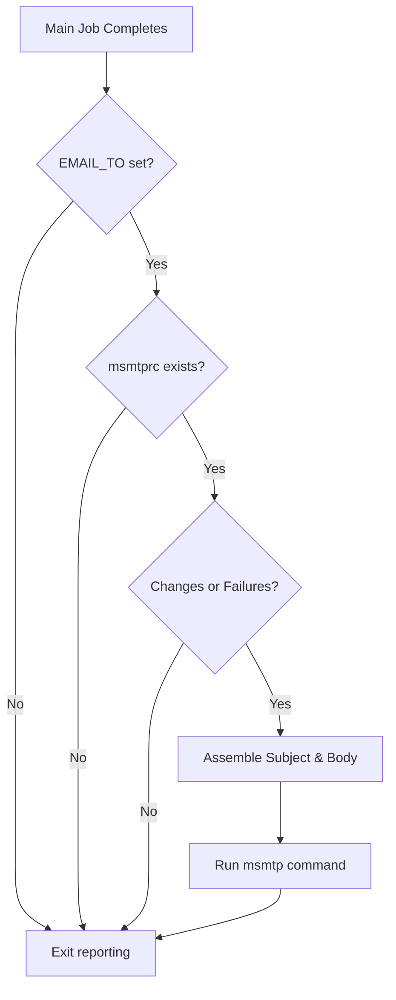
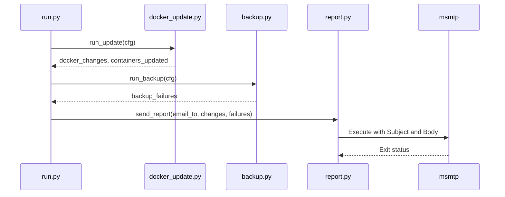

<details>
<summary>Relevant source files</summary>

The following files were used as context for generating this wiki page:

- [src/report.py](../../../src/report.py)
- [src/run.py](../../../src/run.py)
- [src/config.py](../../../src/config.py)
- [src/entrypoint.py](../../../src/entrypoint.py)
- [README.md](../../../README.md)
- [CLAUDE.md](../../../CLAUDE.md)

</details>

# Email Notifications

The Email Notifications system in `docker-idempotent-update` provides a concise, consolidated summary of maintenance activities performed during the daily execution cycle. Its primary purpose is to inform administrators about Docker container updates and rclone backup failures while adhering to an "idempotent" reporting philosophy: emails are only dispatched when actionable events occur or failures are detected.

The system relies on the `msmtp` light-weight SMTP client to transmit reports. It integrates data from the update module (container changes) and the backup module (failed sync tasks) into a single message, ensuring that users are not overwhelmed with repetitive "no-change" notifications.

Sources: [README.md:12-25](README.md#L12-L25), [CLAUDE.md:3-8](CLAUDE.md#L3-L8), [src/report.py:10-14](src/report.py#L10-L14)

## Architecture and Data Flow

The notification logic is triggered at the end of the main execution loop in `src/run.py`. It collects output from previous steps and passes them to the reporting module.

### Notification Trigger Logic

The system evaluates several conditions before attempting to send an email:
1. **Recipient Configuration**: An email address must be defined in the `EMAIL_TO` environment variable.
2. **Configuration File**: An `msmtprc` configuration file must exist at `/etc/msmtprc` (only existence is checked — its contents are not validated).
3. **Change Detection**: At least one container must have been updated or at least one backup task must have failed.

Sources: [src/report.py:11-14](src/report.py#L11-L14), [src/run.py:38-40](src/run.py#L38-L40)

### Logic Flow Diagram
The following diagram illustrates the decision matrix used to determine if a report should be dispatched.



The reporting logic ensures that notifications are only sent when there is a meaningful state change or an error requiring intervention.
Sources: [src/report.py:11-14](src/report.py#L11-L14), [src/run.py:38-40](src/run.py#L38-L40)

## Configuration and Setup

The notification system requires both environment variables and template-based configuration files to function.

### Environment Variables

| Variable | Default | Description |
| :--- | :--- | :--- |
| `EMAIL_TO` | *(unset)* | The recipient email address. If empty, no mail is sent. |
| `MODE` | `both` | Determines if update or backup data is collected for the report. |

Sources: [README.md:104-106](README.md#L104-L106), [src/config.py:9-14](src/config.py#L9-L14)

### Configuration Files
The system automatically initializes configuration templates during the container's entrypoint phase if a recipient is defined.

*  **`msmtprc`**: Located at `/config/msmtprc` (internally symlinked to `/etc/msmtprc`). This file contains SMTP server details, authentication, and port settings.
*  **Template Logic**: If `EMAIL_TO` is set but `/config/msmtprc` is missing, the system copies `/etc/msmtprc.template` to `/config/msmtprc` for user customization.

Sources: [src/entrypoint.py:46-57](src/entrypoint.py#L46-L57), [README.md:65-71](README.md#L65-L71)

## Report Generation

The `send_report` function in `src/report.py` handles the assembly of the email subject and body based on the results of the maintenance run.

### Subject Line Dynamics
The subject line is dynamically generated to reflect the severity and type of events:
*  **Success with Updates**: `🐳 Docker updated – [host] [date]`
*  **Backup Failure Only**: `⚠️ Backup failed – [host] [date]`
*  **Mixed Results**: `🐳 Docker updated + ⚠️ backup failed – [host] [date]`

Sources: [src/report.py:17-31](src/report.py#L17-L31)

### Data Components

The body of the email is constructed by concatenating specific report parts:

| Section | Data Source | Content Description |
| :--- | :--- | :--- |
| **Container updates** | `docker_changes` | A diff-style string showing image name/ID changes (e.g., `<` for old, `>` for new). |
| **Backup failures** | `backup_failures` | A list of application directories that failed to sync via rclone, prefixed with `✗`. |

Sources: [src/report.py:19-25](src/report.py#L19-L25), [src/docker_update.py:178-184](src/docker_update.py#L178-L184)

### Implementation Detail
The report is dispatched using a subprocess call to `msmtp`.

```python
# src/report.py:33-40
    try:
        subprocess.run(
            ["msmtp", email_to],
            input=f"Subject: {subject}\n\n{body}",
            text=True,
            check=True,
        )
        log.info("Mail sent: %s", subject)
    except subprocess.CalledProcessError:
        log.warning("Failed to send mail")
```

Sources: [src/report.py:33-43](src/report.py#L33-L43)

## Execution Sequence

The notification step is the final stage of the daily job execution, following the update and backup phases.



The sequence ensures that the report contains the most recent status from both the Docker engine and the rclone backup process.
Sources: [src/run.py:30-40](src/run.py#L30-L40), [README.md:20-25](README.md#L20-L25)

## Summary
The Email Notification system provides an automated feedback loop for Docker host maintenance. By integrating with `msmtp` and implementing conditional reporting based on actual system changes or failures, it offers a high-signal, low-noise monitoring solution for containerized environments.
