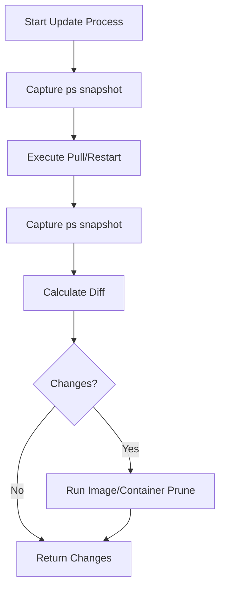
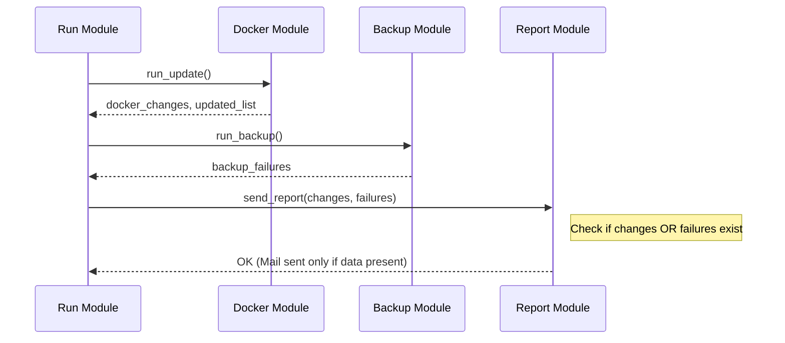

<details>
<summary>Relevant source files</summary>

The following files were used as context for generating this wiki page:

- [src/run.py](../../../src/run.py)
- [src/report.py](../../../src/report.py)
- [src/docker_update.py](../../../src/docker_update.py)
- [src/config.py](../../../src/config.py)
- [src/backup.py](../../../src/backup.py)
- [README.md](../../../README.md)
</details>

# Status Tracking (Idempotency)

Status tracking in this project ensures that administrative tasks—specifically Docker image updates and data backups—are handled with idempotency and clear observability. The system tracks the results of every maintenance cycle, recording changes to the Docker environment and the outcome of rclone synchronization tasks.

The primary mechanism for this is a JSON-based status file that persists the state of the last execution, allowing users and the system to verify what was modified, what failed, and the current operational mode.

Sources: [src/run.py:45-66](src/run.py#L45-L66), [README.md:31-35](README.md#L31-L35)

## State Capture and Persistence

At the end of every execution cycle, the system generates a state snapshot. This snapshot is stored in a structured JSON format, overwriting the file from the previous run — only the latest snapshot is kept, not a historical record.

### Status File Schema

The status information is written to a file defined by the `Config` class, typically located at `/config/status.json`. It captures the following fields:

| Field | Type | Description |
|-------|------|-------------|
| `timestamp` | String | ISO 8601 formatted UTC time of the run. |
| `mode` | String | The operation mode used (`update`, `backup`, or `both`). |
| `dry_run` | Boolean | Indicates if the changes were actually applied. |
| `containers_updated` | List[str] | Names of containers successfully recreated or updated. |
| `backup_failures` | List[str] | List of application backup paths that failed to sync. |
| `docker_changes` | String | A diff-style string showing image changes (before vs after). |

Sources: [src/run.py:53-60](src/run.py#L53-L60), [src/config.py:16](src/config.py#L16)

### Persistence Logic
The `_write_status` function in `src/run.py` handles the serialization of the runtime state to the filesystem. It writes directly with `write_text` (not a temp-file-plus-rename), so the write is not atomic.

```python
def _write_status(
    cfg: Config,
    docker_changes: str,
    containers_updated: list[str],
    backup_failures: list[str],
) -> None:
    status = {
        "timestamp": datetime.now(timezone.utc).strftime("%Y-%m-%dT%H:%M:%SZ"),
        "mode": cfg.mode,
        "dry_run": cfg.dry_run,
        "containers_updated": containers_updated,
        "backup_failures": backup_failures,
        "docker_changes": docker_changes,
    }
    cfg.status_file.write_text(json.dumps(status, indent=2))
```

Sources: [src/run.py:45-63](src/run.py#L45-L63)

## Idempotency in Docker Updates

Idempotency in the update module is achieved through state differential analysis. The system takes a "snapshot" of the running environment before and after attempting updates to determine if any action was actually taken.

### Update Workflow
1. **Snapshot Before:** The system records current container names, images, and Image IDs.
2. **Execution:** It performs a `docker pull` or `docker compose pull`.
3. **Snapshot After:** It records the environment state again.
4. **Diffing:** It compares the two snapshots to identify discrepancies.

The following diagram illustrates the flow from snapshotting to reporting:



Sources: [src/docker_update.py:12-25](src/docker_update.py#L12-L25)

### Image ID Verification
When using the Docker socket directly (without Compose), the system checks idempotency by comparing the `Id` (Image ID) from a container's current inspection against the `Id` of the latest pulled image. A container is only recreated if `running_id != latest_id`.

Sources: [src/docker_update.py:92-104](src/docker_update.py#L92-L104)

## Conditional Reporting

The system achieves "noise reduction" by using the tracked status to decide whether or not to send an email notification. Reports are only dispatched if the tracked state indicates a change or an error.



Sources: [src/run.py:38-41](src/run.py#L38-L41), [src/report.py:12-14](src/report.py#L12-L14)

### Notification Thresholds
The `send_report` function in `src/report.py` implements a guard clause. If `docker_changes` is empty and `backup_failures` is also empty, the function returns immediately without invoking `msmtp`. This ensures the project remains "silent" when the environment is already in the desired state.

Sources: [src/report.py:12-14](src/report.py#L12-L14)

## Error Tracking and Retries

For the backup system, idempotency is supported by a retry mechanism. If an `rclone sync` fails, the system does not immediately report failure but attempts the synchronization up to three times with a sleep interval. Only persistent failures are recorded in the `backup_failures` list and subsequently written to the status file.

Sources: [src/backup.py:53-64](src/backup.py#L53-L64)

## Summary of Components

| Component | File | Role in Status/Idempotency |
|-----------|------|----------------------------|
| `Config` | `src/config.py` | Defines the path for the `status.json` file. |
| `run_update` | `src/docker_update.py` | Compares pre- and post-run container snapshots. |
| `run_backup` | `src/backup.py` | Collects list of specific folder sync failures. |
| `_write_status` | `src/run.py` | Finalizes the execution by persisting the state to disk. |

Sources: [src/run.py:45-66](src/run.py#L45-L66), [src/docker_update.py:12-25](src/docker_update.py#L12-L25), [src/config.py:16](src/config.py#L16)
