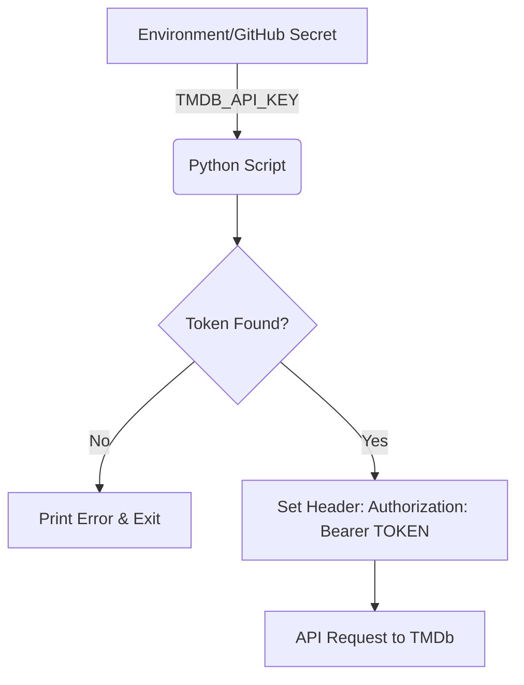
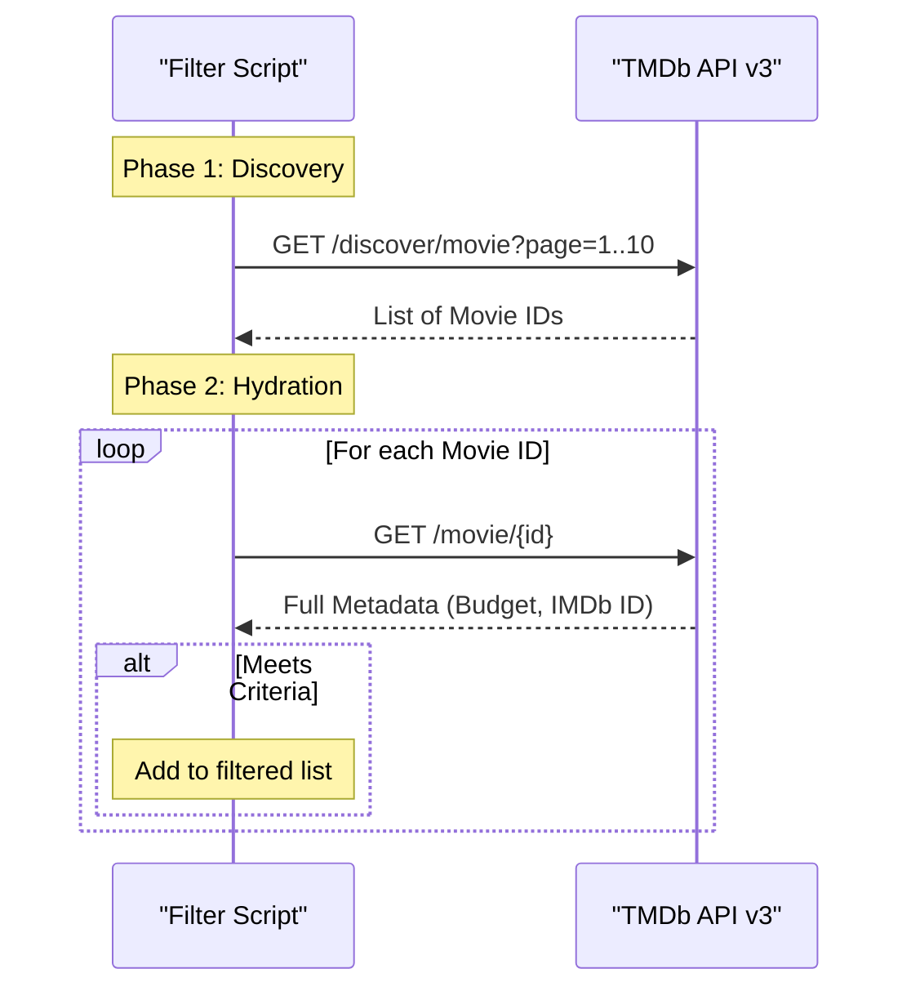

Relevant source files

The following files were used as context for generating this wiki page:

- [README.md](../../../README.md)
- [filter_movies.py](../../../filter_movies.py)
- [filter_tv_shows.py](../../../filter_tv_shows.py)
- [AGENTS.md](../../../AGENTS.md)
- [SECURITY.md](../../../SECURITY.md)

# TMDb API Integration & Auth

## Introduction
The TMDb API integration serves as the primary data ingestion layer for the `filtered-movies` project. Its purpose is to query The Movie Database (TMDb) for media metadata, which is then filtered based on specific financial or network criteria to generate import lists for Radarr and Sonarr. The integration is designed to run automatically via GitHub Actions or locally through Python scripts.

The scope of this integration includes authentication via API Read Access Tokens, discovery of new content through multiple endpoints, and detailed metadata retrieval for movies and TV shows. Security is maintained by strictly using environment variables for credential management, ensuring no sensitive tokens are committed to the repository.

Sources: [README.md:1-15](README.md#L1-L15), [AGENTS.md:1-15](AGENTS.md#L1-L15), [filter_movies.py:1-25](filter_movies.py#L1-L25)

## Authentication Mechanism
Authentication with the TMDb API is handled exclusively through **API Read Access Tokens** (JWT format, starting with `eyJ...`), rather than standard API Keys. The project mandates that this token be stored as an environment variable named `TMDB_API_KEY`.

### Credential Security
*  **Environment Variables:** The scripts retrieve the token using `os.environ.get("TMDB_API_KEY")`.
*  **GitHub Secrets:** In production (GitHub Actions), the token is stored as a repository secret.
*  **Local Development:** Users are instructed to export the variable in their shell or use `.env` files (which are ignored by git).
*  **Request Headers:** The token is transmitted in the `Authorization` header as a `Bearer` token.

Sources: [README.md:104-118](README.md#L104-L118), [SECURITY.md:58-75](SECURITY.md#L58-L75), [filter_movies.py:38-48](filter_movies.py#L38-L48)

The diagram above illustrates the flow of credentials from secure storage to the outgoing API request.
Sources: [filter_movies.py:38-48](filter_movies.py#L38-L48), [filter_tv_shows.py:39-49](filter_tv_shows.py#L39-L49)

## API Integration Architecture
The integration uses a two-phase data retrieval process: **Discovery** and **Detail Hydration**.

### 1. Discovery Phase
The system queries "Discovery" and "Listing" endpoints to gather a set of unique TMDb IDs. To ensure comprehensive coverage, it iterates through multiple pages of results (defaulting to 10 pages).

| Endpoint Type | Purpose | Specific Endpoints Used |
| :--- | :--- | :--- |
| **Movie Listings** | Current releases | `/movie/now_playing` |
| **Movie Discovery** | Filtered searches | `/discover/movie` (sorted by popularity, revenue, vote_count) |
| **TV Listings** | Current broadcasts | `/tv/on_the_air`, `/tv/airing_today` |
| **TV Discovery** | Filtered searches | `/discover/tv` (sorted by popularity, vote_average, first_air_date) |

Sources: [filter_movies.py:53-75](filter_movies.py#L53-L75), [filter_tv_shows.py:56-82](filter_tv_shows.py#L56-L82)

### 2. Detail Hydration & Filtering
Once a list of IDs is compiled, the script performs individual requests for each ID to retrieve full metadata required for filtering (e.g., `budget` for movies or `networks` and `external_ids` for TV shows).

This sequence diagram shows the iterative process of discovering IDs and then fetching detailed metadata for each entry.
Sources: [filter_movies.py:91-135](filter_movies.py#L91-L135), [filter_tv_shows.py:108-155](filter_tv_shows.py#L108-L155)

## Error Handling and Rate Limiting
The integration includes basic resiliency measures to handle API instability and rate limiting imposed by TMDb.

*  **Rate Limit Handling:** If the API returns a `429 Too Many Requests` status code, the scripts pause using `time.sleep()` before retrying the request.
*  **Timeouts:** All `requests.get` calls are configured with a 30-second timeout to prevent the script from hanging on network issues.
*  **Invalid Credentials:** The TV show script explicitly checks for `401 Unauthorized` responses to identify invalid API keys early.
*  **Monitoring:** Integration with Sentry (`sentry_sdk`) is utilized to capture and report exceptions during the execution of the filtering scripts.

Sources: [filter_movies.py:27-33, 76-85](filter_movies.py#L27-L33), [filter_tv_shows.py:84-95, 126-130](filter_tv_shows.py#L84-L95), [requirements.txt:2](requirements.txt#L2)

## API Data Mapping
The following table outlines how TMDb API fields are mapped to the project's internal logic and output files.

| Project Module | TMDb API Field | Usage | Output Field |
| :--- | :--- | :--- | :--- |
| **Movies** | `budget` | Must be ≥ 100,000,000 | N/A (Filter only) |
| **Movies** | `imdb_id` | Required for Radarr import | `imdb_id` |
| **Movies** | `title` | Display name | `title` |
| **TV Shows** | `networks` | Checked against PRESTIGE_NETWORKS list | N/A (Filter only) |
| **TV Shows** | `external_ids.tvdb_id` | Required for Sonarr import | `TvdbId` |
| **Common** | `release_date` / `first_air_date` | Restricted to current calendar year | N/A (Filter only) |

Sources: [filter_movies.py:118-135](filter_movies.py#L118-L135), [filter_tv_shows.py:43-52, 137-147](filter_tv_shows.py#L43-L52), [README.md:82-100](README.md#L82-L100)

## Conclusion
The TMDb API integration provides a robust mechanism for data acquisition, prioritizing security and reliability. By leveraging both discovery and detailed metadata endpoints, the system accurately identifies high-value content while respecting API constraints. The use of standard Bearer token authentication ensures compatibility with TMDb's preferred security model for read-only access.
