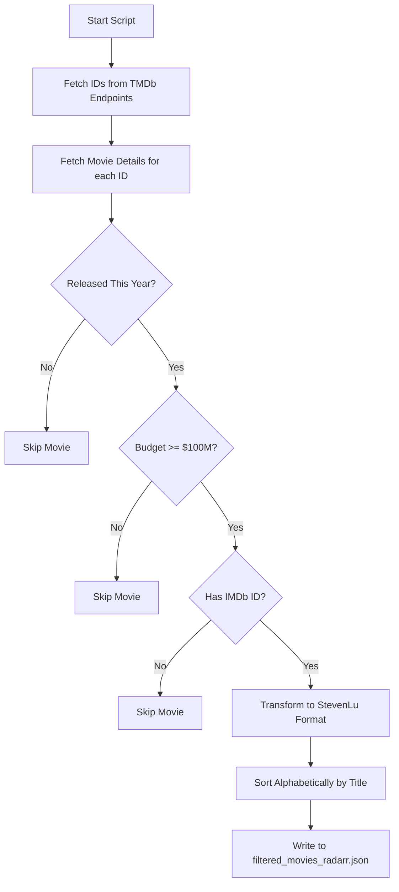
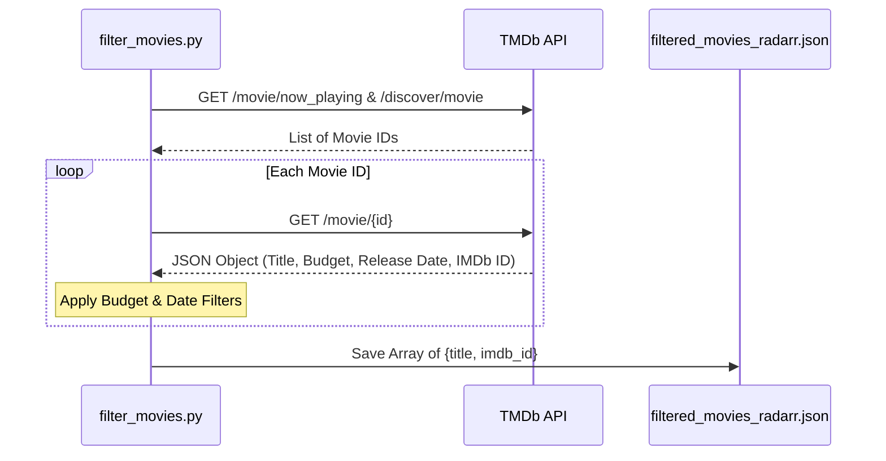

<details>
<summary>Relevant source files</summary>

The following files were used as context for generating this wiki page:

- [filtered_movies_radarr.json](../../../filtered_movies_radarr.json)
- [filter_movies.py](../../../filter_movies.py)
- [README.md](../../../README.md)
- [AGENTS.md](../../../AGENTS.md)
- [CLAUDE.md](../../../CLAUDE.md)
</details>

# JSON Data Schema: Movies

The Movie JSON Data Schema defines the structure of the high-value movie lists generated by this project for consumption by automation tools like Radarr. The primary purpose of this schema is to provide a "StevenLu Custom" compatible format that Radarr can parse to automatically monitor and download films based on specific financial criteria.

The schema is populated daily by an automated pipeline that queries The Movie Database (TMDb) API. It specifically targets "Big Budget" productions, defined as movies with a production budget of $100,000,000 or more, released within the current calendar year.

Sources: [README.md:12-16](README.md#L12-L16), [filter_movies.py:1-12](filter_movies.py#L1-L12), [AGENTS.md:12-16](AGENTS.md#L12-L16)

## Data Structure Overview

The schema is represented as a JSON array of objects. Each object represents a single movie that has passed the budget and release date filters. The structure is intentionally minimalist to maintain compatibility with the StevenLu import format used by Radarr.

### Schema Fields

| Field | Type | Description | Constraints |
| :--- | :--- | :--- | :--- |
| `title` | String | The official title of the movie. | Copied from TMDb as-is; not validated as non-empty by the generator. |
| `imdb_id` | String | The unique identifier for the movie on IMDb. | Required (movie is skipped if missing/falsy); the "tt" prefix format is not itself validated. |

Sources: [filter_movies.py:84-93](filter_movies.py#L84-L93), [filtered_movies_radarr.json:1-10](filtered_movies_radarr.json#L1-L10), [README.md:65-75](README.md#L65-L75)

## Logic and Data Flow

The generation of the JSON schema follows a strict filtering and transformation process. The system first gathers candidate IDs from various TMDb endpoints and then performs deep inspections to validate budget and identity requirements.

### Data Acquisition Flow

The following diagram illustrates how TMDb data is retrieved and transformed into the final movie schema.



The workflow ensures that only high-budget, current-year films with valid external identifiers are included in the output.
Sources: [filter_movies.py:44-81](filter_movies.py#L44-L81), [filter_movies.py:96-141](filter_movies.py#L96-L141)

### Filtering Constraints

1.  **Temporal Constraint:** The movie must have a `release_date` between January 1st of the current year and the current date.
2.  **Financial Constraint:** The movie must have a reported `budget` field in TMDb greater than or equal to `100,000,000`. Movies with a budget of `0` (unknown) are explicitly ignored to avoid false positives.
3.  **Identity Constraint:** The movie must possess a valid `imdb_id`. If TMDb does not provide an IMDb ID, the entry is skipped because Radarr requires this identifier for the StevenLu import method.

Sources: [filter_movies.py:38](filter_movies.py#L38), [filter_movies.py:114-129](filter_movies.py#L114-L129)

## API Integration Schema

The schema is derived from specific TMDb API responses. The script interacts with several endpoints to gather the necessary fields.

### TMDb Mappings

| Source Field (TMDb) | Target Field (Schema) | Mapping Function |
| :--- | :--- | :--- |
| `results[].id` | N/A (Internal) | Used to fetch full details via `/movie/{id}`. |
| `title` | `title` | Direct mapping in `simplify_movie_stevenlu`. |
| `imdb_id` | `imdb_id` | Direct mapping; entry discarded if null. |

Sources: [filter_movies.py:44-55](filter_movies.py#L44-L55), [filter_movies.py:84-93](filter_movies.py#L84-L93)

### Sequence of Data Extraction

The sequence diagram below shows the interaction between the filtering script and the external TMDb API to build the JSON schema.



Sources: [filter_movies.py:44-81](filter_movies.py#L44-L81), [filter_movies.py:96-141](filter_movies.py#L96-L141)

## Example JSON Instance

The following snippet demonstrates a valid instance of the schema as it appears in the generated output file.

```json
[
  {
    "title": "Project Hail Mary",
    "imdb_id": "tt12042730"
  },
  {
    "title": "Hoppers",
    "imdb_id": "tt26443616"
  }
]
```

Sources: [filtered_movies_radarr.json:1-10](filtered_movies_radarr.json#L1-L10), [README.md:65-75](README.md#L65-L75)

## Summary
The "JSON Data Schema: Movies" provides a standardized, lightweight interface between TMDb's vast movie database and Radarr's import capabilities. By restricting the schema to just `title` and `imdb_id` and applying a strict $100M budget filter, the project automates the discovery of major theatrical and streaming releases for home media management systems.
