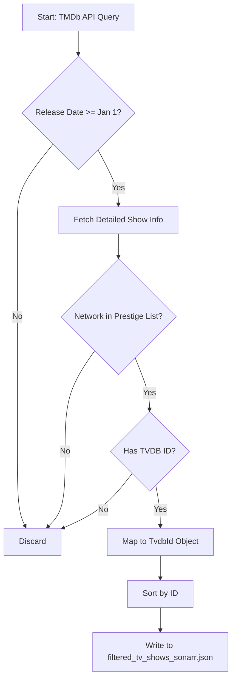
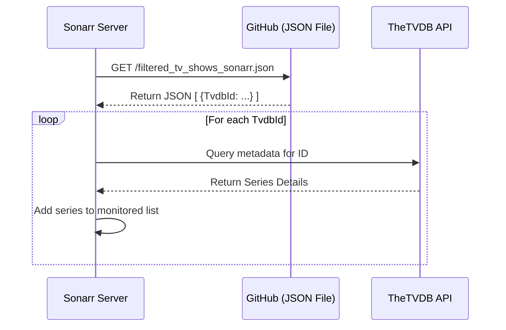

<details>
<summary>Relevant source files</summary>

The following files were used as context for generating this wiki page:

- [filtered\_tv\_shows\_sonarr.json](../../../filtered_tv_shows_sonarr.json)
- [filter\_tv\_shows.py](../../../filter_tv_shows.py)
- [README.md](../../../README.md)
- [CLAUDE.md](../../../CLAUDE.md)
- [AGENTS.md](../../../AGENTS.md)
</details>

# JSON Data Schema: TV Shows

The TV Shows JSON data schema represents a curated list of high-value television content intended for automated consumption by Sonarr. The schema focuses on "Prestige Networks"—high-tier streaming services and premium cable channels—to ensure that only top-tier content is imported into media management systems. 

Sources: [README.md:1-25](README.md#L1-L25), [filter_tv_shows.py:1-15](filter_tv_shows.py#L1-L15)

This data is generated daily through an automated pipeline that queries The Movie Database (TMDb) API, filters results based on network affiliation and release date, and maps the results to the TVDB identification format required by Sonarr's Custom List importer.

Sources: [CLAUDE.md:1-15](CLAUDE.md#L1-L15), [filter_tv_shows.py:165-180](filter_tv_shows.py#L165-L180)

## Schema Structure

The schema is a flat array of objects, where each object contains a single key-value pair representing a unique identifier for a TV show.

### Data Model Fields

| Field | Type | Description |
| :--- | :--- | :--- |
| `TvdbId` | Integer | The unique identifier from TheTVDB.com, used by Sonarr for indexing and metadata retrieval. |

Sources: [filtered_tv_shows_sonarr.json:1-10](filtered_tv_shows_sonarr.json#L1-L10), [filter_tv_shows.py:136-140](filter_tv_shows.py#L136-L140)

### JSON Format Example
The output file `filtered_tv_shows_sonarr.json` follows this structure:

```json
[
  {
    "TvdbId": 376098
  },
  {
    "TvdbId": 430654
  }
]
```

Sources: [README.md:82-88](README.md#L82-L88), [filtered_tv_shows_sonarr.json:1-10](filtered_tv_shows_sonarr.json#L1-L10)

## Data Generation Logic

The logic responsible for populating this schema resides in `filter_tv_shows.py`. The system performs a multi-stage filtering process to ensure data quality and relevance.

### Filtering Criteria
The data generation script applies the following hardcoded constraints:
*  **Timeframe**: Only shows that premiered from January 1st of the current year onwards.
*  **Provider**: Only shows belonging to specific "Prestige Networks".
*  **Metadata**: Only shows that possess a valid TVDB ID via TMDb's `external_ids` endpoint.

Sources: [filter_tv_shows.py:11-20](filter_tv_shows.py#L11-L20), [filter_tv_shows.py:115-125](filter_tv_shows.py#L115-L125)

### Prestige Networks List
The following networks are included in the filter:
*  HBO / Max
*  Apple TV+ / Apple TV
*  National Geographic
*  Amazon / Prime Video / Amazon Prime Video

Sources: [filter_tv_shows.py:44-53](filter_tv_shows.py#L44-L53), [README.md:27-35](README.md#L27-L35)

### Processing Flow
The following diagram illustrates how TMDb data is transformed into the TV Show JSON schema:



The flow ensures that every entry in the final JSON file is actionable by Sonarr.
Sources: [filter_tv_shows.py:65-155](filter_tv_shows.py#L65-L155)

## Integration with Sonarr

The generated JSON file is hosted via GitHub Pages/Raw content and acts as a "Custom List" source for Sonarr.

### Sequence of Import



Sources: [README.md:57-70](README.md#L57-L70), [AGENTS.md:1-15](AGENTS.md#L1-L15)

## Technical Requirements for Schema Updates

The schema is maintained through an automated Python environment.

| Component | Requirement |
| :--- | :--- |
| **Language** | Python 3.8 or later |
| **Dependencies** | `requests`, `sentry-sdk` |
| **Authentication** | TMDb API Read Access Token (Environment Variable) |
| **Automation** | GitHub Actions (update-tv-shows.yml) |

Sources: [requirements.txt:1-2](requirements.txt#L1-L2), [filter_tv_shows.py:27-35](filter_tv_shows.py#L27-L35), [README.md:100-110](README.md#L100-L110)

## Conclusion
The TV Show JSON Data Schema serves as a bridge between high-volume media databases (TMDb) and specialized management software (Sonarr). By strictly enforcing a schema consisting only of `TvdbId` entries and filtering by prestigious distributors, the project automates the discovery of high-quality television content.
