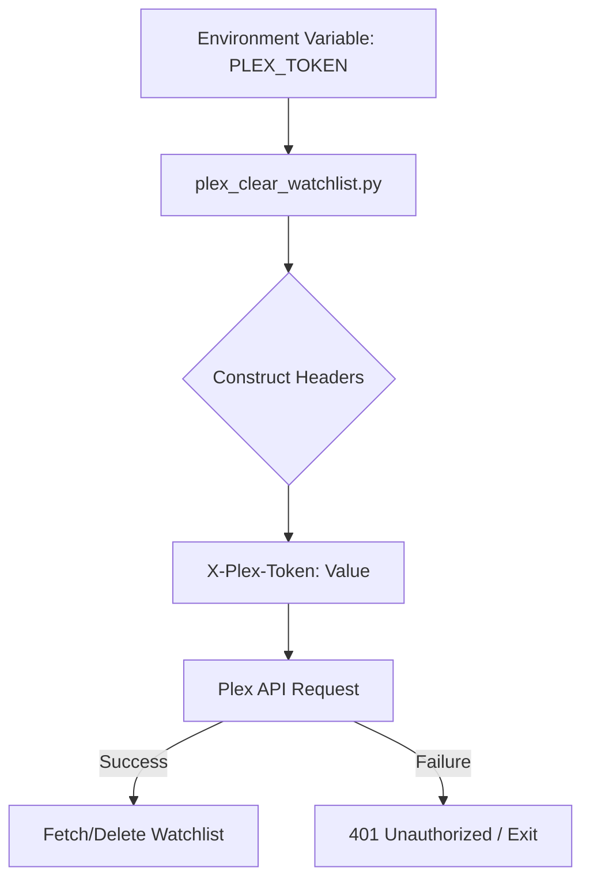
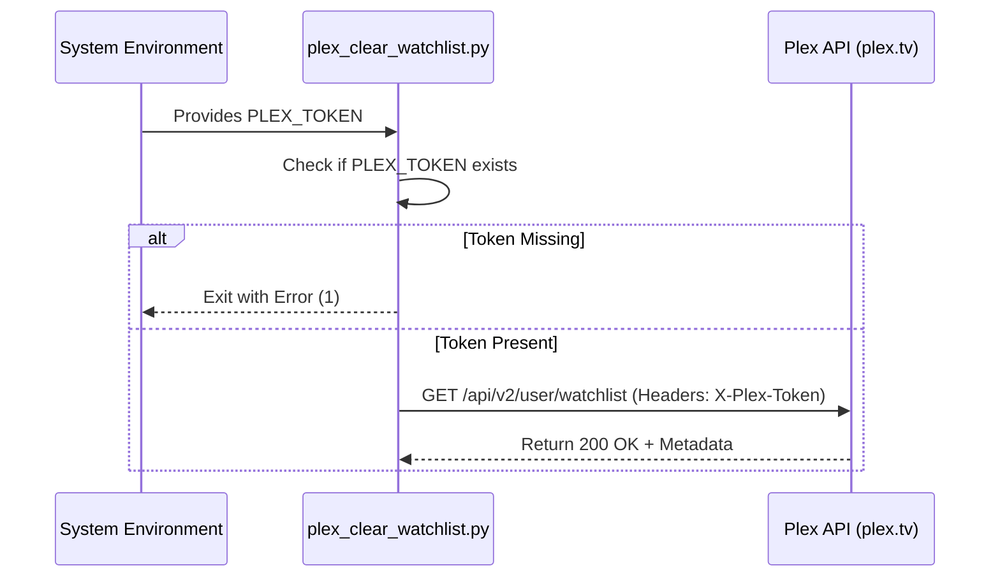

Relevant source files

The following files were used as context for generating this wiki page:

- [plex\_clear\_watchlist.py](plex_clear_watchlist.py)
- [README.md](README.md)
- [SECURITY.md](SECURITY.md)
- [AGENTS.md](AGENTS.md)
- [CLAUDE.md](CLAUDE.md)
- [docker-compose.yml](docker-compose.yml)

# Plex Token Management

## Introduction
Plex Token Management refers to the handling, storage, and utilization of the `PLEX_TOKEN` authentication credential within the `plex_clear_watchlist` utility. This token serves as the primary authorization mechanism for interacting with the Plex API v2 to retrieve and modify a user's private watchlist.

The project enforces strict security standards for token handling, mandating the use of environment variables to prevent accidental exposure in source control. The token is integrated across various execution environments, including local Python scripts, Docker containers, and Docker Compose services.
Sources: [README.md:12-14](README.md#L12-L14), [AGENTS.md:21-23](AGENTS.md#L21-L23), [SECURITY.md:17-19](SECURITY.md#L17-L19)

## Authentication Flow and Security
The `PLEX_TOKEN` is the cornerstone of the application's authentication. It is required for all requests made to `https://plex.tv/api/v2/user/watchlist`. 

### Security Constraints
*  **Environment Variables:** The token must always be provided via environment variables and never hardcoded into the source files.
*  **Credential Exposure:** Users are instructed never to commit `.env` files or credentials to version control.
*  **Access Control:** The token allows the script to perform both `GET` (fetch items) and `DELETE` (remove items) operations on the user's account.

Sources: [SECURITY.md:18-19](SECURITY.md#L18-L19), [AGENTS.md:21-23](AGENTS.md#L21-L23), [plex_clear_watchlist.py:9-14](plex_clear_watchlist.py#L9-L14)

### Data Flow Diagram
The following diagram illustrates how the `PLEX_TOKEN` is passed from the environment into the application logic to authorize API calls.

The script validates the presence of the token at startup. If the environment variable is missing, the application terminates immediately with an error message.
Sources: [plex_clear_watchlist.py:9-14](plex_clear_watchlist.py#L9-L14), [plex_clear_watchlist.py:20-24](plex_clear_watchlist.py#L20-L24)

## Implementation Details

### API Configuration
The application uses the token to populate the `HEADERS` dictionary used in every `requests` call.

| Component | Value/Description | Source |
| :--- | :--- | :--- |
| **Token Variable** | `os.environ.get("PLEX_TOKEN", "")` | [plex_clear_watchlist.py:9](plex_clear_watchlist.py#L9) |
| **Header Key** | `X-Plex-Token` | [plex_clear_watchlist.py:21](plex_clear_watchlist.py#L21) |
| **Accept Type** | `application/json` | [plex_clear_watchlist.py:22](plex_clear_watchlist.py#L22) |
| **Endpoint** | `https://plex.tv/api/v2/user/watchlist` | [plex_clear_watchlist.py:18](plex_clear_watchlist.py#L18) |

### Token Injection Methods
Depending on the deployment method, the token is injected into the runtime environment differently:

1.  **Direct Shell:** `export PLEX_TOKEN='your-token-here'`
2.  **Docker CLI:** `docker run -e PLEX_TOKEN=your-token ...`
3.  **Docker Compose:** Values are mapped from the host environment or a `.env` file via `PLEX_TOKEN=${PLEX_TOKEN}`.

Sources: [README.md:32-34](README.md#L32-L34), [README.md:43](README.md#L43), [docker-compose.yml:6](docker-compose.yml#L6)

### Execution Logic
The following sequence diagram shows the interaction between the system environment, the script, and the Plex API during the authentication and retrieval phase.

Sources: [plex_clear_watchlist.py:9-56](plex_clear_watchlist.py#L9-L56), [README.md:20-25](README.md#L20-L25)

## Conclusion
Plex Token Management in this project is designed for simplicity and security. By leveraging standard environment variables, the system ensures that sensitive authentication credentials remain outside the codebase while providing a flexible mechanism for authorization across multiple deployment platforms like Docker and standalone Python environments.
Sources: [AGENTS.md:21-25](AGENTS.md#L21-L25), [CLAUDE.md:19-23](CLAUDE.md#L19-L23)
