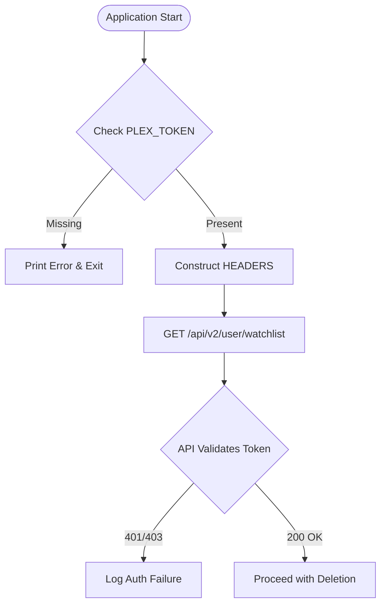
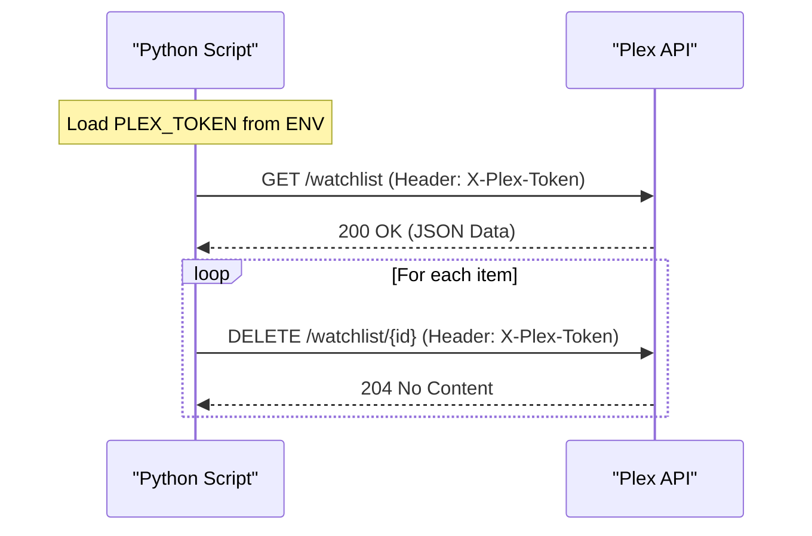

<details>
<summary>Relevant source files</summary>

The following files were used as context for generating this wiki page:

- [README.md](README.md)
- [plex_clear_watchlist.py](plex_clear_watchlist.py)
- [SECURITY.md](SECURITY.md)
- [AGENTS.md](AGENTS.md)
- [docker-compose.yml](docker-compose.yml)
- [CLAUDE.md](CLAUDE.md)
</details>

# Plex Token Management

Plex Token Management within the `plex_clear_watchlist` project encompasses the secure acquisition, storage, and utilization of the `PLEX_TOKEN` required to authenticate requests against the Plex API. This token serves as the primary credential allowing the script to retrieve and modify a user's personal watchlist.

The project is designed to handle tokens exclusively through environment variables, ensuring that sensitive credentials are never hardcoded or committed to version control. This architectural decision supports secure deployment via Docker and standard shell environments.
Sources: [plex_clear_watchlist.py:9-14](plex_clear_watchlist.py#L9-L14), [AGENTS.md:20-22](AGENTS.md#L20-L22), [SECURITY.md:14-16](SECURITY.md#L14-L16)

## Token Acquisition and Storage

Users must obtain their Plex token manually from the Plex web interface (Settings → Account → Security). The application does not include logic for generating tokens or performing OAuth flows; it assumes a valid token is provided at runtime.

### Configuration Methods
The token is managed through three primary methods:
1.  **Environment Variables**: Direct export in the shell.
2.  **Dotenv Files**: Storing `PLEX_TOKEN=your-token` in a `.env` file for Docker Compose.
3.  **Docker Orchestration**: Passing the token via the `-e` flag or the `environment` section in YAML.

Sources: [README.md:10-25](README.md#L10-L25), [docker-compose.yml:6-7](docker-compose.yml#L6-L7)

## Implementation Logic

The main script initializes the token at startup. If the `PLEX_TOKEN` environment variable is missing, the application logs an error to `stderr` and terminates with exit code 1.

```python
PLEX_TOKEN = os.environ.get("PLEX_TOKEN", "")
if not PLEX_TOKEN:
    print("❌ Error: PLEX_TOKEN environment variable not set", file=sys.stderr)
    sys.exit(1)
```

Sources: [plex_clear_watchlist.py:9-14](plex_clear_watchlist.py#L9-L14)

### API Authentication Flow
Once loaded, the token is injected into the HTTP headers for all requests sent to the Plex API. The following flowchart illustrates how the token is utilized during the authentication process.



The application uses the `X-Plex-Token` header for authentication.
Sources: [plex_clear_watchlist.py:17-21](plex_clear_watchlist.py#L17-L21)

## API Usage Reference

The token is utilized across two main API endpoints to manage the watchlist.

| Endpoint | Method | Token Usage | Description |
| :--- | :--- | :--- | :--- |
| `https://plex.tv/api/v2/user/watchlist` | GET | `X-Plex-Token` Header | Fetches paginated watchlist items. |
| `https://plex.tv/api/v2/user/watchlist/{rating_key}` | DELETE | `X-Plex-Token` Header | Removes a specific item from the watchlist. |

Sources: [plex_clear_watchlist.py:17-21](plex_clear_watchlist.py#L17-L21), [plex_clear_watchlist.py:35](plex_clear_watchlist.py#L35), [plex_clear_watchlist.py:61](plex_clear_watchlist.py#L61)

### Authentication Data Flow
The sequence diagram below details the interaction between the script and the Plex API using the managed token.



Sources: [plex_clear_watchlist.py:24-70](plex_clear_watchlist.py#L24-L70)

## Security Guidelines

To maintain the integrity of the Plex Token, the following security practices are enforced within the repository:
*  **No Hardcoding**: The `PLEX_TOKEN` must always be provided via environment variables.
*  **Version Control**: `.env` files and credentials must never be committed.
*  **Security Reporting**: Vulnerabilities related to credential handling should be reported via GitHub's private reporting feature rather than public issues.

Sources: [SECURITY.md:8-16](SECURITY.md#L8-L16), [CLAUDE.md:20-22](CLAUDE.md#L20-L22)

## Summary
Plex Token Management in this project is a lightweight, environment-driven system. By leveraging the `X-Plex-Token` header and enforcing strict environment variable usage, the project ensures that user credentials remain secure while providing the necessary authorization for automated watchlist maintenance.
Sources: [plex_clear_watchlist.py:9-21](plex_clear_watchlist.py#L9-L21), [AGENTS.md:20-22](AGENTS.md#L20-L22)
