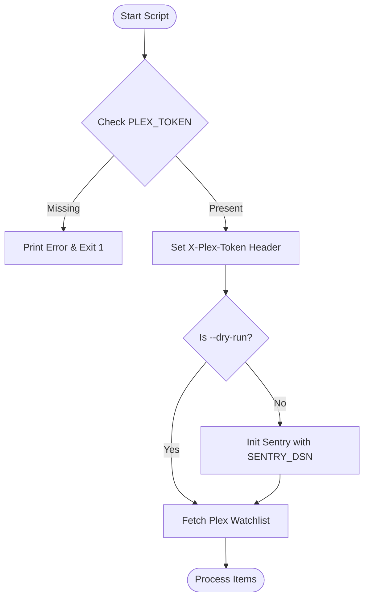

<details>
<summary>Relevant source files</summary>

The following files were used as context for generating this wiki page:

- [README.md](README.md)
- [docker-compose.yml](docker-compose.yml)
- [plex_clear_watchlist.py](plex_clear_watchlist.py)
- [SECURITY.md](SECURITY.md)
- [AGENTS.md](AGENTS.md)
- [CLAUDE.md](CLAUDE.md)
</details>

# Environment Variables Overview

Environment variables serve as the primary configuration mechanism for the `plex_clear_watchlist` tool. They are used to handle sensitive authentication data and optional telemetry integration, ensuring that credentials like the Plex Token are never hardcoded into the source code or committed to version control.

The system relies on these variables to authenticate against the Plex API and, optionally, to report runtime errors to a Sentry instance. These variables can be provided through standard shell exports, `.env` files, or Docker orchestration.
Sources: [SECURITY.md:15-17](SECURITY.md#L15-L17), [AGENTS.md:21-23](AGENTS.md#L21-L23), [CLAUDE.md:21-23](CLAUDE.md#L21-L23)

## Core Configuration Variables

The application requires specific variables to interact with the Plex ecosystem and manage error reporting.

### Supported Environment Variables

| Variable | Requirement | Description | Default |
| :--- | :--- | :--- | :--- |
| `PLEX_TOKEN` | **Required** | The authentication token used to access the Plex API. | None |
| `SENTRY_DSN` | Optional | Data Source Name for Sentry error tracking. | Unset (No-op) |

Sources: [plex_clear_watchlist.py:9-12](plex_clear_watchlist.py#L9-L12), [README.md:14-16](README.md#L14-L16), [docker-compose.yml:7-8](docker-compose.yml#L7-L8)

### PLEX_TOKEN
The `PLEX_TOKEN` is mandatory for the script to function. It is utilized in the `HEADERS` dictionary as `X-Plex-Token` for every request made to `https://plex.tv/api/v2/user/watchlist`. If this variable is missing, the script will output an error message to `stderr` and terminate with exit code 1.
Sources: [plex_clear_watchlist.py:10-14](plex_clear_watchlist.py#L10-L14), [plex_clear_watchlist.py:20-22](plex_clear_watchlist.py#L20-L22)

### SENTRY_DSN
The `SENTRY_DSN` is an optional variable used to initialize the Sentry SDK for error tracking. This initialization only occurs if the `--dry-run` flag is **not** present. If the variable is unset, the system performs a no-op regarding error reporting.
Sources: [README.md:16](README.md#L16), [plex_clear_watchlist.py:85-92](plex_clear_watchlist.py#L85-L92)

## Initialization and Data Flow

The script processes environment variables during its initial execution phase to establish the configuration state.



The flow shows how `PLEX_TOKEN` is critical for initial setup, while `SENTRY_DSN` is conditionally used based on execution arguments.
Sources: [plex_clear_watchlist.py:9-24](plex_clear_watchlist.py#L9-L24), [plex_clear_watchlist.py:84-92](plex_clear_watchlist.py#L84-L92)

## Deployment and Environment Provisioning

Environment variables can be passed to the application through multiple methods depending on the execution environment.

### Docker and Docker Compose
In a Docker environment, variables are typically defined in the `docker-compose.yml` file or passed via the `-e` flag in a `docker run` command. The `docker-compose.yml` file is configured to forward these variables from the host environment or a `.env` file.
Sources: [docker-compose.yml:6-8](docker-compose.yml#L6-L8), [README.md:26-30](README.md#L26-L30)

```yaml
# Example from docker-compose.yml
services:
  plex-clear-watchlist:
    environment:
      - PLEX_TOKEN=${PLEX_TOKEN}
      - SENTRY_DSN=${SENTRY_DSN:-}
```

Sources: [docker-compose.yml:4-8](docker-compose.yml#L4-L8)

### Security Best Practices
The project strictly enforces security regarding environment variables:
*  **No Hardcoding:** `PLEX_TOKEN` must always be provided via environment variables.
*  **Version Control:** Credentials and `.env` files should never be committed to the repository.
*  **Confidentiality:** Security vulnerabilities related to credential handling should be reported via private reporting features.

Sources: [SECURITY.md:16-17](SECURITY.md#L16-L17), [AGENTS.md:21-22](AGENTS.md#L21-L22), [CLAUDE.md:21-22](CLAUDE.md#L21-L22)

## Summary
Environment variables represent the primary interface for configuring the `plex_clear_watchlist` tool. The mandatory `PLEX_TOKEN` enables secure communication with the Plex API, while the optional `SENTRY_DSN` facilitates production monitoring. By leveraging these variables, the project maintains a clear separation between code logic and sensitive configuration data.
