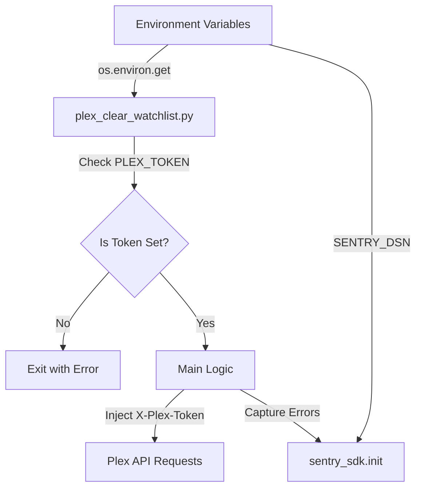

<details>
<summary>Relevant source files</summary>

The following files were used as context for generating this wiki page:

- [plex\_clear\_watchlist.py](plex_clear_watchlist.py)
- [docker-compose.yml](docker-compose.yml)
- [README.md](README.md)
- [AGENTS.md](AGENTS.md)
- [SECURITY.md](SECURITY.md)
- [CLAUDE.md](CLAUDE.md)
</details>

# Environment Variables Overview

The `plex_clear_watchlist` project utilizes environment variables as the primary mechanism for configuration and security. This approach ensures that sensitive credentials, specifically authentication tokens, are never hardcoded into the source code or committed to version control systems. The application relies on these variables to authenticate with the Plex API and optionally to provide error monitoring services.

Sources: [SECURITY.md:16-18](SECURITY.md#L16-L18), [AGENTS.md:27-29](AGENTS.md#L27-L29), [CLAUDE.md:27-29](CLAUDE.md#L27-L29)

## Core Configuration Variables

The application identifies two primary environment variables that control its execution and monitoring capabilities.

### PLEX_TOKEN
The `PLEX_TOKEN` is a mandatory requirement for the application to function. It serves as the authentication credential for the Plex API. The script retrieves this value using `os.environ.get("PLEX_TOKEN", "")`. If the variable is not set, the application terminates with an error message and exits with status code 1.

Sources: [plex_clear_watchlist.py:9-14](plex_clear_watchlist.py#L9-L14), [README.md:14-14](README.md#L14)

### SENTRY_DSN
The `SENTRY_DSN` is an optional variable used to enable error tracking via the Sentry SDK. If provided, the application initializes the Sentry client to capture exceptions and failed deletion attempts. If unset, Sentry operations remain a no-op, and the application continues to function normally.

Sources: [README.md:16-16](README.md#L16), [plex_clear_watchlist.py:104-110](plex_clear_watchlist.py#L104-L110)

## Implementation and Data Flow

The environment variables are ingested at the start of the execution and passed to different components of the system.



*The diagram shows how environment variables flow from the system environment into the script logic and external service integrations.*

Sources: [plex_clear_watchlist.py:9-110](plex_clear_watchlist.py#L9-L110), [docker-compose.yml:6-8](docker-compose.yml#L6-L8)

## Configuration Summary Table

| Variable Name | Required | Default | Description |
| :--- | :--- | :--- | :--- |
| `PLEX_TOKEN` | Yes | None | Authentication token for Plex.tv API. |
| `SENTRY_DSN` | No | Empty String | Data Source Name for Sentry error tracking. |

Sources: [plex_clear_watchlist.py:9-105](plex_clear_watchlist.py#L9-L105), [docker-compose.yml:7-8](docker-compose.yml#L7-L8), [README.md:14-16](README.md#L14-L16)

## Deployment Integration

Environment variables can be provided to the application through several methods depending on the execution environment.

### Docker Compose
In a Docker environment, variables are mapped from the host shell or a `.env` file to the container. The `docker-compose.yml` file uses variable substitution to pass these values to the service.

```yaml
services:
  plex-clear-watchlist:
    environment:
      - PLEX_TOKEN=${PLEX_TOKEN}
      - SENTRY_DSN=${SENTRY_DSN:-}
```

Sources: [docker-compose.yml:1-8](docker-compose.yml#L1-L8)

### Manual Execution (Python)
When running the script directly via Python, the user must export the variable to the shell environment before execution.

```bash
export PLEX_TOKEN="your-token-here"
python3 plex_clear_watchlist.py
```

Sources: [README.md:33-35](README.md#L33-L35), [plex_clear_watchlist.py:12-12](plex_clear_watchlist.py#L12)

## Security Best Practices
The project enforces strict security guidelines regarding the handling of these variables:
- **No Hardcoding**: Secrets are always provided via environment variables.
- **VCS Protection**: `.env` files or credentials must never be committed to version control.
- **Confidential Reporting**: Security vulnerabilities related to credential handling should be reported via GitHub's private reporting feature rather than public issues.

Sources: [SECURITY.md:16-18](SECURITY.md#L16-L18), [AGENTS.md:27-29](AGENTS.md#L27-L29)

The use of environment variables in `plex_clear_watchlist` provides a clean separation between the logic of the watchlist management tool and the sensitive credentials required to operate it across different environments.
