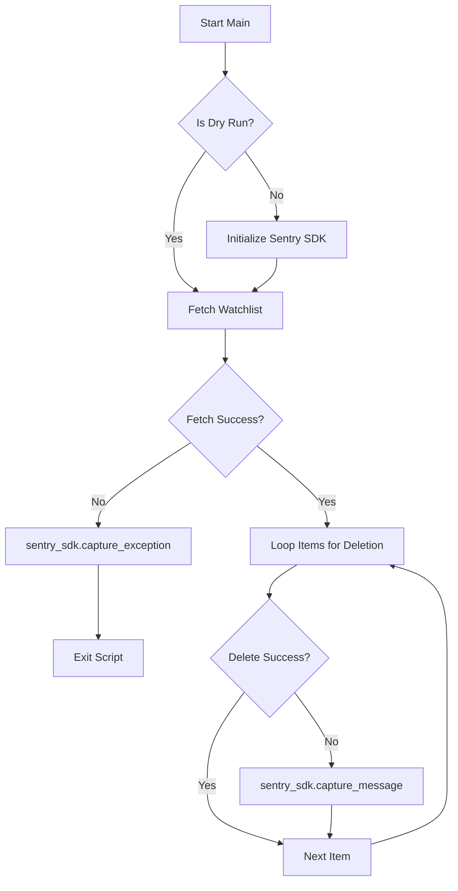

<details>
<summary>Relevant source files</summary>

The following files were used as context for generating this wiki page:

- [plex_clear_watchlist.py](plex_clear_watchlist.py)
- [requirements.txt](requirements.txt)
- [docker-compose.yml](docker-compose.yml)
- [README.md](README.md)
- [SECURITY.md](SECURITY.md)
</details>

# Sentry Integration

## Introduction

Sentry integration in the Plex Clear Watchlist project provides automated error tracking and observability for the watchlist management script. It is designed to capture runtime exceptions during the retrieval of watchlist items and reporting failures during the deletion process. This integration allows developers to monitor the health of the tool in production environments, particularly when running as a scheduled task or within a containerized environment.

The integration is optional and acts as a "no-op" if the required configuration is not provided. It leverages the official Sentry SDK to send telemetry data to a Sentry Data Source Name (DSN).
Sources: [README.md:14](README.md#L14), [plex_clear_watchlist.py:101-107](plex_clear_watchlist.py#L101-L107)

## Architecture and Configuration

The Sentry integration is managed through environment variables and the `sentry-sdk` Python library. It is initialized early in the `main()` function, provided that the execution is not a "dry run".

### Environment Setup
The integration relies on the `SENTRY_DSN` environment variable. In containerized deployments, this variable is passed from the host to the container.

| Configuration Key | Source | Description |
| :--- | :--- | :--- |
| `SENTRY_DSN` | Environment Variable | The unique DSN for the Sentry project. If unset, tracking is disabled. |
| `sentry-sdk` | `requirements.txt` | Minimum version `2.0.0` required for the script. |

Sources: [requirements.txt:2](requirements.txt#L2), [docker-compose.yml:7](docker-compose.yml#L7), [README.md:14](README.md#L14), [plex_clear_watchlist.py:102](plex_clear_watchlist.py#L102)

### Initialization Logic
The script initializes Sentry with specific privacy and performance settings to minimize data leakage and overhead.

```python
sentry_sdk.init(
    dsn=os.getenv("SENTRY_DSN"),
    traces_sample_rate=0.0,
    send_default_pii=False,
    include_local_variables=False,
    max_request_body_size="never",
)
```

Sources: [plex_clear_watchlist.py:101-107](plex_clear_watchlist.py#L101-L107)

## Data Flow and Error Capture

Sentry captures data at two primary stages: during watchlist retrieval and during item deletion. The integration distinguishes between fatal exceptions (using `capture_exception`) and specific operational failures (using `capture_message`).

### Error Tracking Flow
This diagram illustrates how the script decides when to report errors to Sentry.



The integration ensures that data is only sent if `SENTRY_DSN` is configured and `--dry-run` is not active.
Sources: [plex_clear_watchlist.py:100-112](plex_clear_watchlist.py#L100-L112), [plex_clear_watchlist.py:149-158](plex_clear_watchlist.py#L149-L158)

### Captured Metadata
When a deletion fails, the script sends a message with specific metadata to help identify the problematic entry without exposing sensitive user information.

*  **Level**: `error`
*  **Extras**: Includes the `rating_key` of the item that failed to delete.
*  **Fingerprint**: Grouped under `["watchlist-delete-failure"]` to prevent issue duplication in the Sentry UI.

Sources: [plex_clear_watchlist.py:152-157](plex_clear_watchlist.py#L152-L157)

## Security Considerations

The Sentry integration follows the project's security best practices by ensuring that sensitive credentials like the `PLEX_TOKEN` are not transmitted to Sentry.

1.  **PII Masking**: The configuration explicitly sets `send_default_pii=False` and `include_local_variables=False` to ensure user identifiers and local script variables (which might contain the token) are not captured in stack traces.
2.  **Request Body Security**: `max_request_body_size` is set to `"never"` to prevent capturing potentially sensitive API request payloads.
3.  **Vulnerability Reporting**: While Sentry handles runtime errors, security vulnerabilities found in the integration or dependencies should be reported via GitHub's private reporting feature rather than Sentry issues.

Sources: [plex_clear_watchlist.py:104-106](plex_clear_watchlist.py#L104-L106), [SECURITY.md:11-13](SECURITY.md#L11-L13)

## Summary

Sentry integration in `plex_clear_watchlist` provides a robust but privacy-conscious monitoring layer. By capturing both network-level exceptions and application-level deletion failures, it allows for proactive maintenance of the tool while strictly adhering to security guidelines regarding environment variables and Personally Identifiable Information (PII).
