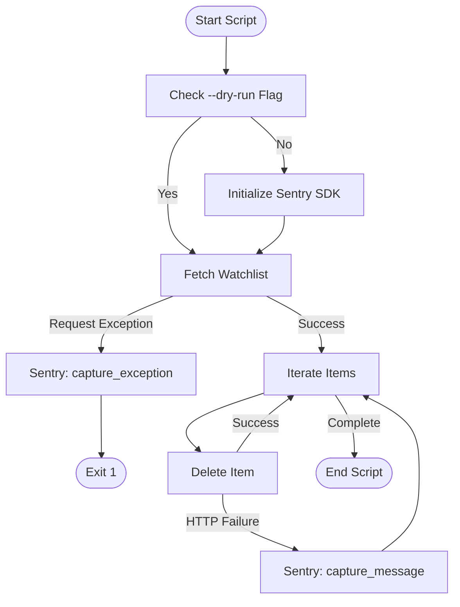

<details>
<summary>Relevant source files</summary>

The following files were used as context for generating this wiki page:

- [README.md](README.md)
- [docker-compose.yml](docker-compose.yml)
- [plex_clear_watchlist.py](plex_clear_watchlist.py)
- [requirements.txt](requirements.txt)
- [AGENTS.md](AGENTS.md)
</details>

# Sentry Integration

Sentry Integration in `plex_clear_watchlist` provides error tracking and monitoring capabilities for the automated watchlist cleanup process. It allows the application to capture and report exceptions and specific execution failures to a Sentry instance, enabling developers to monitor the health of the script in production environments.

The integration is designed as an optional component. It remains a "no-op" (non-operational) if the required configuration is missing, ensuring the script can run in environments where error tracking is not desired or configured.
Sources: [README.md:15](README.md#L15), [plex_clear_watchlist.py:101-107](plex_clear_watchlist.py#L101-L107)

## Configuration and Initialization

The Sentry SDK is initialized within the `main()` function of the application. The initialization is conditional; it only occurs if the `--dry-run` flag is not present, ensuring that test runs do not send telemetry to Sentry.

### Configuration Parameters
The integration is configured via environment variables. In Docker environments, these variables are typically passed through the container runtime or defined in orchestration files.

| Parameter | Type | Default | Description |
| :--- | :--- | :--- | :--- |
| `SENTRY_DSN` | Environment Variable | None | The Data Source Name used to connect to the Sentry project. |
| `traces_sample_rate` | Float (SDK Init) | `0.0` | Disables performance monitoring/tracing. |
| `send_default_pii` | Boolean (SDK Init) | `False` | Prevents sending Personally Identifiable Information. |
| `include_local_variables` | Boolean (SDK Init) | `False` | Disables sending local variable state with exceptions. |

Sources: [README.md:15](README.md#L15), [docker-compose.yml:7](docker-compose.yml#L7), [plex_clear_watchlist.py:101-107](plex_clear_watchlist.py#L101-L107)

### Initialization Logic
The script uses the `sentry_sdk` package, which is defined as a dependency in the project.
Sources: [requirements.txt:2](requirements.txt#L2)

```python
if not args.dry_run:
    sentry_sdk.init(
        dsn=os.getenv("SENTRY_DSN"),
        traces_sample_rate=0.0,
        send_default_pii=False,
        include_local_variables=False,
        max_request_body_size="never",
    )
```

Sources: [plex_clear_watchlist.py:101-107](plex_clear_watchlist.py#L101-L107)

## Error Capture and Reporting Flow

The integration captures two primary types of issues: unhandled exceptions during API interaction and logical failures during item deletion.

### Exception Capture
When the script fails to fetch the watchlist due to a network or API error, the `requests.RequestException` is caught. If not in dry-run mode, the exception is passed to `sentry_sdk.capture_exception(e)` before the script terminates.
Sources: [plex_clear_watchlist.py:112-117](plex_clear_watchlist.py#L112-L117)

### Message Capture (Deletion Failures)
If the script successfully fetches the watchlist but fails to delete a specific item via the Plex API, it logs a message to Sentry using `sentry_sdk.capture_message`. This event includes extra metadata and a specific fingerprint for grouping.

| Metadata Key | Description |
| :--- | :--- |
| `rating_key` | The unique identifier of the Plex item that failed to delete. |
| `fingerprint` | Hardcoded to `["watchlist-delete-failure"]` for error grouping. |

Sources: [plex_clear_watchlist.py:151-160](plex_clear_watchlist.py#L151-L160)

### Logic Flow Diagram
The following diagram illustrates how Sentry integration interacts with the main execution loop:



The diagram shows the conditional initialization and the two distinct capture points (exceptions and messages).
Sources: [plex_clear_watchlist.py:101-160](plex_clear_watchlist.py#L101-L160)

## Deployment Environment

The integration is pre-configured for Docker environments. The `docker-compose.yml` file includes the `SENTRY_DSN` mapping, allowing the host's environment variable to be forwarded to the container.

```yaml
services:
  plex-clear-watchlist:
    environment:
      - PLEX_TOKEN=${PLEX_TOKEN}
      - SENTRY_DSN=${SENTRY_DSN:-}
```

Sources: [docker-compose.yml:1-7](docker-compose.yml#L1-L7), [AGENTS.md:12](AGENTS.md#L12)

## Summary

Sentry integration in `plex_clear_watchlist` acts as a silent monitoring layer that activates only when a `SENTRY_DSN` is provided and the script is executing a live (non-dry) run. By capturing both broad request exceptions and granular item-level deletion failures, it provides comprehensive visibility into the tool's performance and reliability during automated operations.
