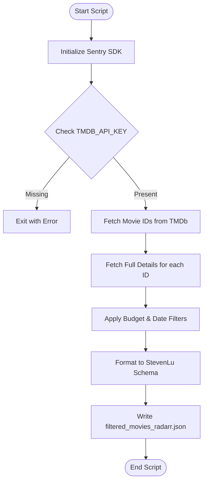

<details>
<summary>Relevant source files</summary>

The following files were used as context for generating this wiki page:

- [filter\_movies.py](../../../filter_movies.py)
- [AGENTS.md](../../../AGENTS.md)
- [CLAUDE.md](../../../CLAUDE.md)
- [README.md](../../../README.md)
- [SECURITY.md](../../../SECURITY.md)
- [filtered\_movies\_radarr.json](../../../filtered_movies_radarr.json)
</details>

# Python Script: filter_movies.py

## Introduction
The `filter_movies.py` script is a core component of the `filtered-movies` project, designed to automate the discovery and filtering of high-value movies. Its primary purpose is to query The Movie Database (TMDb) API to identify films released within the current calendar year that possess a production budget of $100,000,000 or greater. The script generates a JSON output file formatted specifically for direct import into Radarr via the "StevenLu Custom" list type.

Sources: [filter_movies.py:1-15](filter_movies.py#L1-L15), [README.md:1-15](README.md#L1-L15), [AGENTS.md:1-15](AGENTS.md#L1-L15)

Within the broader project architecture, this script is executed daily via GitHub Actions. It focuses exclusively on cinematic releases, complementing its counterpart, `filter_tv_shows.py`, which handles television content. The philosophy behind the script's logic is that high-budget investments indicate significant production value, making these films noteworthy regardless of critical reception.

Sources: [README.md:18-22](README.md#L18-L22), [CLAUDE.md:5-15](CLAUDE.md#L5-L15), [AGENTS.md:5-15](AGENTS.md#L5-L15)

## Architecture and Data Flow
The script follows a linear, functional execution path: initializing monitoring, fetching candidate IDs, retrieving detailed metadata, filtering based on specific criteria, and persisting the results.

### High-Level Execution Flow
The following diagram illustrates the lifecycle of a script execution, from environment validation to final file output.



Sources: [filter_movies.py:30-155](filter_movies.py#L30-L155)

### Data Retrieval Logic
The script uses multiple TMDb endpoints to ensure broad coverage of recent releases. It aggregates IDs from "Now Playing" and various "Discover" queries (sorted by popularity, vote count, and revenue) to build a comprehensive list of candidates.

Sources: [filter_movies.py:50-65](filter_movies.py#L50-L65)

## Key Functions and Logic

### Data Fetching: `get_movie_ids`
This function performs paginated requests to TMDb endpoints. It targets movies released between January 1st of the current year and the current date.

| Endpoint | Logic / Filtering |
| :--- | :--- |
| `/movie/now_playing` | Fetches currently playing movies. |
| `/discover/movie` | Uses `primary_release_date.gte` and `primary_release_date.lte`. |
| `sort_by` parameters | popularity.desc, vote_count.desc, revenue.desc. |

Sources: [filter_movies.py:46-77](filter_movies.py#L46-L77)

### Detail Processing: `fetch_and_filter_movies`
This function iterates through the collected IDs to perform a deep-fetch of movie details. It enforces the core project requirement: `budget >= 100,000,000`.

*  **Rate Limiting:** The script handles HTTP 429 status codes by implementing a `time.sleep(2)` retry mechanism.
*  **Validation:** It verifies the existence of an `imdb_id` before inclusion, as this is required for the Radarr integration.
*  **Budget Check:** TMDb returns `0` for unreported budgets; the script explicitly skips these to avoid false positives.

Sources: [filter_movies.py:92-125](filter_movies.py#L92-L125)

## Configuration and Environment
The script relies on environment variables for authentication and error tracking.

```python
# Constants defined in the script
MIN_BUDGET = 100_000_000  # $100M threshold
OUTPUT_FILE = "filtered_movies_radarr.json"
BASE_URL = "https://api.themoviedb.org/3"
```

Sources: [filter_movies.py:36-40](filter_movies.py#L36-L40)

### Security and Credentials
As per the project's security policy, API keys are never hardcoded. The script requires a TMDb API Read Access Token (JWT) provided via the `TMDB_API_KEY` environment variable.

Sources: [SECURITY.md:38-46](SECURITY.md#L38-L46), [filter_movies.py:30-34](filter_movies.py#L30-L34)

## Data Schema: StevenLu Format
The script transforms TMDb's complex movie object into a simplified structure compatible with Radarr's StevenLu Custom List format.

**Example Output Object:**

```json
{
  "title": "Project Hail Mary",
  "imdb_id": "tt12042730"
}
```

Sources: [filtered_movies_radarr.json:28-31](filtered_movies_radarr.json#L28-L31), [filter_movies.py:80-89](filter_movies.py#L80-L89)

## Summary
`filter_movies.py` serves as a specialized ETL (Extract, Transform, Load) tool that bridges TMDb data with Radarr's automation capabilities. By focusing strictly on production budget and release year, it creates a reliable feed of "high-value" cinematic content. Its integration with Sentry ensures that any failures in the daily GitHub Actions workflow are captured and reported for maintenance.

Sources: [filter_movies.py:25-27](filter_movies.py#L25-L27), [README.md:55-65](README.md#L55-L65)
