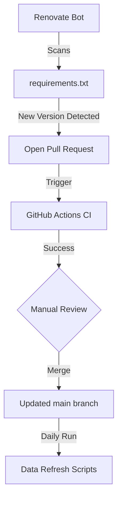

<details>
<summary>Relevant source files</summary>

The following files were used as context for generating this wiki page:

- [requirements.txt](requirements.txt)
- [renovate.json](renovate.json)
- [SECURITY.md](SECURITY.md)
- [README.md](README.md)
- [CLAUDE.md](CLAUDE.md)
</details>

# Dependency Management & Renovate

## Introduction
Dependency management in the `filtered-movies` project is handled through a combination of explicit versioning in configuration files and automated update tools. The project primarily relies on Python-based libraries to interact with The Movie Database (TMDb) API and Sentry for error tracking. Maintaining up-to-date dependencies is a core part of the project's [Security & Vulnerability Policy](../06-section-security/01-page-sec-policy.md) to ensure the stability of the daily data refresh cycles.

The project utilizes **Renovate** to automate the detection and updating of software dependencies. This ensures that the Python environment remains secure and performant without manual intervention for every minor or patch release of the underlying libraries.
Sources: [README.md:1-15](README.md#L1-L15), [SECURITY.md:33-40](SECURITY.md#L33-L40), [AGENTS.md:7-10](AGENTS.md#L7-L10)

## Dependency Configuration

The project specifies its direct Python requirements in a standard configuration file. These dependencies are essential for the execution of the main filtering scripts, `filter_movies.py` and `filter_tv_shows.py`.

### Core Dependencies
The current dependency stack is focused on HTTP networking and monitoring:

| Package | Version | Purpose |
|---------|---------|---------|
| `requests` | 2.34.2 | Handles TMDb API communication |
| `sentry-sdk` | 2.66.0 | Error reporting and performance monitoring |

Sources: [requirements.txt:1-2](requirements.txt#L1-L2), [filter_movies.py:23-28](filter_movies.py#L23-L28), [filter_tv_shows.py:24-29](filter_tv_shows.py#L24-L29)

### Automated Updates via Renovate
Renovate is configured to monitor the repository and propose updates to the dependencies listed in `requirements.txt`. The configuration follows the recommended baseline to balance stability and freshness.

```json
{
  "$schema": "https://docs.renovatebot.com/renovate-schema.json",
  "extends": [
    "config:recommended"
  ]
}
```

Sources: [renovate.json:1-6](renovate.json#L1-L6)

## Security & Maintenance Flow

The relationship between automated tools and the security policy ensures that third-party vulnerabilities are addressed promptly. While the project maintainers handle the core scripts, third-party dependency vulnerabilities are deferred to their respective maintainers, with Renovate serving as the bridge to pull in those fixes.

### Update Workflow
The following diagram illustrates how dependencies are updated within the project lifecycle:



The automated update process ensures that scripts like `filter_movies.py` and `filter_tv_shows.py` always run on the latest validated versions of their libraries during daily GitHub Action executions.
Sources: [README.md:107-112](README.md#L107-L112), [renovate.json:1-6](renovate.json#L1-L6), [SECURITY.md:33-40](SECURITY.md#L33-L40)

## Implementation Constraints

Maintenance of dependencies is subject to specific repository conventions and security restrictions:
*  **Version Pinning:** Dependencies are pinned to specific versions in `requirements.txt` to ensure reproducible builds in GitHub Actions.
*  **Workflow Integrity:** Automated updates must not bypass `repository-checks`. A known issue was identified where `[skip ci]` tags in commit messages blocked PR merges because they skipped mandatory security checks.
*  **Secret Protection:** Dependency updates must never involve or expose `TMDB_API_KEY` or other environment secrets.

Sources: [CLAUDE.md:27-32](CLAUDE.md#L27-L32), [SECURITY.md:43-58](SECURITY.md#L43-L58), [requirements.txt:1-2](requirements.txt#L1-L2)

## Summary
The `filtered-movies` project maintains a lean dependency profile, managed primarily through `requirements.txt`. By integrating Renovate with the `config:recommended` preset, the project automates the maintenance of its core networking and monitoring libraries. This automation is a critical component of the project's security posture, ensuring that the daily automated movie and TV show lists are generated using secure and up-to-date third-party code.
