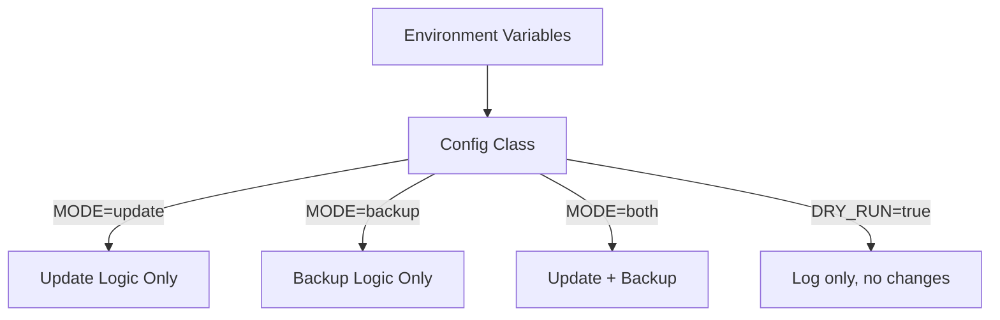
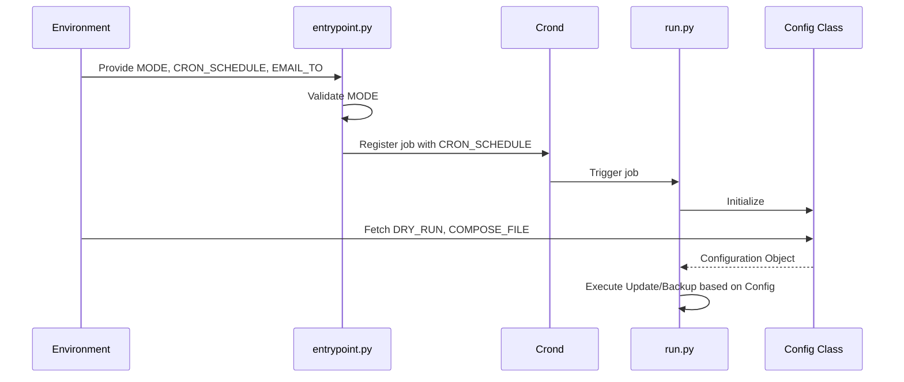

Relevant source files

The following files were used as context for generating this wiki page:

- [src/config.py](src/config.py)
- [README.md](README.md)
- [src/entrypoint.py](src/entrypoint.py)
- [src/github_report.py](src/github_report.py)
- [src/sentry_report.py](src/sentry_report.py)
- [src/run.py](src/run.py)

# Environment Variables Reference

## Introduction
The `docker-idempotent-update` project utilizes environment variables as the primary mechanism for configuration and secret management. This approach ensures that sensitive credentials, such as API tokens and email addresses, are never hardcoded in the source code, adhering to security best practices. Environment variables define the operational mode of the container, scheduling for the internal cron daemon, and integration settings for external reporting tools like GitHub and Sentry.

These variables are primarily consumed by the `Config` class in `src/config.py` and the initialization logic in `src/entrypoint.py`. The configuration system determines whether the system performs Docker image updates, rclone backups, or both.

Sources: [SECURITY.md:14-16](SECURITY.md#L14-L16), [src/config.py:7-17](src/config.py#L7-L17), [src/entrypoint.py:22-68](src/entrypoint.py#L22-L68)

## Core Operational Configuration
The core behavior of the maintenance container is governed by variables that set the operational mode and the execution schedule.

### Operation Modes
The `MODE` variable determines which maintenance tasks are active. The application supports three primary modes: `update`, `backup`, and `both`. If an invalid mode is provided, the entrypoint script terminates execution.

The diagram above illustrates how the `MODE` and `DRY_RUN` variables dictate the internal execution path.
Sources: [src/config.py:8-14](src/config.py#L8-L14), [src/entrypoint.py:22-30](src/entrypoint.py#L22-L30)

### Configuration Parameters
| Variable | Default | Description |
| :--- | :--- | :--- |
| `MODE` | `both` | Operational scope: `update`, `backup`, or `both`. |
| `CRON_SCHEDULE` | `0 3 * * *` | Standard cron expression defining when the maintenance job runs. |
| `DRY_RUN` | `false` | If set to `true`, the system logs planned actions without executing them (e.g., no `docker pull` or `rclone sync`). |
| `EMAIL_TO` | *(unset)* | The recipient email address for the activity report. If empty, no mail is sent. |

Sources: [src/config.py:16-19](src/config.py#L16-L19), [src/entrypoint.py:61-62](src/entrypoint.py#L61-L62), [README.md:109-114](README.md#L109-L114)

## Docker Update Configuration
When the `MODE` includes `update`, the system requires specific environment variables to interact with the Docker daemon or Docker Compose.

### Docker Interaction Methods
The system supports two methods of updating containers:
1. **Option A (Socket-only):** Uses the Docker socket to pull images and recreate containers based on existing configurations.
2. **Option B (Compose-file):** Uses `docker compose` commands. This requires the `COMPOSE_FILE` variable to be set to a valid path inside the container.

### Docker Specific Variables
| Variable | Default | Description |
| :--- | :--- | :--- |
| `COMPOSE_FILE` | *(unset)* | Path to the `docker-compose.yml` file within the container. Enables Option B. |
| `COMPOSE_ENV_FILE` | *(unset)* | Path to an optional `.env` file passed to the `docker compose --env-file` command. |

Sources: [src/config.py:20-21](src/config.py#L20-L21), [README.md:83-99](README.md#L83-L99)

## Error Reporting and Integration
The system includes "best-effort" error reporting capabilities that trigger when unhandled exceptions occur during the daily run. These integrations are only activated if the corresponding tokens or DSNs are provided via environment variables.

### GitHub Issue Reporting
If `GITHUB_ERROR_REPORT_TOKEN` is provided, the system will attempt to open a GitHub issue in the specified repository. The reporter automatically redacts sensitive information from the traceback, including strings that look like emails, home paths, or keys (e.g., `ghp_`, `sk-`, `Bearer`).

### Sentry Integration
The system includes a minimal, standard-library-only Sentry reporter. It captures unhandled exceptions and posts them to the Sentry Envelope API if `SENTRY_DSN` is configured.

| Variable | Scope | Description |
| :--- | :--- | :--- |
| `GITHUB_ERROR_REPORT_TOKEN` | Error Reporting | A Fine-grained Personal Access Token with "Issues: Write" permissions. |
| `SENTRY_DSN` | Error Reporting | The Data Source Name for a Sentry project. |
| `SENTRY_ENVIRONMENT` | Error Reporting | Sets the environment tag in Sentry (defaults to `production`). |

Sources: [src/github_report.py:48-52](src/github_report.py#L48-L52), [src/sentry_report.py:53-56](src/sentry_report.py#L53-L56), [src/sentry_report.py:82](src/sentry_report.py#L82), [CLAUDE.md:28-36](CLAUDE.md#L28-L36)

## Configuration Workflow
The following sequence diagram shows how environment variables are processed during the container startup and job execution.

The sequence illustrates the transition from environment variable ingestion at the entrypoint to configuration usage in the main execution logic.
Sources: [src/entrypoint.py:22-68](src/entrypoint.py#L22-L68), [src/run.py:27-46](src/run.py#L27-L46), [src/config.py:7-22](src/config.py#L7-L22)

## Summary
Environment variables in `docker-idempotent-update` serve as the central control plane for the application. They manage everything from basic task selection (`MODE`) to advanced automated error recovery (`GITHUB_ERROR_REPORT_TOKEN`). By strictly using these variables for secrets and configuration, the project maintains a portable and secure deployment model suitable for Docker environments.

Sources: [README.md:107-118](README.md#L107-L118), [src/config.py:7-25](src/config.py#L7-L25)
