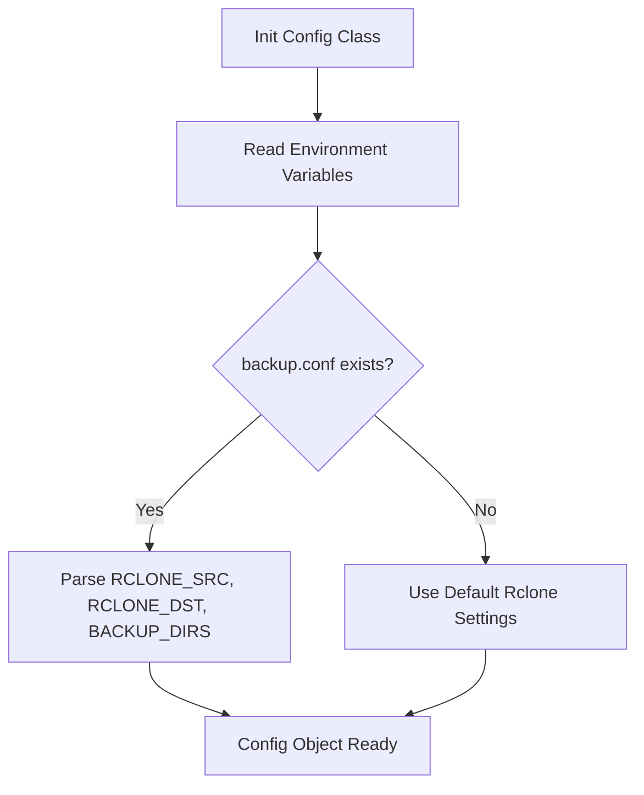
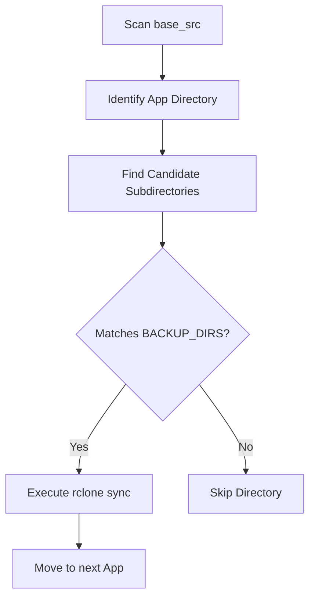
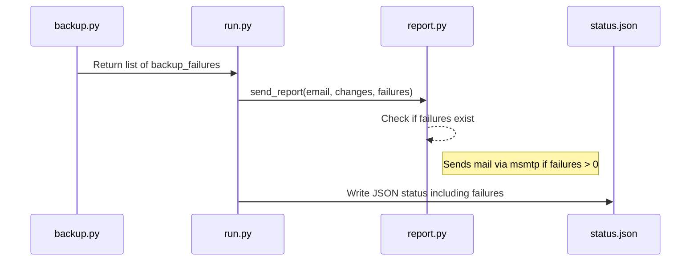

<details>
<summary>Relevant source files</summary>

The following files were used as context for generating this wiki page:

- [src/config.py](../../../src/config.py)
- [README.md](../../../README.md)
- [src/backup.py](../../../src/backup.py)
- [src/entrypoint.py](../../../src/entrypoint.py)
- [src/run.py](../../../src/run.py)
- [src/report.py](../../../src/report.py)
</details>

# Backup Configuration

The Backup Configuration system defines how application data is identified, scanned, and synchronized to remote storage. This functionality is active when the `MODE` environment variable is set to `backup` or `both`. It relies on `rclone` for data transfer and uses a combination of environment variables and a dedicated configuration file (`backup.conf`) to manage source paths and destination targets.

The system is designed for idempotency and runs on a schedule managed by an internal cron daemon. It automatically handles the creation of configuration templates if they are missing during initialization and provides feedback through a status JSON file and optional email reports.

Sources: [README.md:9-25](README.md#L9-L25), [src/entrypoint.py:27-58](src/entrypoint.py#L27-L58), [src/run.py:31-40](src/run.py#L31-L40)

## Configuration Files and Initialization

During the container startup, the entrypoint script validates the configuration requirements based on the selected mode. For backup operations, it ensures that `rclone.conf` exists and initializes `backup.conf` from a template if it is not already present in the `/config` volume.

### File Roles

| File Path | Description | Initialization |
|:---|:---|:---|
| `/config/rclone.conf` | Contains remote storage credentials and settings. | Created manually via `docker exec -it docker-maintenance rclone config`. |
| `/config/backup.conf` | Defines source directories, destinations, and target folder names. | Created from `/etc/backup.conf.template` if missing. |
| `/config/status.json` | Stores the results of the last backup run, including failures and timestamps. | Updated at the end of every execution in `src/run.py`. |

Sources: [README.md:46-64](README.md#L46-L64), [src/entrypoint.py:40-52](src/entrypoint.py#L40-L52), [src/run.py:43-62](src/run.py#L43-L62)

### Configuration Loading Logic
The `Config` class in `src/config.py` is responsible for parsing the `backup.conf` file and merging it with environment variables.



The logic scans for key-value pairs separated by `=` and strips quotes from values.
Sources: [src/config.py:10-40](src/config.py#L10-L40)

## Backup Execution Logic

The backup process is initiated by `src/run.py` calling `run_backup(cfg)`. The system iterates through subdirectories in the source path (default `/data`) and looks for specific target folders defined in `backup.conf`.

### Directory Scanning and Selection
The system scans up to two levels deep within the source directory. It identifies "apps" as first-level directories and looks for folders named `backup` or `backups` (case-insensitive) within them.



Sources: [src/backup.py:42-79](src/backup.py#L42-L79), [README.md:88-98](README.md#L88-L98)

### Synchronization Parameters
Synchronizations are performed using `rclone sync` with a specific set of flags optimized for reliability and performance:
*  `--fast-list`, `--checksum`, and `--delete-during` for efficiency.
*  Retry logic: The system attempts the sync up to 3 times per directory with a 15-second delay between failures.
*  Concurrency: Configured with 4 transfers and 6 checkers.

Sources: [src/backup.py:10-27](src/backup.py#L10-L27), [src/backup.py:61-75](src/backup.py#L61-L75)

## Environment and Manual Configuration

The backup behavior can be tuned using environment variables. These variables control the high-level operation mode and the execution schedule.

| Variable | Default | Description |
|:---|:---|:---|
| `MODE` | `both` | Set to `backup` or `both` to enable backup features. |
| _(fixed path)_ | `/config/rclone.conf` | Not configurable via environment variable — the internal rclone configuration path is fixed. |
| `CRON_SCHEDULE` | `0 3 * * *` | The crontab-formatted schedule for the daily run. |
| `DRY_RUN` | `false` | If true, logs the sync operations without transferring data. |

Sources: [README.md:103-112](README.md#L103-L112), [src/config.py:13-20](src/config.py#L13-L20), [src/entrypoint.py:27-31](src/entrypoint.py#L27-L31)

### Customizing backup.conf
The `backup.conf` file allows overriding the internal defaults for source and destination paths.

```ini
# Example backup.conf
RCLONE_SRC = /data
RCLONE_DST = gdrive:backups
BACKUP_DIRS = backup backups custom_backup
```

Sources: [src/config.py:33-40](src/config.py#L33-L40), [README.md:88-98](README.md#L88-L98)

## Error Handling and Reporting

The backup system tracks failures for each individual application directory. If a directory fails to sync after all retries, it is added to a `backup_failures` list.

### Sequence of Reporting
The results are reported through multiple channels as shown in the sequence below:



Sources: [src/run.py:35-41](src/run.py#L35-L41), [src/report.py:13-46](src/report.py#L13-L46), [src/run.py:44-53](src/run.py#L44-L53)

If `EMAIL_TO` is configured, an email is sent only if there are updates or backup failures. The subject line will include a warning emoji (⚠️) if the backup failed.
Sources: [src/report.py:14-16](src/report.py#L14-L16), [src/report.py:31-35](src/report.py#L31-L35)

## Conclusion
The backup configuration provides a structured yet flexible way to automate data redundancy for Docker-based applications. By combining directory-naming conventions with `rclone`'s robust synchronization engine, the system ensures that critical data is backed up to remote storage while providing clear visibility into successes and failures through status files and email alerts.
