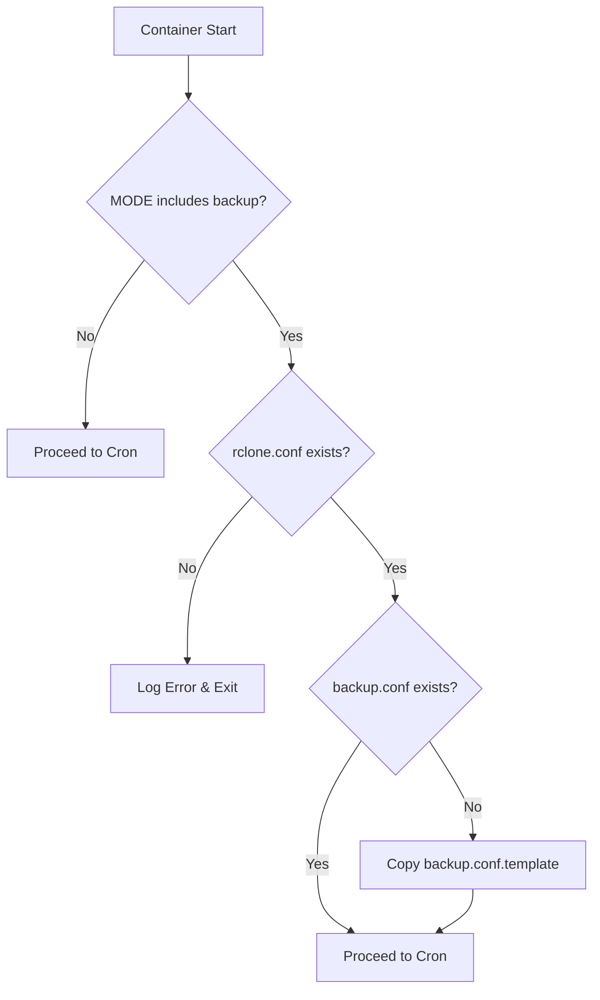
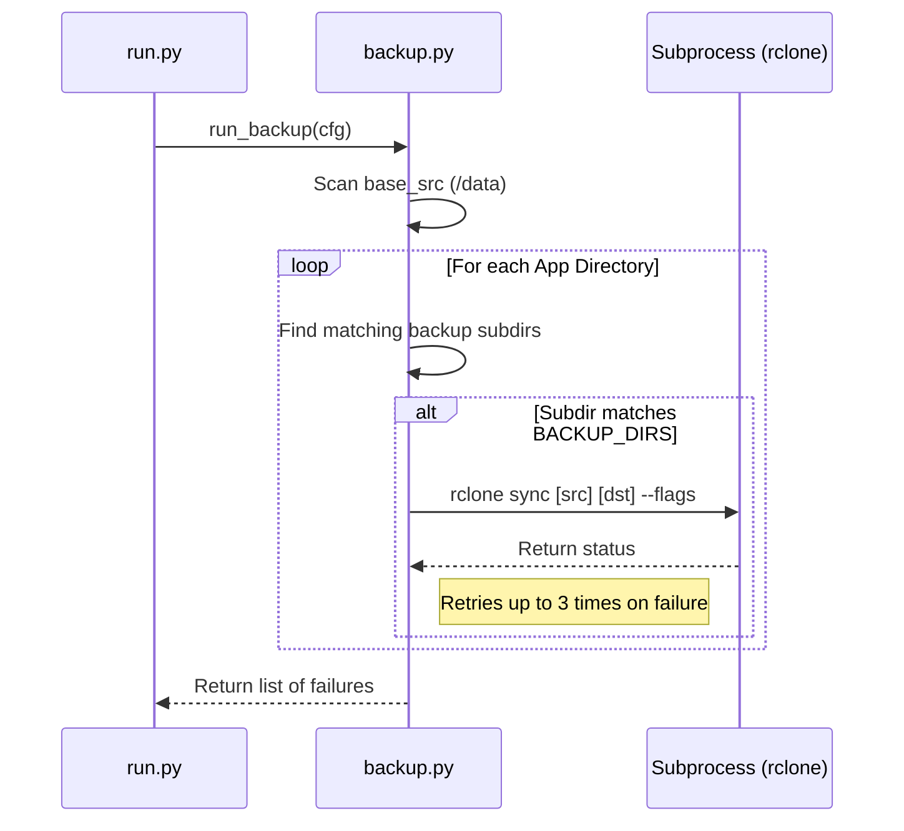

Relevant source files

The following files were used as context for generating this wiki page:

- [src/config.py](../../../src/config.py)
- [README.md](../../../README.md)
- [src/entrypoint.py](../../../src/entrypoint.py)
- [src/backup.py](../../../src/backup.py)
- [src/run.py](../../../src/run.py)

# Rclone Configuration Setup

The Rclone Configuration Setup is a critical component of the `docker-idempotent-update` project, specifically when the system is operating in `backup` or `both` modes. It facilitates the synchronization of application data from the local Docker host to a remote storage provider defined via rclone. This setup involves validating the presence of the `rclone.conf` file, managing a custom `backup.conf` for fine-grained folder selection, and executing the sync logic through the rclone CLI.

Sources: [README.md:10-15](README.md#L10-L15), [src/entrypoint.py:34-45](src/entrypoint.py#L34-L45)

## Core Components and Initialization

The initialization process ensures that the environment is correctly configured before the cron daemon starts. If the `MODE` environment variable includes backup functionality, the system checks for the existence of `/config/rclone.conf`. If missing, the container logs an error and instructs the user to run the `rclone config` command interactively.

### Initialization Workflow

The following diagram illustrates the startup logic for rclone within the container entrypoint:

The entrypoint validates the filesystem state and prepares configuration files before the scheduled backup runs. 
Sources: [src/entrypoint.py:34-52](src/entrypoint.py#L34-L52)

## Configuration Files

Two primary configuration files govern the behavior of the backup system:

| File | Location (Internal) | Description |
| :--- | :--- | :--- |
| `rclone.conf` | `/config/rclone.conf` | Contains remote credentials and endpoint definitions. Created manually via `docker exec`. |
| `backup.conf` | `/config/backup.conf` | Defines source/destination paths and specific folder names to include in the sync. |

Sources: [README.md:65-71](README.md#L65-L71), [src/config.py:21-25](src/config.py#L21-L25)

### Backup Logic Configuration (`backup.conf`)
The `Config` class parses `backup.conf` to override default paths and directory filters. The system scans the source directory for subfolders matching the names specified in `BACKUP_DIRS`.

| Parameter | Default Value | Description |
| :--- | :--- | :--- |
| `RCLONE_SRC` | `/data` | The base directory on the host to scan for backups. |
| `RCLONE_DST` | `gdrive:backups` | The rclone remote and path where data will be synced. |
| `BACKUP_DIRS` | `backup`, `backups` | Folder names (case-insensitive) that trigger a sync. |

Sources: [src/config.py:19-45](src/config.py#L19-L45), [README.md:95-105](README.md#L95-L105)

## Backup Execution Logic

When the daily run is triggered, the `run_backup` function iterates through the source directory. It performs a depth-limited search (up to two levels) to find directories matching the configured `BACKUP_DIRS`.

### Execution Flow

The system implements a retry mechanism, waiting 15 seconds between attempts if an rclone sync fails.
Sources: [src/backup.py:33-72](src/backup.py#L33-L72), [src/run.py:32-34](src/run.py#L32-L34)

### Rclone Command Flags
The system uses a specific set of optimized flags for the `rclone sync` operation:
- `--fast-list`: Optimizes listing for supported backends.
- `--checksum`: Uses checksums to determine if files have changed.
- `--delete-during`: Deletes files on the destination that no longer exist on the source during the sync.
- `--transfers 4` and `--checkers 6`: Controls concurrency.

Sources: [src/backup.py:10-27](src/backup.py#L10-L27)

## Directory Mapping Example

The rclone setup maps local directories to the remote destination by appending the application name and relative path to the `RCLONE_DST`.

| Local Path | Application | Relative Subdir | Remote Path (Default) |
| :--- | :--- | :--- | :--- |
| `/data/prowlarr/backups` | `prowlarr` | `backups` | `gdrive:backups/prowlarr/backups` |
| `/data/sonarr/config/backup` | `sonarr` | `config/backup` | `gdrive:backups/sonarr/config/backup` |

Sources: [README.md:105-115](README.md#L105-L115), [src/backup.py:49-51](src/backup.py#L49-L51)

## Summary
The Rclone Configuration Setup provides an automated, idempotent method for syncing Docker application data. By combining the industry-standard `rclone.conf` with a project-specific `backup.conf`, it allows for flexible remote storage options while maintaining strict control over which directories are backed up. The integration within the entrypoint and daily run script ensures that backups are performed reliably with built-in error reporting and retries.
