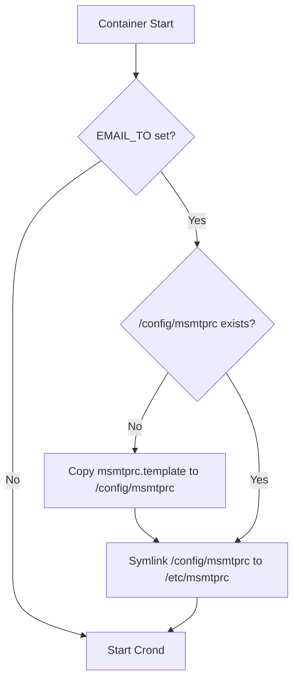
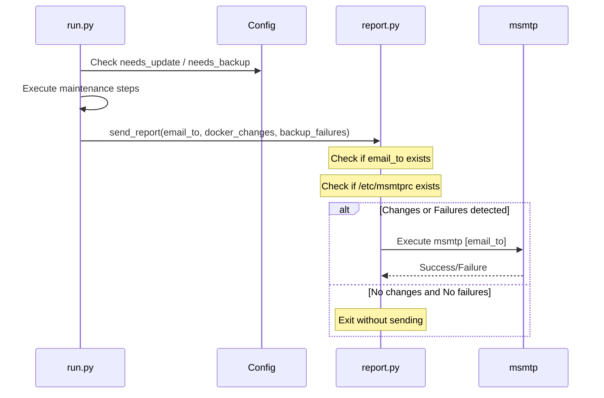

<details>
<summary>Relevant source files</summary>

The following files were used as context for generating this wiki page:

- [src/config.py](../../../src/config.py)
- [src/report.py](../../../src/report.py)
- [src/entrypoint.py](../../../src/entrypoint.py)
- [src/run.py](../../../src/run.py)
- [README.md](../../../README.md)
- [CLAUDE.md](../../../CLAUDE.md)

</details>

# Mail Server Settings

## Introduction

The mail server settings in this project facilitate the delivery of automated summary reports following daily Docker maintenance tasks. These reports are generated only when specific events occur, such as container updates or backup failures, ensuring that users are notified of relevant changes or issues without unnecessary noise. The system utilizes `msmtp` as the underlying mail transport agent to send these notifications to a designated recipient.

The configuration for mailing is primarily driven by environment variables and local configuration files stored within the container's `/config` directory. If the mandatory `EMAIL_TO` environment variable is not set, the reporting system remains inactive, though the maintenance tasks continue to run and update a local status file.

Sources: [README.md:12-21](README.md#L12-L21), [src/report.py:11-15](src/report.py#L11-L15), [src/run.py:38-42](src/run.py#L38-L42)

## Configuration Components

The mailing system relies on two main components: the `EMAIL_TO` environment variable and the `msmtprc` configuration file.

### Environment Variables

The system uses specific environment variables to determine the recipient and control the behavior of the mail reporting.

| Variable | Default | Description |
| :--- | :--- | :--- |
| `EMAIL_TO` | *(unset)* | The email address where the summary report will be sent. |
| `DRY_RUN` | `false` | If set to `true`, maintenance actions (Docker/rclone) are only logged, not applied. `send_report` still sends mail when `EMAIL_TO` and `/etc/msmtprc` are present — dry-run does not suppress email delivery. |

Sources: [README.md:131-135](README.md#L131-L135), [src/config.py:13-15](src/config.py#L13-L15)

### msmtprc Configuration

`msmtp` is used for email delivery. On the first start of the container, if `EMAIL_TO` is provided, the system initializes a default `msmtprc` file from a template.

*  **Template Location:** `/etc/msmtprc.template`
*  **Active Config Location:** `/config/msmtprc`
*  **System Link:** The file `/config/msmtprc` is symlinked to `/etc/msmtprc` during initialization to ensure the `msmtp` binary can locate its settings.

Sources: [src/entrypoint.py:53-64](src/entrypoint.py#L53-L64), [README.md:65-67](README.md#L65-L67)

## Reporting Logic and Workflow

The system follows a specific workflow to determine if a mail should be sent. Mail is sent if and only if:
1.  An `EMAIL_TO` address is configured.
2.  The `/etc/msmtprc` file exists.
3.  Either Docker containers were updated or a backup task failed.

### Initialization Flow
The `entrypoint.py` script handles the initial setup of the mail environment before starting the cron daemon.



*The initialization logic ensures the mail configuration is available for the background cron job.*
Sources: [src/entrypoint.py:53-64](src/entrypoint.py#L53-L64)

### Execution and Dispatch
During the daily run (`src/run.py`), the results of update and backup steps are collected and passed to the reporting module.



*The sequence of events leading to a mail dispatch based on task outcomes.*
Sources: [src/run.py:33-40](src/run.py#L33-L40), [src/report.py:11-44](src/report.py#L11-L44)

## Summary Content and Subjects

The report body is constructed dynamically based on the outcomes of the maintenance tasks.

*  **Container Updates:** If `docker_changes` is populated, it lists the containers that were recreated or images that were pulled.
*  **Backup Failures:** If `backup_failures` is populated, it lists the specific directories that failed to sync via `rclone`.

The email subject is also dynamic to provide immediate visibility into the status:

| Condition | Subject Format |
| :--- | :--- |
| Both Update & Failure | `🐳 Docker updated + ⚠️ backup failed – [hostname] [date]` |
| Only Backup Failure | `⚠️ Backup failed – [hostname] [date]` |
| Only Docker Update | `🐳 Docker updated – [hostname] [date]` |

Sources: [src/report.py:21-35](src/report.py#L21-L35)

## Implementation Details

The dispatch is handled via a `subprocess.run` call to the `msmtp` binary. The subject and body are passed via standard input.

```python
# src/report.py:37-42
subprocess.run(
    ["msmtp", email_to],
    input=f"Subject: {subject}\n\n{body}",
    text=True,
    check=True,
)
```

Sources: [src/report.py:37-42](src/report.py#L37-L42)

## Error Handling

If the `msmtp` process fails (e.g., due to incorrect credentials in `msmtprc` or network issues), the system catches the `subprocess.CalledProcessError` and logs a warning: `Failed to send mail`. It does not crash the main maintenance loop, ensuring that the `status.json` is still written even if notification fails.

Sources: [src/report.py:43-44](src/report.py#L43-L44), [src/run.py:42-45](src/run.py#L42-L45)

## Conclusion

Mail server settings provide a critical feedback loop for the `docker-idempotent-update` project. By leveraging `msmtp` and a simple template-based configuration, the system provides flexible yet lightweight notifications. Users must ensure that the `msmtprc` file is correctly populated with their SMTP provider's details (host, port, credentials) in the persistent `/config` volume to enable successful delivery.
