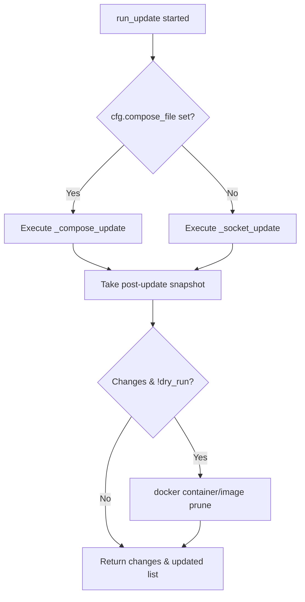

<details>
<summary>Relevant source files</summary>

The following files were used as context for generating this wiki page:

- [src/docker_update.py](../../../src/docker_update.py)
- [README.md](../../../README.md)
- [src/config.py](../../../src/config.py)
- [src/run.py](../../../src/run.py)
- [src/entrypoint.py](../../../src/entrypoint.py)
- [CLAUDE.md](../../../CLAUDE.md)

</details>

# Docker Socket vs Compose File Update Options

The project provides two distinct methods for managing Docker container updates: **Option A (Docker Socket)** and **Option B (Compose File)**. These options determine how the system identifies running containers, pulls updated images, and recreates services to ensure the environment is running the latest available versions. The choice between these options is primarily controlled by the presence of the `COMPOSE_FILE` environment variable.

Sources: [README.md:105-112](README.md#L105-L112), [src/docker_update.py:16-21](src/docker_update.py#L16-L21)

## Selection Logic and Architecture

The update logic is encapsulated within the `run_update` function, which branches based on the system configuration. If a `COMPOSE_FILE` path is defined in the `Config` class, the system defaults to the Compose-based update method. Otherwise, it falls back to direct Docker socket interaction.

### Update Mode Decision Flow
The following flowchart illustrates how the project determines which update path to execute based on the environment configuration.



The system performs a "before" and "after" snapshot of container states to determine exactly what changed during the process.
Sources: [src/docker_update.py:13-29](src/docker_update.py#L13-L29), [src/run.py:38-40](src/run.py#L38-L40)

---

## Option A: Docker Socket (Socket-Only)

This method is used when `COMPOSE_FILE` is unset. It interacts directly with the Docker daemon via `/var/run/docker.sock` to manage containers globally on the host without requiring external YAML definitions.

### Mechanism
1.  **Image Identification**: The system runs `docker ps --format "{{.Image}}"` to list all unique images currently used by running containers.
2.  **Pulling**: It attempts to pull the latest version of every identified image.
3.  **Inspection**: It compares the `ImageID` of the running container against the `Id` of the newly pulled image using `docker inspect`.
4.  **Recreation**: If a mismatch is found, the system manually constructs a new `docker run` command by extracting metadata (networks, env vars, binds, ports, labels) from the existing container, stops the old one, and starts the new one.

Sources: [src/docker_update.py:92-125](src/docker_update.py#L92-L125), [README.md:107-108](README.md#L107-L108)

### Key Implementation: Container Reconstitution
The socket-only method must manually rebuild the container configuration. The `_recreate_container` function parses the following attributes from the Docker API:

| Category | Attributes Extracted |
| :--- | :--- |
| **Networking** | NetworkMode, PortBindings (HostIp, HostPort) |
| **Storage** | Binds (Volume mounts) |
| **Environment** | Env variables, Labels |
| **Policy** | RestartPolicy (Name, MaximumRetryCount) |

Sources: [src/docker_update.py:128-176](src/docker_update.py#L128-L176)

---

## Option B: Compose File (Recommended)

This method is activated by setting the `COMPOSE_FILE` environment variable and mounting the corresponding directory. It leverages the native `docker compose` CLI, which provides more robust handling of complex multi-container dependencies.

### Mechanism
1.  **Service Discovery**: Runs `docker compose config --services` to identify all services defined in the file.
2.  **Image Snapshots**: Captures current Image IDs using `docker compose images`.
3.  **Sequential Pull**: Iterates through services, attempting to pull each image with up to 3 retries and exponential backoff (5s, 10s).
4.  **Deployment**: Executes `docker compose up -d --remove-orphans` to apply updates and remove containers no longer defined in the file.

Sources: [src/docker_update.py:46-80](src/docker_update.py#L46-L80), [README.md:110-112](README.md#L110-L112)

### Configuration Requirements
For Option B to function, the following environment and volume configurations are necessary:

*  **Environment Variables**:
  *  `COMPOSE_FILE`: Full path to the YAML file inside the container (e.g., `/compose/docker-compose.yml`).
  *  `COMPOSE_ENV_FILE`: (Optional) Path to a `.env` file to be passed to the compose command.
*  **Volume Mounts**:
  *  The directory containing the compose file must be mounted, typically at `/compose:ro`.

Sources: [src/config.py:17-18](src/config.py#L17-L18), [README.md:79-81](README.md#L79-L81)

---

## Technical Comparison

| Feature | Docker Socket (Option A) | Compose File (Option B) |
| :--- | :--- | :--- |
| **Trigger** | `COMPOSE_FILE` is empty | `COMPOSE_FILE` is defined |
| **Scope** | All running containers | Only services in the YAML file |
| **Logic Source** | Custom Python implementation | Native `docker compose` CLI |
| **Complexity** | High (Manually parses `inspect` JSON) | Low (Delegates to Docker Compose) |
| **Orphan Handling** | No | Yes (via `--remove-orphans`) |
| **Reliability** | Best-effort reconstitution | High (Maintains original intent) |

Sources: [src/docker_update.py:46-125](src/docker_update.py#L46-L125), [README.md:105-112](README.md#L105-L112), [CLAUDE.md:Tech Stack](CLAUDE.md:Tech Stack)

## Cleanup and Reporting

Regardless of the update method used, the system performs post-update maintenance if changes were detected and `DRY_RUN` is false. It executes:
1.  `docker container prune -f`
2.  `docker image prune -f`

The results are then passed to `src/report.py` to generate an email summary and written to `/config/status.json` for persistent tracking of which containers were updated.

Sources: [src/docker_update.py:24-27](src/docker_update.py#L24-L27), [src/run.py:42-49](src/run.py#L42-L49), [src/report.py:16-19](src/report.py#L16-L19)

### Status Data Model
The status file contains the following structure after an update:

```json
{
  "timestamp": "2023-10-27T03:00:00Z",
  "mode": "update",
  "dry_run": false,
  "containers_updated": ["nginx", "db"],
  "backup_failures": [],
  "docker_changes": "< container_old_id\n> container_new_id"
}
```

Sources: [src/run.py:53-65](src/run.py#L53-L65)

## Conclusion

The project offers flexibility by supporting both generic container updates via the Docker socket and structured updates via Docker Compose. While the socket-only method allows for "zero-config" updates of any running container, the Compose-based method is the recommended approach as it leverages official Docker tooling to maintain complex service configurations and handle orphaned containers.

Sources: [README.md:105-112](README.md#L105-L112), [CLAUDE.md:File Overview](CLAUDE.md:File Overview)
